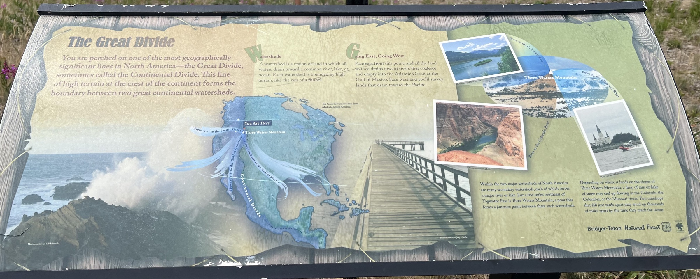
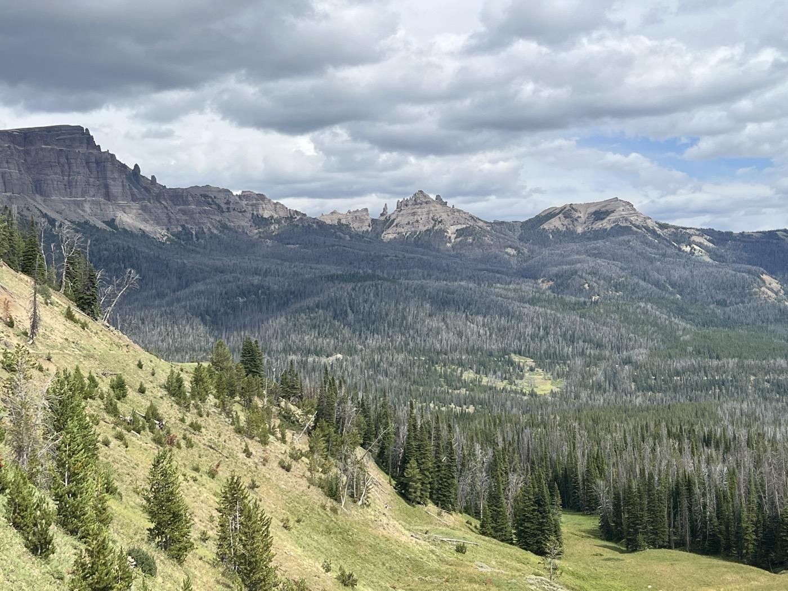

# Togwotee and Union Pass

<figure markdown>
{ width=“300†}
</figure>

After a nice hot shower, I set off to climb 2 passes in one day. I reach 2,000 m of elevation gain and spend the night at 2,900 m. It’s chilly!

<!-- more -->

# A Memorable Shower 

After a freezing night, I reunite with Robert and Aagje (Agathe in Dutch) and a friend who is visiting, in their beautiful cabin with a view of the Grand Tetons. I take advantage of their hospitality: the first shower in 7 days. Wow, it feels great! But Robert also prepares a magnificent buffet of tortillas, scrambled eggs, bacon, tomatoes, salad, coffee, and pineapple: I’m in a little palace in the middle of the forest. Great conversations and exchanges. They bought the cabin (on state land) and come here for 2 months each year. It’s rustic but rejuvenating. A big thank you to Robert, Aagje, and also visiting Robert. There’s a community that facilitates this connection: [Warmshowers](https://www.warmshowers.org). I leave after 2 hours, feeling happy.

# Continental Divide 

The first climb brings me to 2,900 m at a key point of the watershed. I’ll share the explanatory sign for the curious. Then, a beautiful descent; the cliffs are stunning. Really beautiful landscapes. In the middle of nowhere, I get a signal and can quickly call my family: it feels good 😌.

# CDT - Continental Divide Trail

The route of the day crosses the CDT several times. It’s a trail for hikers but follows the same logic. The CDT is known for its difficulty, alongside the Pacific Coast Trail or the Appalachian Trail. Throughout the day, I see quite a few of these hikers. They carry everything on their backs and are super equipped. Often they’ll do it in sections, but those who do the entire trail—huge respect.

# Union Pass

I continue with this other pass to get closer to Pinendale. I’m thinking 🤔 about how to cross the Great Divide Basin that comes next and decide to tackle this second pass to give my legs a bit of rest the following day. I’m happy to arrive, but I set up my tent in the dark at 2,900 m. I’m preparing for a chilly night.

!!! info ""
    Click on the photos to see the comments.

<figure markdown>

{ width=“300†}

{ width=“300†}

{ width=“300†}

{ width=“300†}

{ width=“300†}

{ width=“300†}

{ width=“300†}

{ width=“300†}

{ width=“300†}

{ width=“300†}

</figure>
