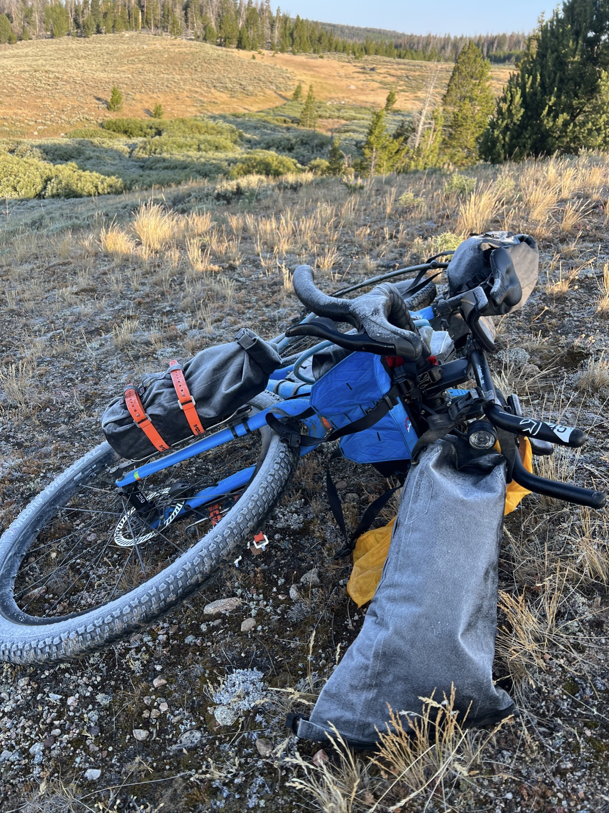

# 21. Pinendale

<figure markdown>
{ width=“300†}
</figure>

After a freezing night, it’s beautiful upon waking. I defrost the bike and also dry the tent and clothes that suffered a bit from the rain in recent days. I then set off toward Pinendale. Today, I crossed the 2,000 km mark since my departure from Geneva on July 25 💪. So happy!

<!-- more -->

# Union Pass is Endless

I ride about 60 km of very rocky gravel. Ouch, here I am back on Paris-Roubaix terrain... And my ambitions to push directly upon arriving in Pinendale are quite dashed too. That’s how it is—you have to adapt. My backside takes a beating, and I have to slow down; there will ultimately be some road too. I finish at Pinendale and can focus on the logistics to cross this form of desert known as the Great Divide Basin. I need to plan for water and check the weather and wind. In total, there will be 350 km with a water resupply point in the middle. And it’s going to be very hot... ride at night? We’ll see: stay tuned for the next post 😉.

# True to the Route

I have a bit of pride because since Banff, I’ve been able to follow the exact route of the GDMBR. Except for the fire that forced me to take a small detour, I have remained faithful. Even if sometimes a shortcut via the road can be tempting, I stick to the rules. I realize that depending on the weather or conditions, others are more permissive. I hope to maintain this course.

# Red Card

One thing that annoys me a bit: here, anything melted cheese is called "Swiss cheese." It’s a huge shortcut and tends to irritate me 😆. They could be a bit more curious, after all!

!!! hint ""
    Click on the photos to see the comments.

<figure markdown>

{ width=“300†}

{ width=“300†}

{ width=“300†}

</figure>
