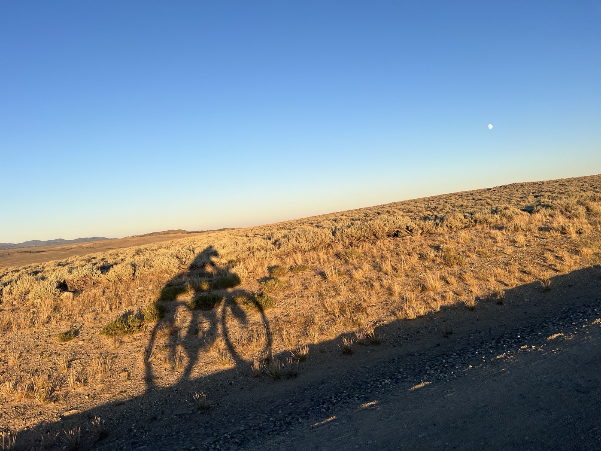
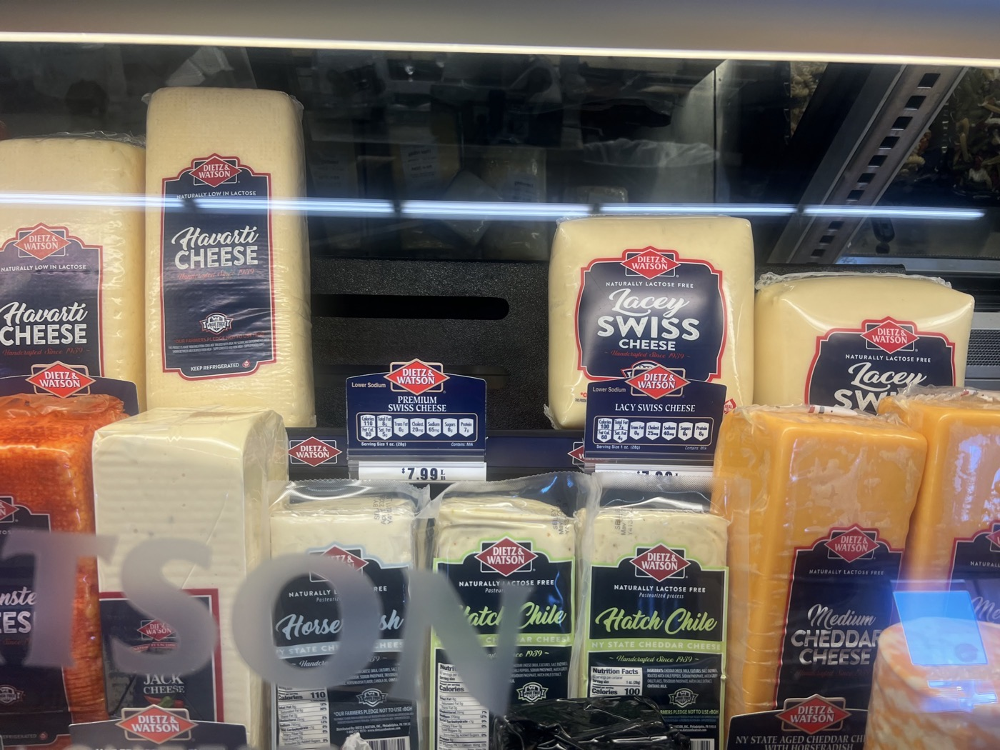
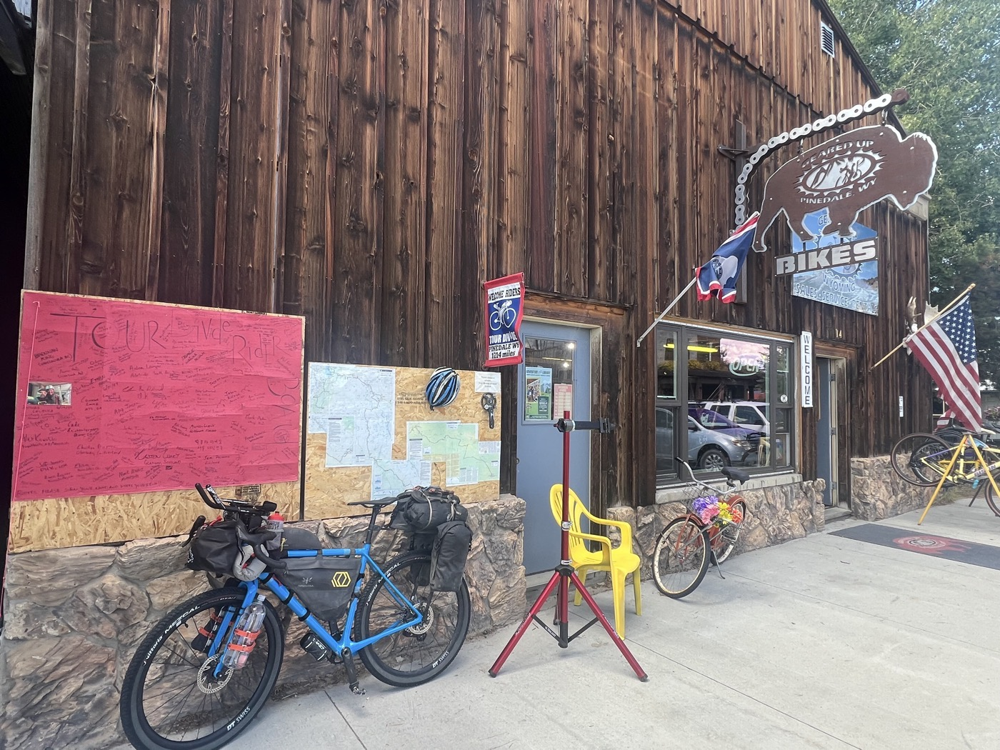
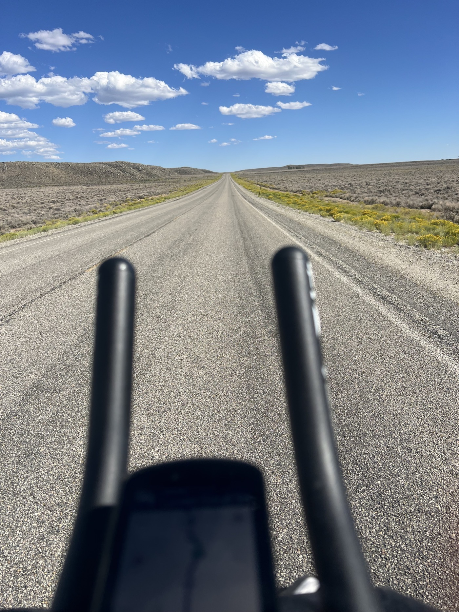
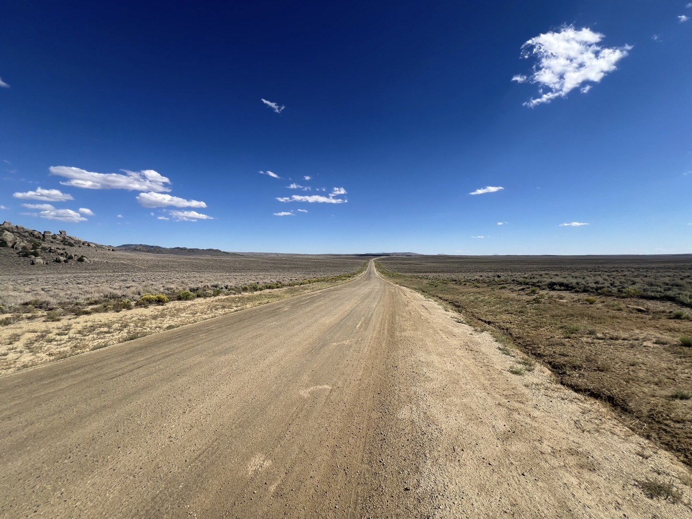
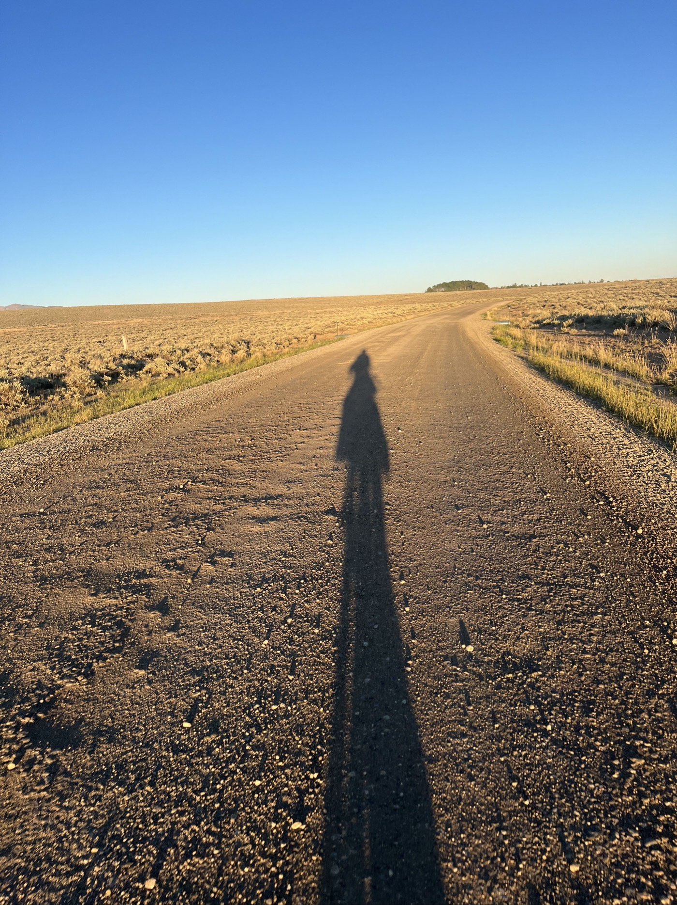
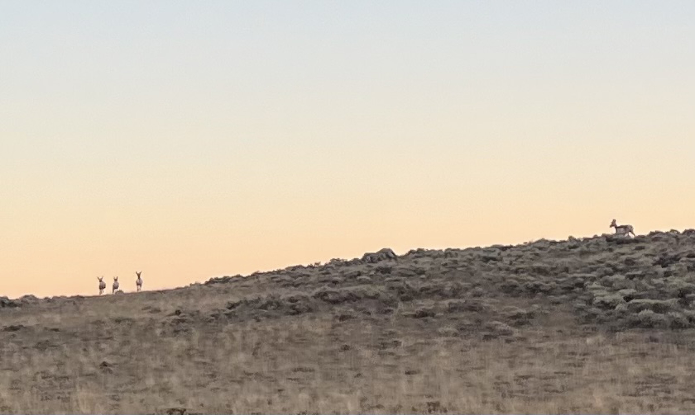
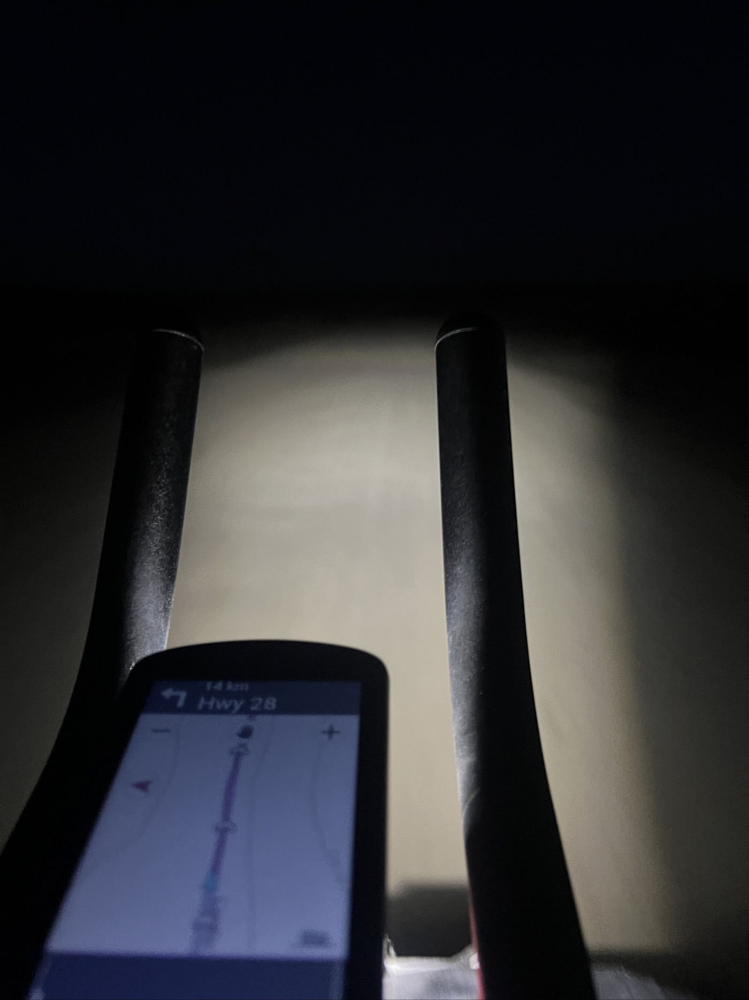

# 22. The Great Basin

<figure markdown>
{ width=“300” }
</figure>

I take advantage of the morning to do some shopping and give my bike some mechanical care. I want to cross the Basin in 2 days while riding at night. 180 km to reach the first spring.

<!-- more -->

# Pinendale 

A relaxing morning to let my legs rest a bit. I go to the supermarket and check out a few stores for camping gear. The bike mechanic is having trouble—he can’t get the derailleur adjusted properly. Did it get damaged? I think about if and when I might replace it in the coming days. Then I set off...

# The Great Basin

The Basin is another legendary passage. Basically, regarding the watershed, this "basin" is on the ridge. So the water that falls on the edges of this high plateau flows toward the oceans. But what falls inside goes nowhere. And this high plateau is very desert-like, flat, and treeless. Just these bushes that withstand everything. Very arid, water points are extremely rare. I need to load the bike; I’m taking 5.5 liters with me. Another challenge: the weather. Winds can be very strong, and a headwind is fatal given the distances. In short, you got it—this is a tough challenge 😳.

# Great Basin - First Part

I set off at 2 p.m. With favorable winds, I aim to pitch my tent around midnight/1 a.m. near a water source. It’s going well, with a tailwind, but the derailleur is bothering me. There aren’t many climbs, but the first gear (the large cog) won’t engage. I waste an hour trying to adjust it—not easy in the middle of nowhere with a loaded bike. Nothing to be done... I continue.

The sunset is magnificent, with a super clear sky and a beautiful moon, almost full. I see Pronghorn (American antelope), and at night I regularly cross paths with hares and nocturnal birds. It’s magical, but by 2 a.m., I’m pretty exhausted. Plus, I’ve gone too far! I turn back 2 km, then I look for this spring...? No signs, nothing. I’m going in circles with my headlamp. Tired of this, I’ll see better when the sun rises. I pitch the tent and go to sleep.

!!! hint ""
    Click on the photos to see the comments.

<figure markdown>

{ width=“300” }

{ width=“300” }

{ width=“300” }

{ width=“300” }

{ width=“300” }

{ width=“300” }

{ width=“300” }

{ width=“300” }

{ width=“300” }

{ width=“300” }

</figure>
