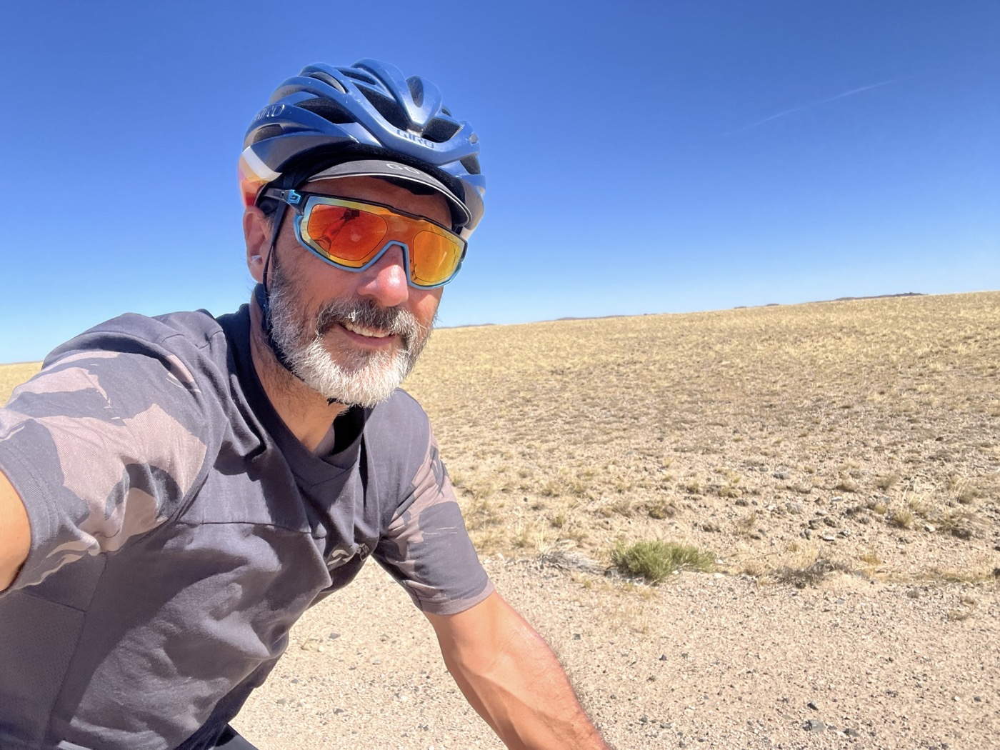
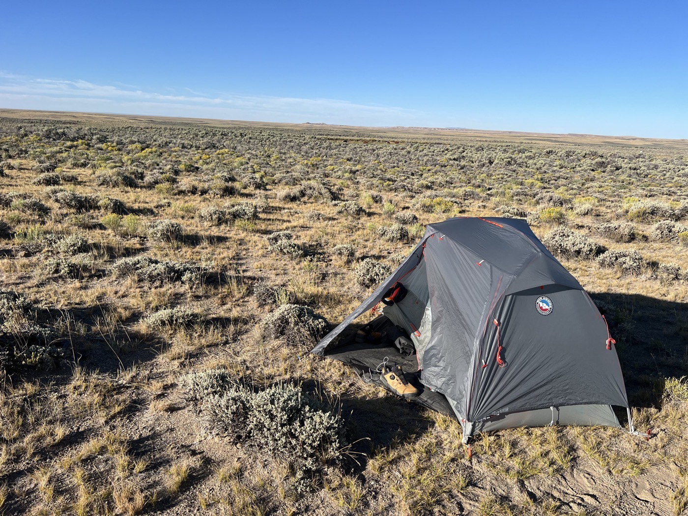
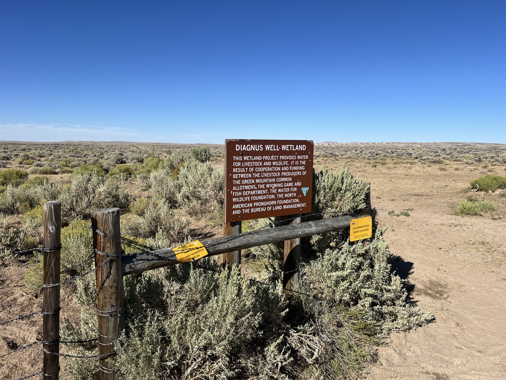
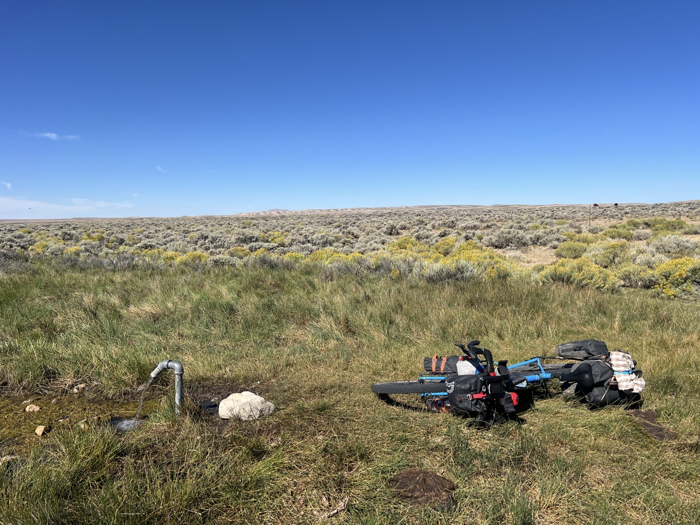
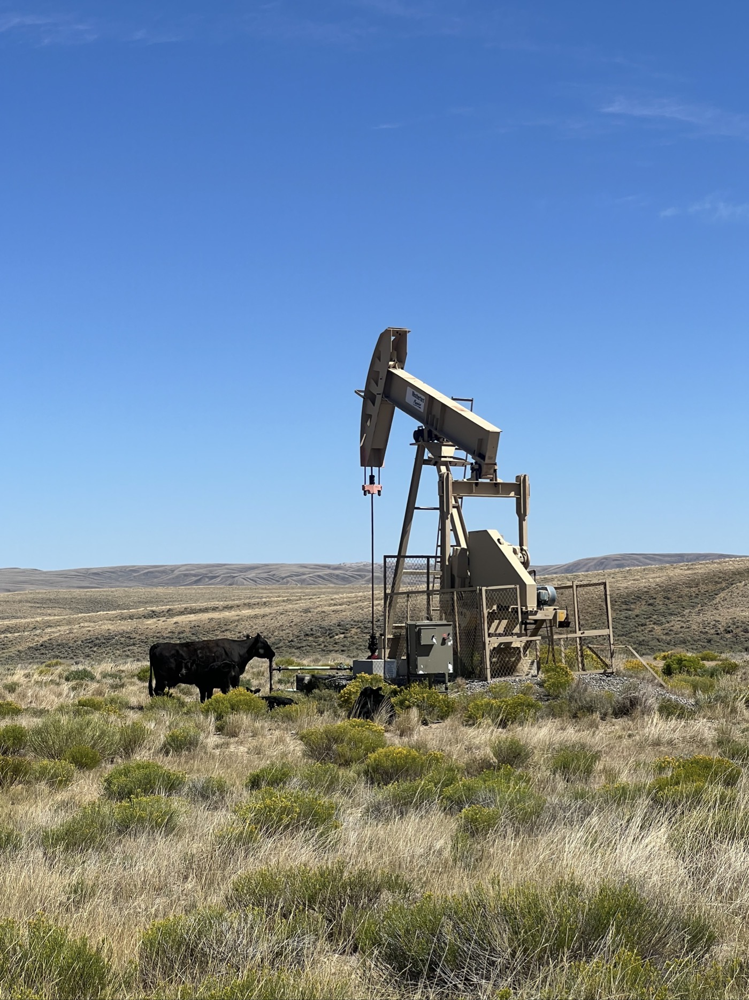
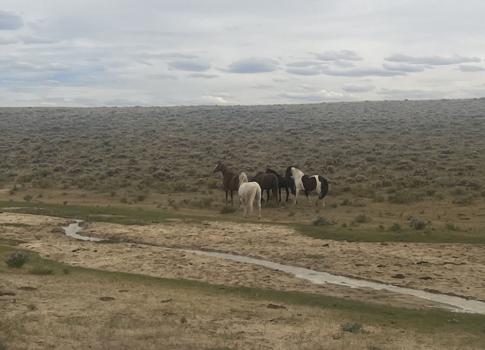
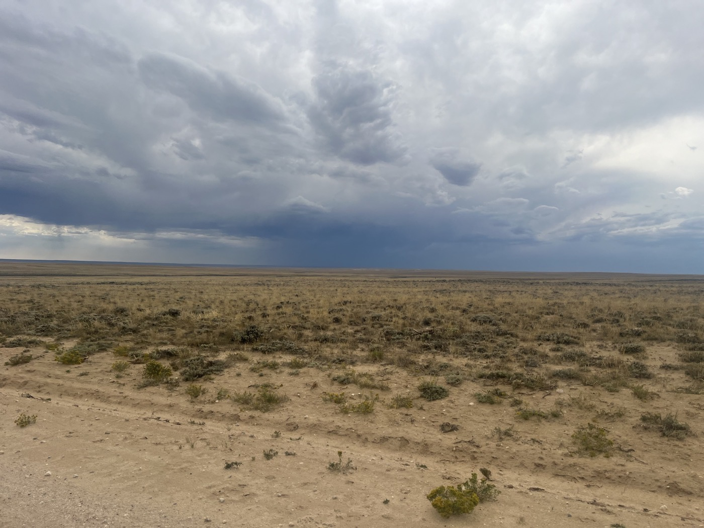
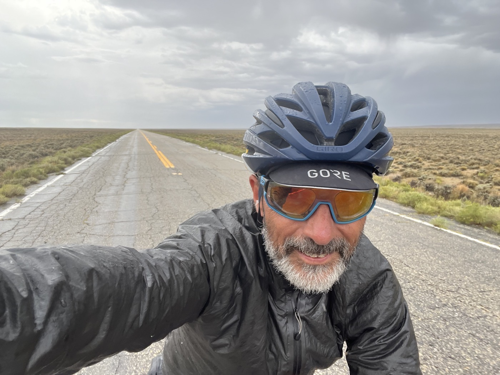

# The Great Basin #2

<figure markdown>
{ width=“300” }
</figure>

In the morning, after a short night, I see cyclists stopping at the spring. I was only 100 m away 😆. I set off at 10 a.m.; I have 180 km left to reach the town of Rawlins. Will I make it there today?

<!-- more -->

# The Diagnus Spring 

It’s incredible to have fresh water like this in the middle of these arid expanses. I fold my tent and have a good breakfast at the spring. I put my head under it to refresh myself well, and then I’m off. It’s already super hot. Three cyclists have left ahead of me.

# Mischievous Wind 

Riding in the desert makes me reflect. It’s different from solitude. I’m in action; I know what I’m leaving behind, but I don’t yet know what I’ll find ahead. And yet, I focus all my efforts to move forward. The odometer slowly ticks off the kilometers. The wind is often head-on or from the side. It’s scorching hot. I pass the first cyclist, exhausted on the side of the road. Then the couple a bit further on. The wind picks up, and I double my efforts. It’s already 3 p.m., and there are still over 100 km to go!

# The Invisible Hand 

The track is long, turning, then headwind—20 km. I see big clouds ahead; a storm is coming. Rain and lightning. I ride as much as I can, hoping to reach the end of my straight line, then turn left to have a tailwind. But the sky darkens, and the wind becomes tempestuous. In the last 5 kilometers, I’m at my max. The first drops fall; I don’t want to be caught in lightning with no trees on the horizon. I’m not exaggerating; in the last 100 m, every pedal stroke was a feat. With one final push, I’m in the storm, and I can turn the handlebars. I find asphalt, and finally, the wind pushes me! I give everything I have left, and with the wind, I hit 40 km/h. 40 km in front of me with this invisible hand I feel on my back. Slowly but surely, I escape the storm. The hand pushes me all the way to 10 km from Rawlins.

I arrive dry in town, stopping at the first motel suggested by the map. $80 a night, special cyclist rate, friendly welcome. I fall asleep exhausted after a good bath. Tomorrow I’ll wake up early: I need to take care of this derailleur and plan the next steps. I will have crossed the Basin in a day and a half. That’s like doing two laps around Lake Geneva, leaving Saturday at 2 p.m. and arriving Sunday at 8 p.m. Big effort 💪!

!!! hint ""
    Click on the photos to see the comments.

<figure markdown>

{ width=“300” }

{ width=“300” }

{ width=“300” }

{ width=“300” }

{ width=“300” }

{ width=“300” }

{ width=“300” }

{ width=“300” }

{ width=“300” }

</figure>
