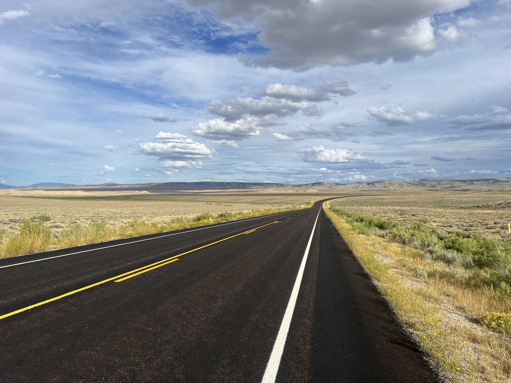
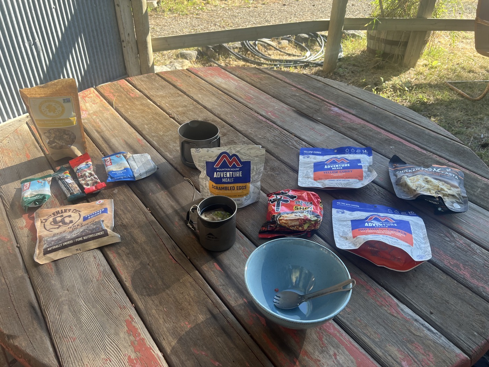
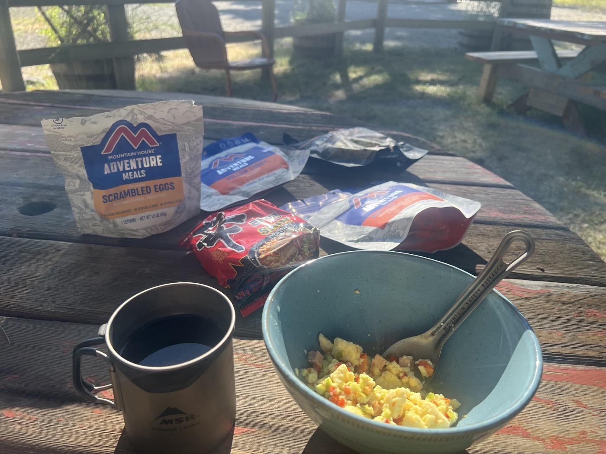

# 24. Things Go Wrong in Rawlins

<figure markdown>
{ width=“300” }
</figure>

I’ve never felt so comfortable in my bed. But I need to move on, so I start looking at the map. Then I want to adjust my derailleur, but after 30 minutes, the cable snaps. I need to repair it to get back on the road.

<!-- more -->

# Derailleur 

After over 2,000 km of gravel, I see that the bike is showing signs of wear. On my 13 speeds, I can no longer shift into first gear—the one needed for climbs. And Colorado means altitude and short, steep climbs, shorter than those in Montana. Am I going to have to replace the derailleur? I go through all the adjustments again, then snap—no shifting at all. The cable has broken in its casing... Darn, that’s a blow. The next bike shop is 200 km away.

# Repair

Well, on the good advice of Tristan, a second derailleur cable is about the last purchase I made before leaving. I check the time and call Tristan. He guides me remotely to change the cable in the hotel parking lot with gusty winds. We manage after more than 2 hours. I’ll spare you the details, but I had never done this operation before. There’s a little victory moment when the new cable is in place and (...) all 13 speeds work. Thank you 🙏🙏🙏 Tristan (who runs the Bikeworld Gland bike shop).

I’m also very grateful that the cable didn’t break 24 hours earlier! What an emotional rollercoaster!

# Food 

With heavy legs, I ride slowly today. So not too many photos. But I wanted to take a moment to talk about my food.

Generally, during the day, I have cereal and energy bars. I also try to take a sandwich or leftovers from pizza with me, along with some dried fruits or an apple.

In the evening, I try freeze-dried meals (not easy to find and quite expensive). Otherwise, mashed potatoes. Nutella tortillas for dessert.

In the morning, oatmeal, freeze-dried omelet, and tortillas.

From time to time: hot dogs, burgers, pizza. In gas stations or convenience stores, I always drink juice and fruit-flavored milk. I limit my quantities during the day, preferring to eat in several portions. Generally, I handle everything well, including energy bars. I have my preferences 😉.

I try to have a 2-3 day supply.

See you soon!

!!! hint ""
    Click on the photos to see the comments.

<figure markdown>

{ width=“300” }

{ width=“300” }

</figure>
