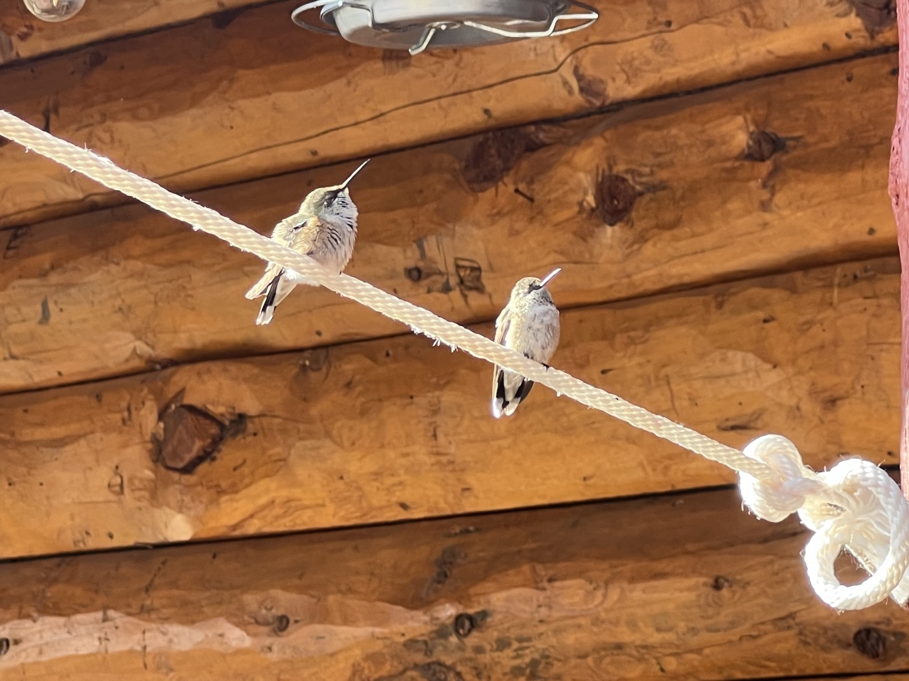

# Hello Colorado!

<figure markdown>
{ width=“300†}
</figure>

After a stormy night, I hit the road again. Today I leave Wyoming to enter Colorado. I stop at Brush Mountain Lodge, an accommodation really made for Dividers. Along the way, I encounter vegetation again 👍.

<!-- more -->

# Aspen Valley 

I continue on this paved road (a succession of climbs and descents) until I finally reach gravel. And here I enter Aspen Valley. Aspen is a tree (Quaking Aspen) that has accompanied me since Calgary. I find these aspens, which can reach 25 m in height, very beautiful, and today I am well rewarded! This tree is mainly Canadian but extends into the USA all the way down to Mexico City. It somewhat follows the divide. Its wood is soft and is used to make paper.

# Goodbye Wyoming

I leave Wyoming and its strong winds, which have worn me out 😉. I find relief, trees, and rivers (finally, I can filter fresh water and reduce my water stock/weight). Colorado will have me pass through small ski resorts, like Steamboat. It’s the second-to-last state of my journey (already!). I also go from a state with 500,000 inhabitants to one populated by nearly 6 million.

# Brush Mountain Lodge 

A magnificent welcome, everything is bike-friendly. After this stop, my legs will surely have recovered! I meet two other Dividers who are doing the GDMBR in sections. Kirsten, the manager, is very attentive. I’m already looking forward to the breakfast, which has a great reputation. I also take the opportunity to do some real laundry.

The next town, Steamboat, is the ideal stop to get my bike repaired. But I’m quite happy; the gears are working well. I hope to pass through the town. My next big stop should be the town of Salida in a few days....

!!! hint ""
    Click on the photos to see the comments.

<figure markdown>

{ width=“300†}

{ width=“300†}

{ width=“300†}

{ width=“300†}

{ width=“300†}

{ width=“300†}

{ width=“300†}

{ width=“300†}

{ width=“300†}

{ width=“300†}

</figure>
