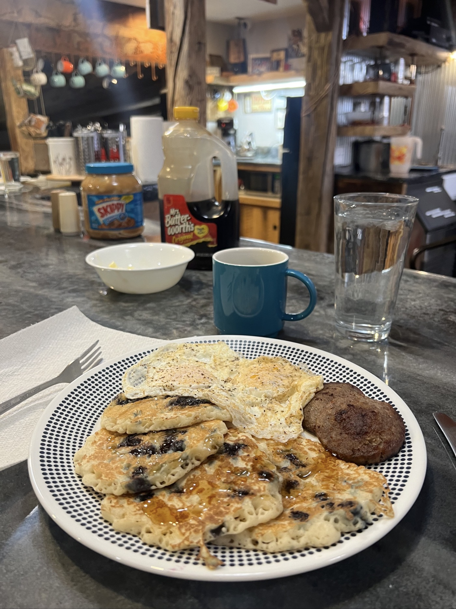
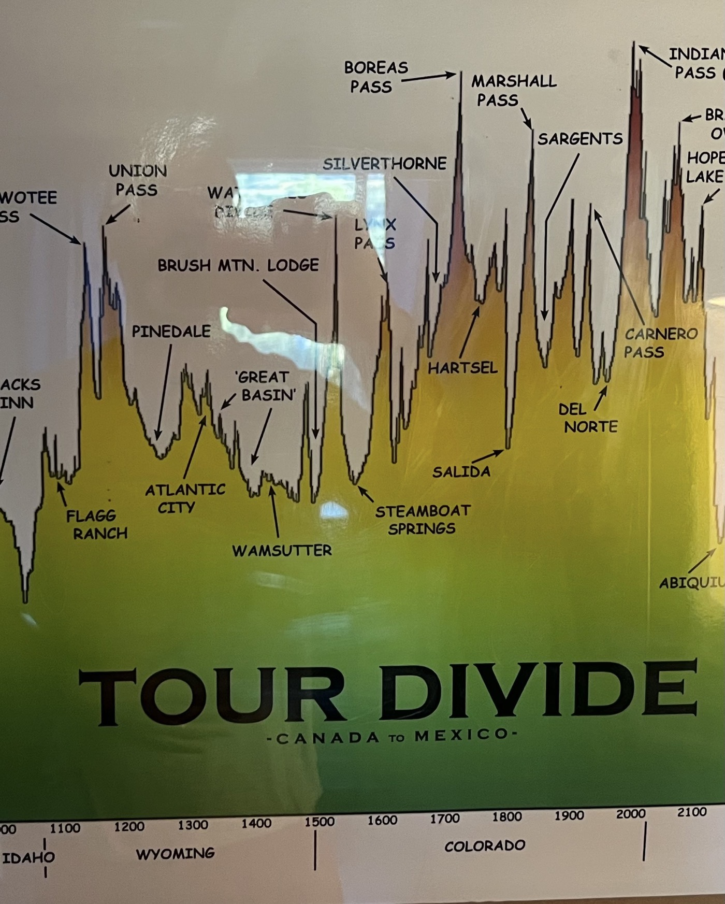
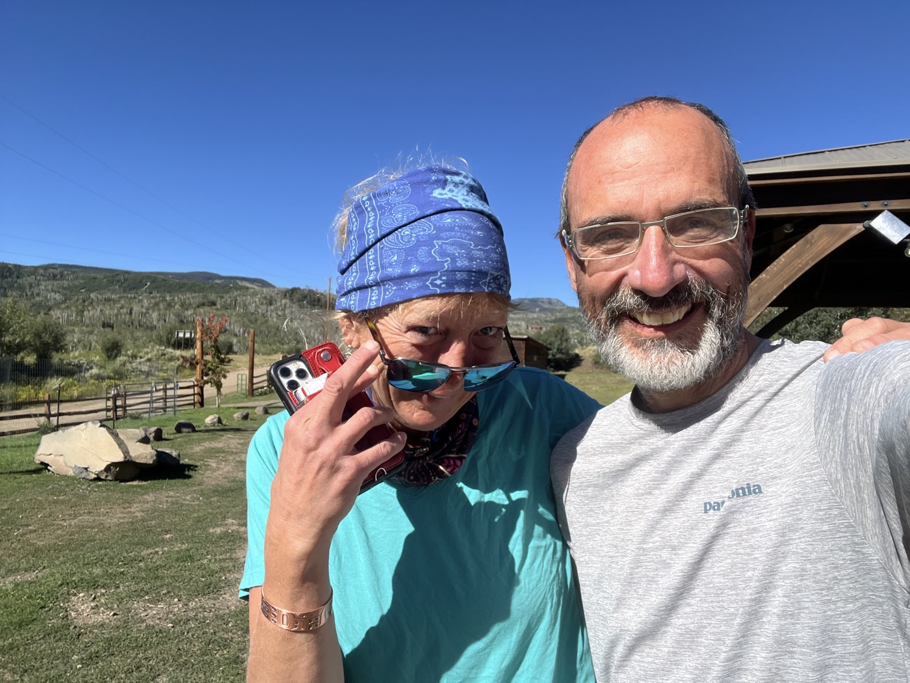
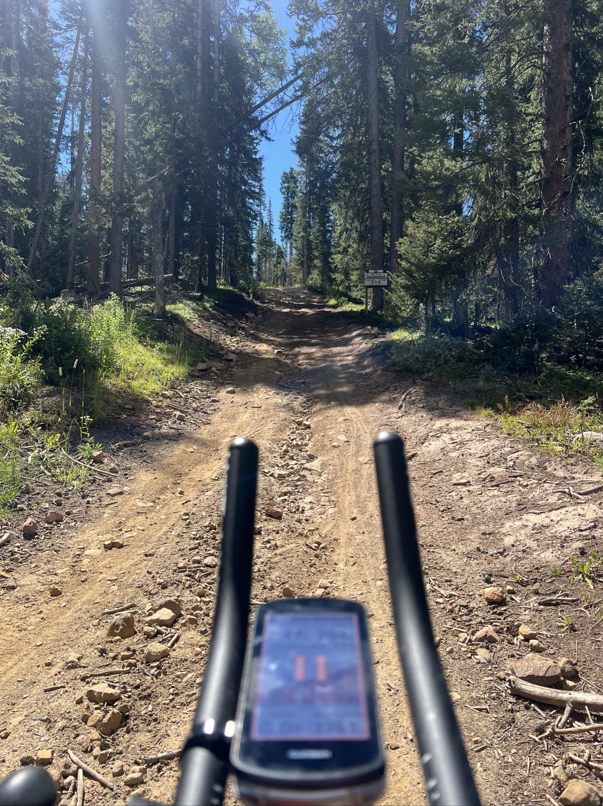
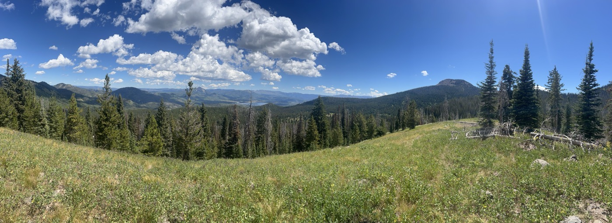
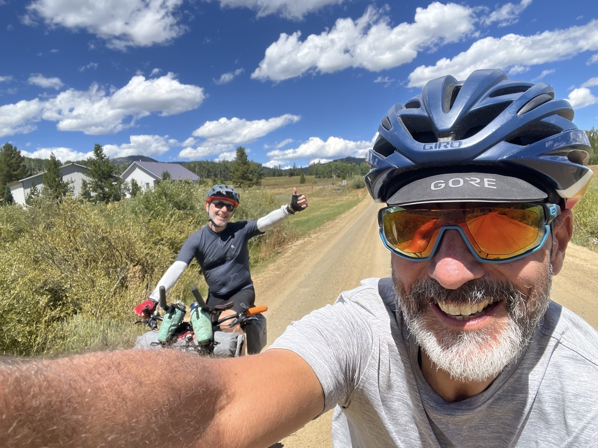
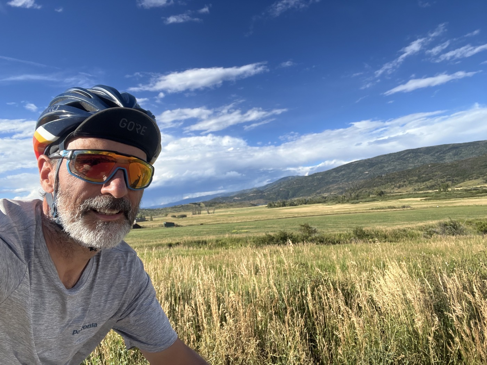
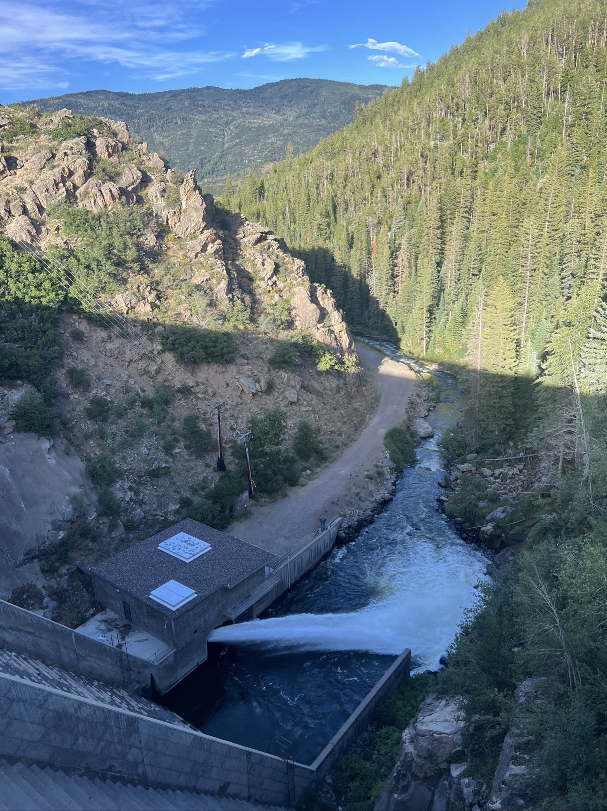
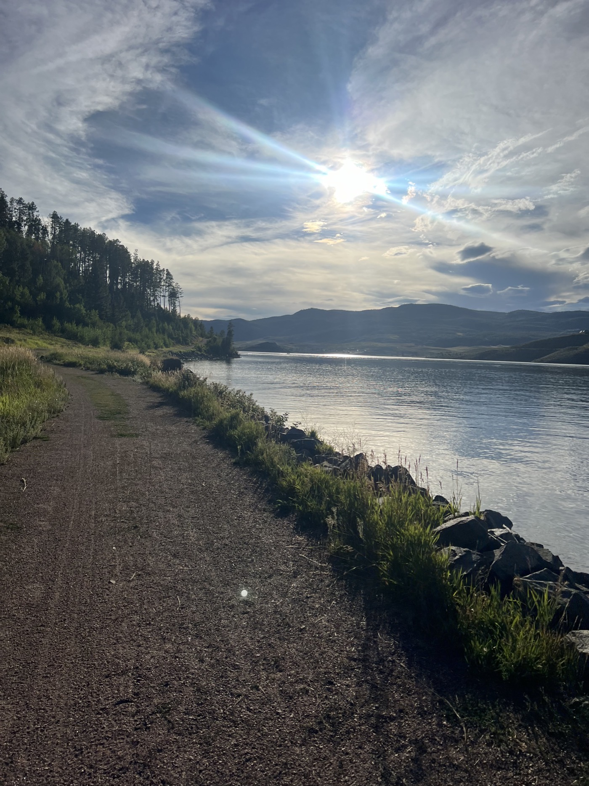
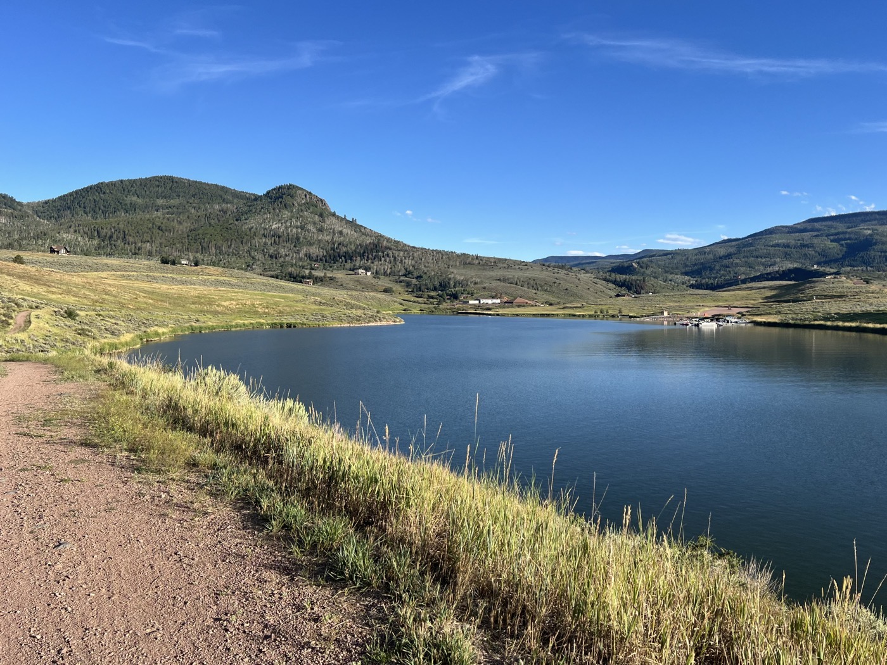

# 26. Leaving Brush Mountain Lodge

<figure markdown>
{ width=“300” }
</figure>

After stuffing myself with pancakes, I say goodbye to the lodge and tackle the first climb. I will need to push the bike. I pass through Steamboat Springs (a ski resort) and bivouac after 135 km. I’m getting ready for some elevation gain!

<!-- more -->

# Goodbye, Mythical Lodge 

This first lodge in Colorado really recharged me! The breakfast is royal, with pancakes galore. Kirsten has been running the lodge since 2008—she’s very attentive. The place is great, and I find it very affordable for everything that’s offered.

# The Passes of Colorado

The first climb ends at 3,000 m while pushing the bike. The vegetation is still present. But the forecast for the coming days looks daunting. More than 5,000 m of elevation gain to reach Salida. I’m thinking about how to manage this since I wanted to take a rest there. It’s the last town before heading into the wilds of New Mexico. I need to make the most of it!

# Ulrich Bartholmoes Drops Out

Few may know him, but he is among the leaders in bikepacking races. Last year he won the Tour Divide, and this year he finished second. However, he wanted to continue with the Colorado Trail Race and then the Arizona Trail Race. This is called the "triple crown." Just chaining them (with a few weeks in between) is insane. In short, Ulrich just dropped out very early in the Colorado race. Mental fatigue. I listened to his testimony—I think it takes guts to say no in this way. And when you no longer have the passion pushing you, knowing how to change course is a strength in my view! For those interested, [here’s the link (in English)](https://bikepacking.com/news/ulrich-bartholmoes-2024-colorado-trail-race-interview/).

!!! hint ""
    Click on the photos to see the comments.

<figure markdown>

{ width=“300” }

{ width=“300” }

{ width=“300” }

{ width=“300” }

{ width=“300” }

{ width=“300” }

{ width=“300” }

{ width=“300” }

{ width=“300” }

{ width=“300” }

</figure>
