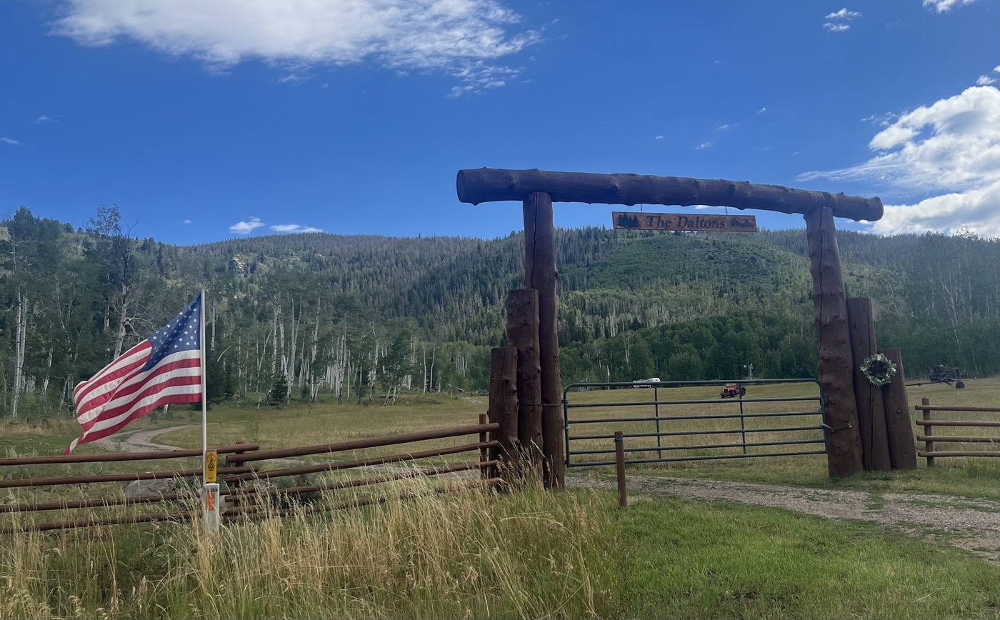
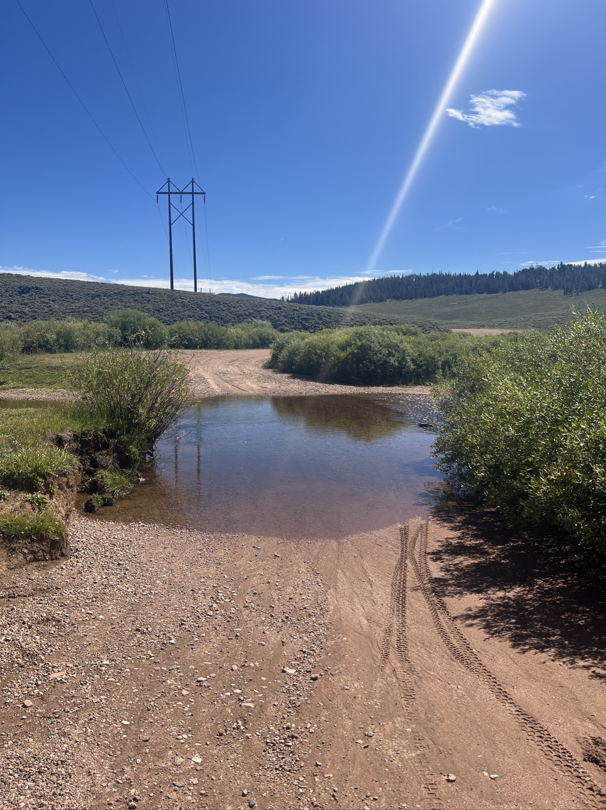
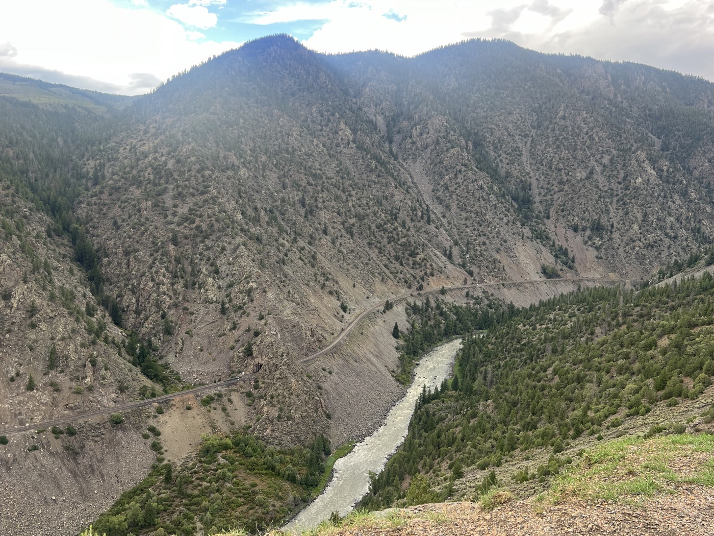
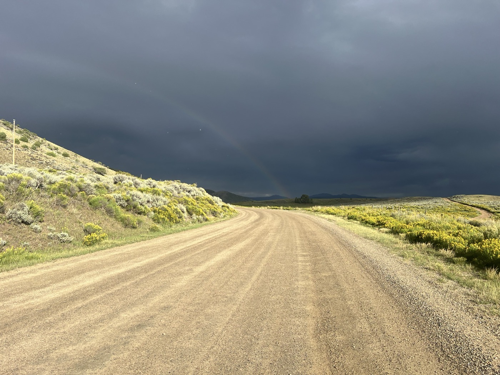
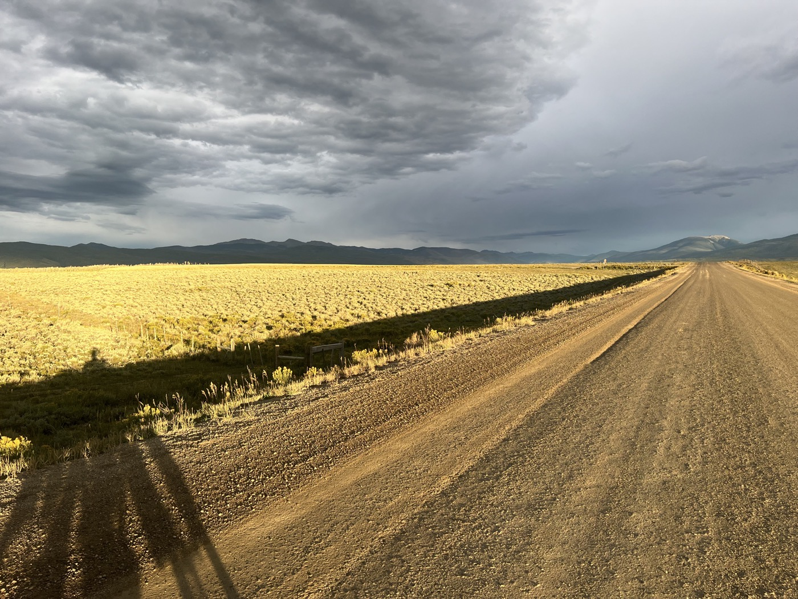

# 27. Colorado Has Relief!

<figure markdown>
{ width=“300” }
</figure>

I leave the bivouac but lose time tinkering with the bike. Finally, I tackle the climbs. Almost the entire day on gravel. Mountain-type landscape, sometimes resembling the Jura. The rocks have beautiful colors. I eventually stop to enter private land with a sign 😉.

<!-- more -->

# It Goes Up and Down...

It feels a bit like Sisyphus... I tackle the climb, but the descent is too steep to recover properly before it’s already going up again—darn! Otherwise, the landscapes are very green; it’s beautiful.

# Encounters

I think this was my last chance to see a moose or an elk. In other words, an elk, which is supposedly gigantic. But alas—didn’t see one. However, I did see a bighorn sheep cross right in front of me. It was so funny to see it bounding. Unfortunately, I could only capture it from behind. 

# Salida

My next goal is the town of Salida. It has a good reputation among the Dividers. It’s my last chance to repair the bike; after that, it’s New Mexico, and it’s quite wild. From here to Salida, I’ll pass through ski resorts, but I try not to stop. After Salida—it’s already a bit like the end is approaching, but I see the glass as half full 😉.

!!! hint ""
    Click on the photos to see the comments.

<figure markdown>

{ width=“300” }

{ width=“300” }

{ width=“300” }

{ width=“300” }

{ width=“300” }

{ width=“300” }

{ width=“300” }

{ width=“300” }

{ width=“300” }

{ width=“300” }

</figure>
