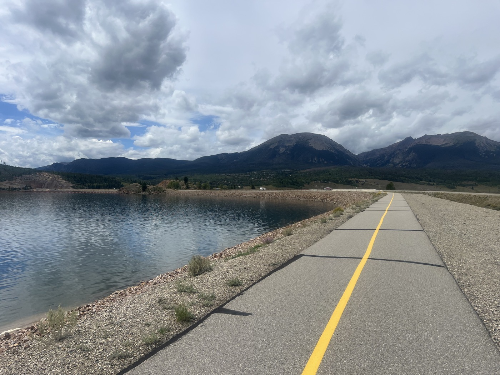
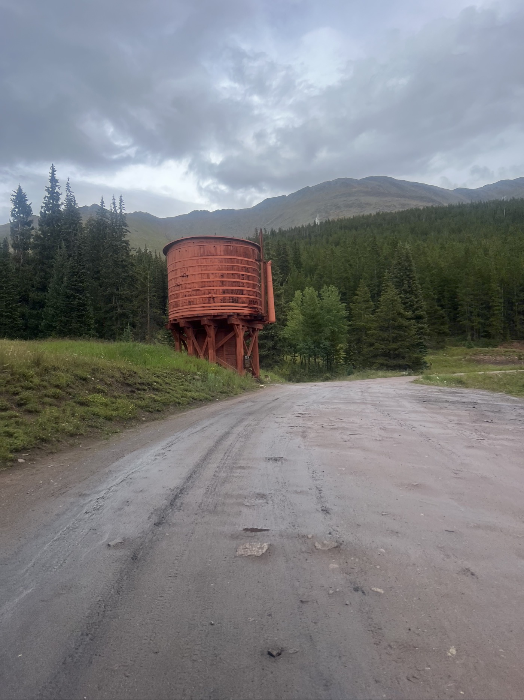

# 28. Boreas Pass 3,500 m

<figure markdown>
{ width=“300†}
</figure>

I leave Steve, who woke up happy with my tent in his garden. I tackle Ute Pass, then Silverthorne, Frisco, and Breckenridge, three ski resorts connected by a bike path. I cross Boreas Pass at 3,500 m, finishing in Hartsel, as close as possible to Salida (= rest). 150 km, 1,800 m elevation gain, 10 hours in the saddle!

<!-- more -->

# Skiing 🎿

Basically, there’s a duopoly in the USA. The resorts are either grouped under the Icon ski pass or the Epic pass. The annual pass costs $1,000. They are expanding their coverage internationally: Icon includes Chamonix and Zermatt, while Epic opens Crans-Montana in 2024/25. [The choice is quite immense](https://www.ski.com/epic-vs-ikon). It’s like the Magic Pass on a global scale (at double the price).

However, even though Silverthorne and Breckenridge are fairly average-sized towns (with no tall buildings), the snow lasts until May. Summer activities are very underdeveloped (no ski lifts were running). Breckenridge is very touristy/many shops. Thank goodness I didn’t stop 😅. Skiing is considered a rather luxury/exclusive activity.

# The Divide

Back to serious matters. The bike path is moderately interesting. But I pass some beautiful chalets. And above all, I tackle Boreas Pass in heavy rain. I put on my gear (including waterproof socks). It’s a long climb (2 hours) and chilly. Happy to have crossed the pass. The descent is very beautiful. But then, it’s endless gravel. I arrive at my destination in the dark and pitch my tent near Hartsel. I’ve spotted a café for my breakfast.

!!! hint ""
    Click on the photos to see the comments.

<figure markdown>

{ width=“300†}

{ width=“300†}

{ width=“300†}

{ width=“300†}

{ width=“300†}

{ width=“300†}

{ width=“300†}

{ width=“300†}

{ width=“300†}

{ width=“300†}

{ width=“300†}

{ width=“300†}

{ width=“300†}

{ width=“300†}

</figure>
