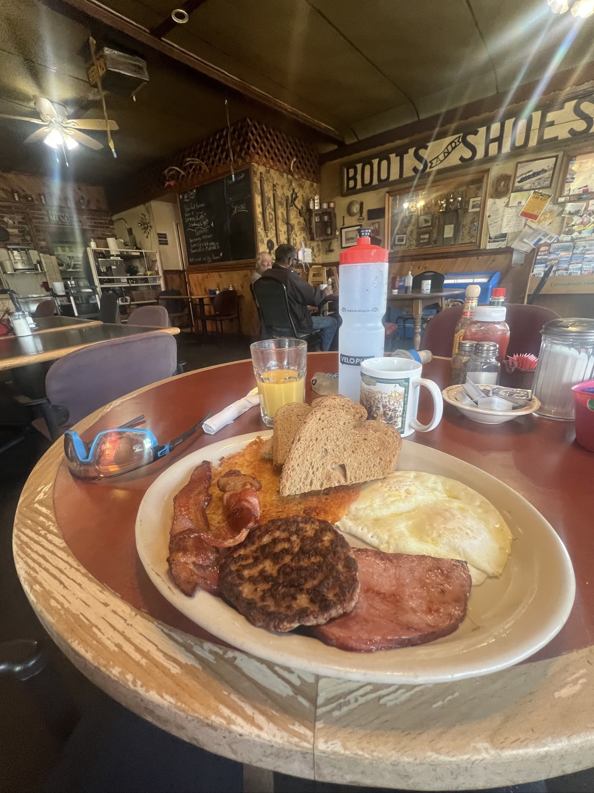
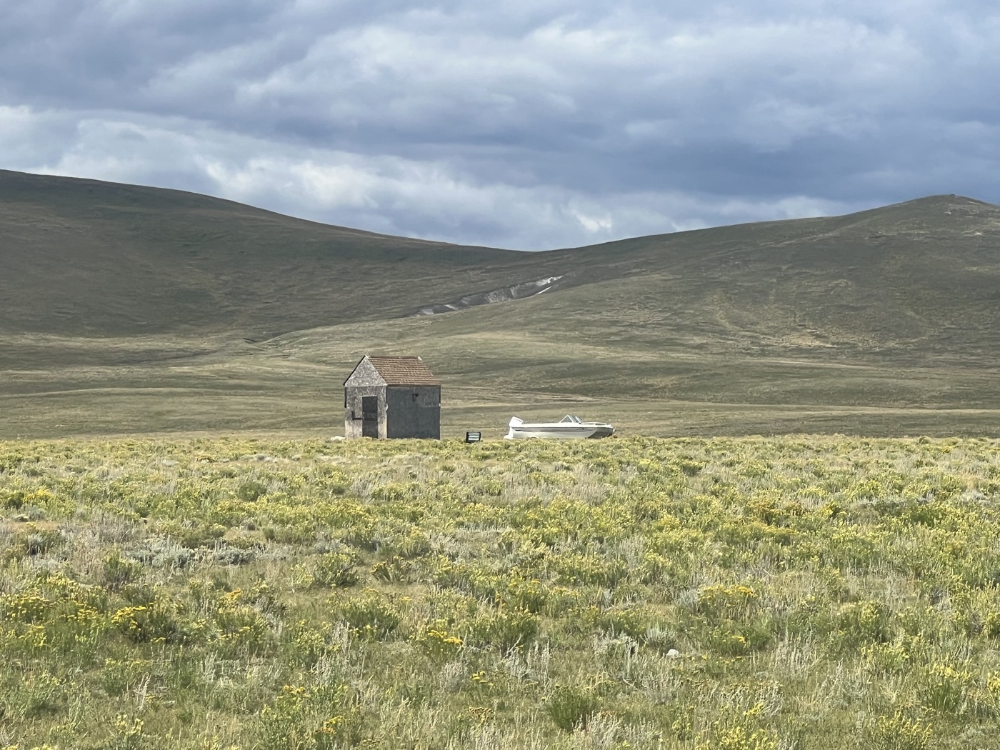
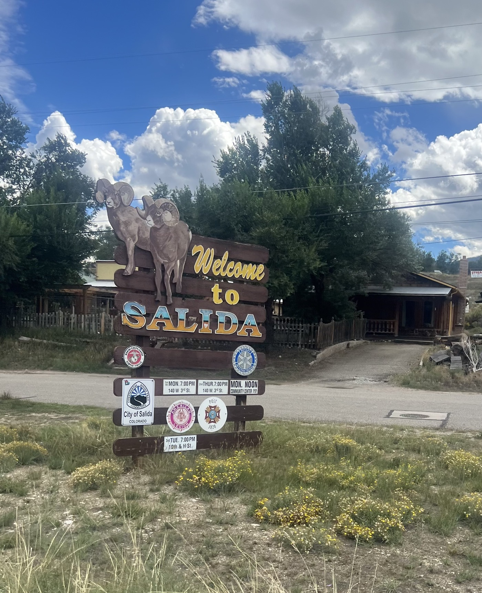
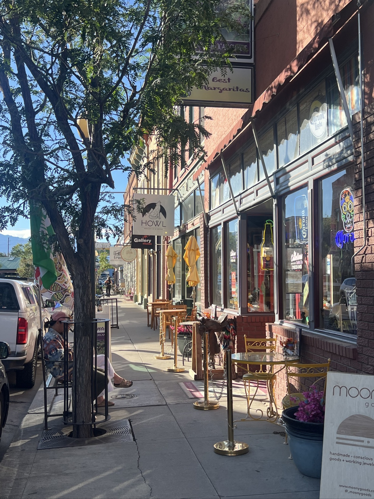
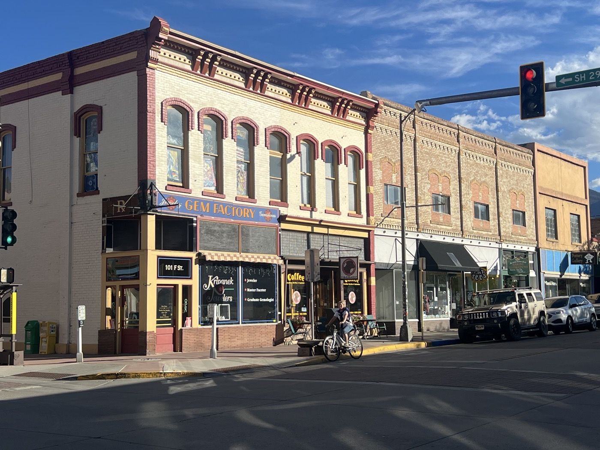
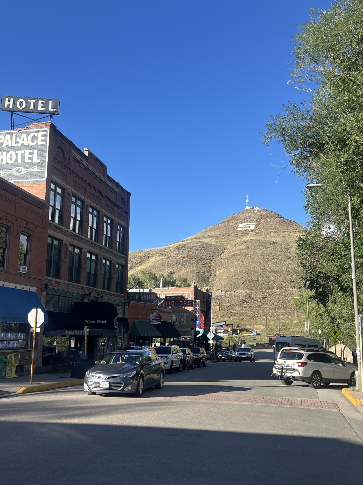
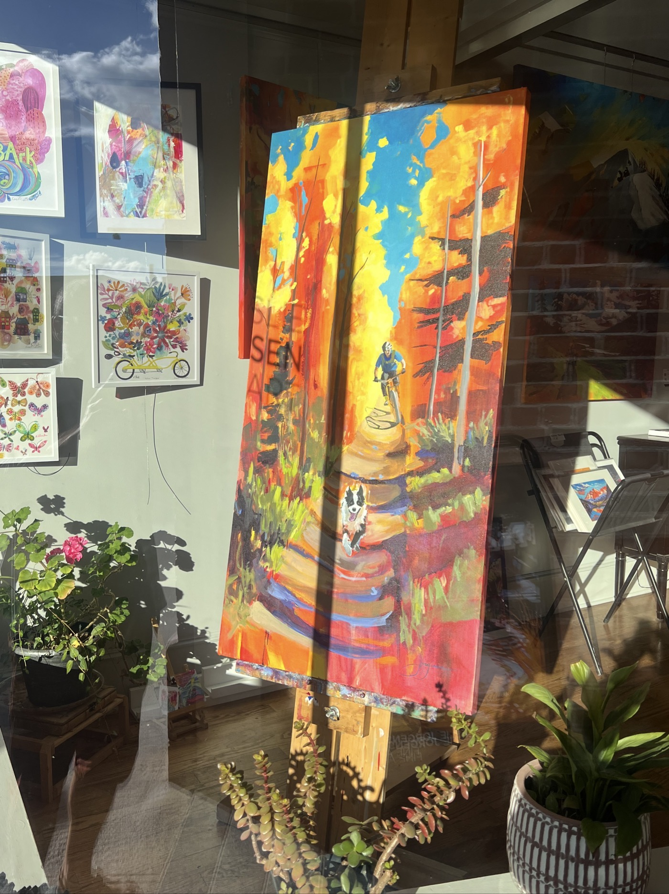
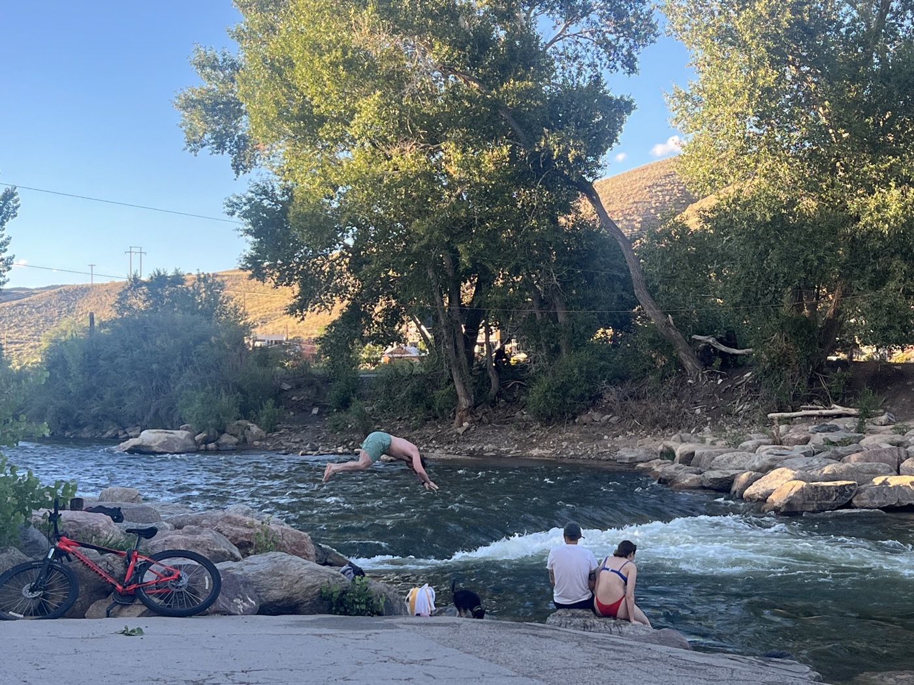
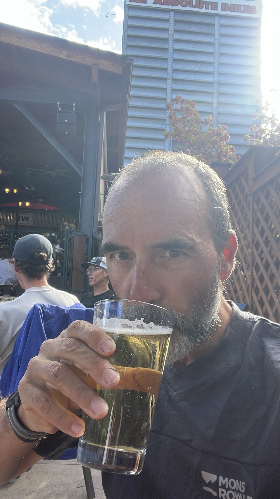

# Salida and a Bit of Rest

<figure markdown>
{ width=“300” }
</figure>

A magical moment with this beautiful "breakfast," let’s call it a meal. I set off because I want to reach Salida. Today my son Loïc turns 12! I want to have a signal to talk to him and spend some time in town. Not counting on the wind and the difficulty of the terrain. Upon arriving in Salida, I’ve surpassed 3,000 km since Calgary. I’m at the same latitude as Lisbon 💪.

<!-- more -->

# A Moment Outside of Time

After a chilly and damp night under the tent, I discover this little café that serves brunch. It’s simple, but the atmosphere is magical. A western vibe, country music, the men wear hats, and the waitress Abby sings (formidable in karaoke, in my opinion). I use Shazam to enrich my divide playlist for my return. Honestly, I wish you all such a moment of peace at breakfast. A challenge for the coming days? To savor and let oneself be carried away.

# On the Road to Salida

Fully charged, I tackle the road. A headwind and, especially, washboarding for 30 km. Horror. My average speed plummets. I struggle as best as I can and start calculating how to get over the pass above Salida, the moment when I’ll have signal. I double my efforts and remind myself that any bad moment is just temporary. My legs respond well; a final push, and phew, we manage to see each other. A great family moment, and happy birthday to my boy 🥳🎂🎁. It’s tough to be away, nonetheless.

# Salida

The descent into Salida is fantastic. And the town is really lovely. Much more authentic than ski resorts with an alternative vibe. Biking is well represented through restaurants and art shops. I love it; it’s a great place to hang out. I get one last service done on my bike. I eat two big meals: I’ve never been so skinny despite all the protein I’m downing 🤔. My stomach hurts tonight from how much I’ve eaten 🍽️😆.

!!! hint ""
    Click on the photos to see the comments.

<figure markdown>

{ width=“300” }

{ width=“300” }

{ width=“300” }

{ width=“300” }

{ width=“300” }

{ width=“300” }

{ width=“300” }

{ width=“300” }

{ width=“300” }

{ width=“300” }

{ width=“300” }

</figure>
