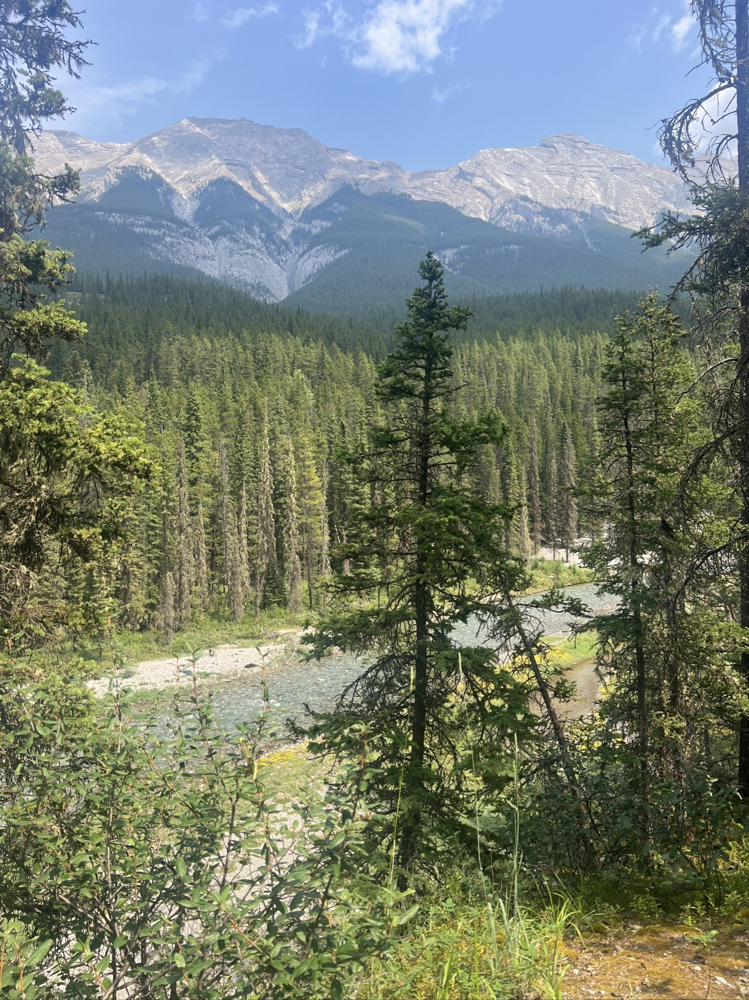
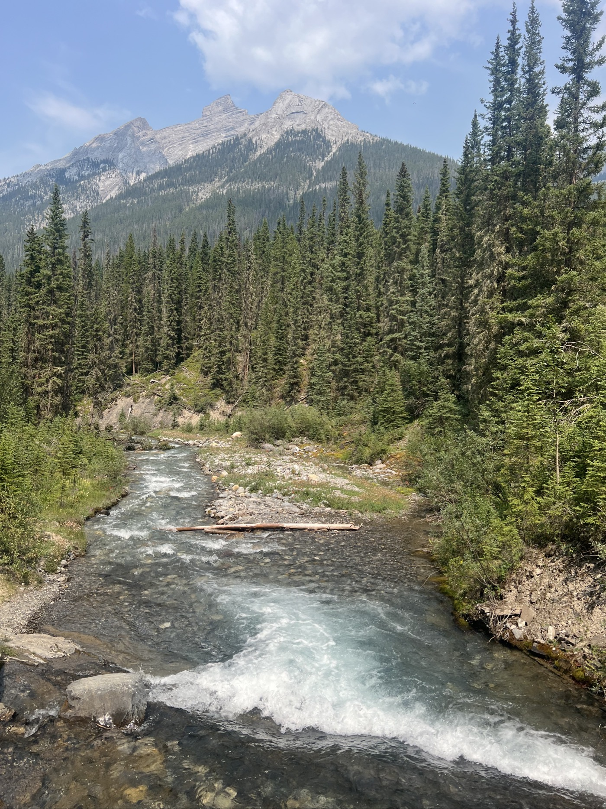
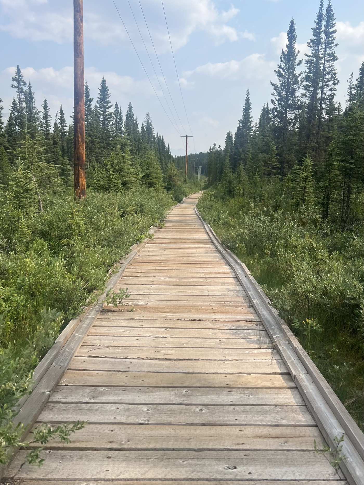

# The Day of the Grand Depart

<figure markdown>
{ width=“300†}
</figure>

It is happening for real: it's MY Grand Depart. Ideal course for gravel, breathtaking landscapes. Camping by Spray Lake Reservoir, there are just 2 cyclists. It's great, but now we need to move forward! I discover solitude in front of the vast spaces.

<!-- more -->

Departure in the early afternoon after doing some shopping and downloading detailed maps of Canada and the USA onto my GARMIN. Can you believe I didn't check beforehand? 🙃 And I won't tell you the hassle of finding a good soul with a computer. Cybercafés are a thing of the past (you need a computer 😳). I was directed to the public library (which was closed). Anyway, everything was sorted thanks to Gayle, a kind lady who runs a flannel shop. Unbelievable, right?

And once out of town, I enter another world. A beautiful route, grandiose, and not a soul around. Just a partridge that flies away (which gives me quite a scare).

The route also has its traps. On sand, it moves along, but with speed, you risk misjudging the dips, which can sometimes be very steep and could block the front wheel. On the stones, it shakes, and some can be quite large. It’s never boring, and I feast my eyes on these wild spaces.

End of the day on a "gravel highway" (40m wide). The 4x4s kick up a lot of dust. The track is "washboarded" like cardboard. It shakes. I understand why there is a market for suspended saddles.

I finish at a campsite reserved for cyclists. We self-register and pitch our tent. It's rudimentary but reserved for "hikers/bikers," so it’s not full. There are dry toilets. No water. I plan to filter water from the small lake. The price is always around 30 CAD. I get to know an Australian who also started today. But he’ll go slower (and farther). He has a beautiful Surly steel frame with a Jones Bar handlebar. I learn that in Australia, after working 7 years for the same company, one is entitled to 6 months of paid leave. Food for thought?

The tent is by the lake (the mosquitoes too) - it's beautiful. The night is quite cool, and I'm comfortable in my tent and quilt (I’ll explain another time).

<figure markdown>
{ width=“300†}

{ width=“300†}

{ width=“300†}

{ width=“300†}

{ width=“300†}

{ width=“300†}

{ width=“300†}

{ width=“300†}

{ width=“300†}

{ width=“300†}
</figure>
