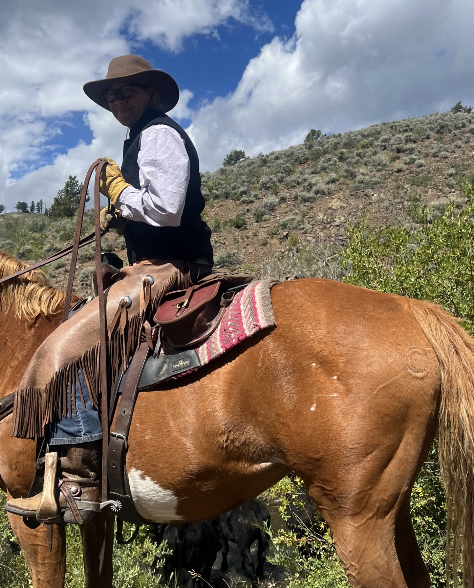
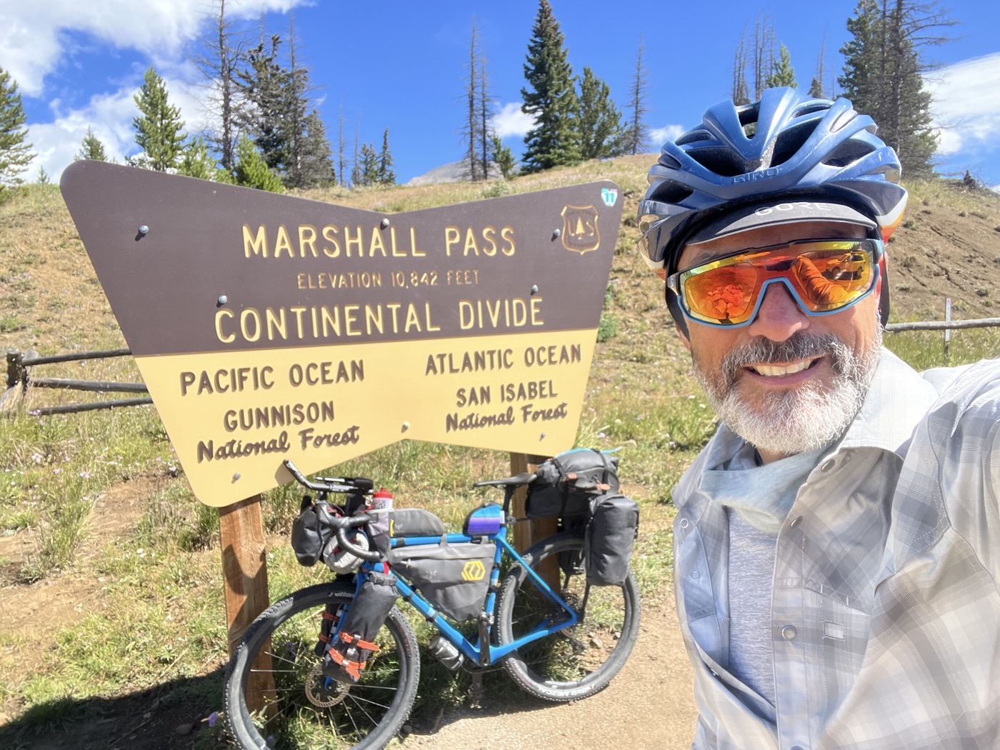
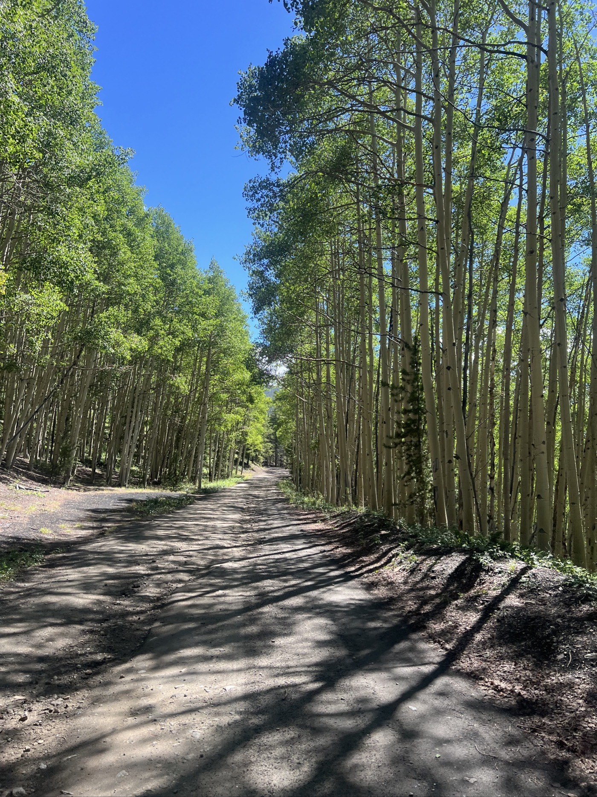
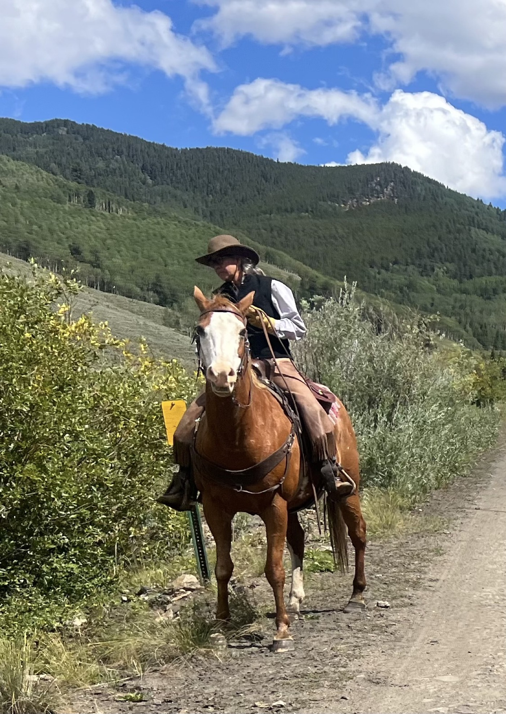
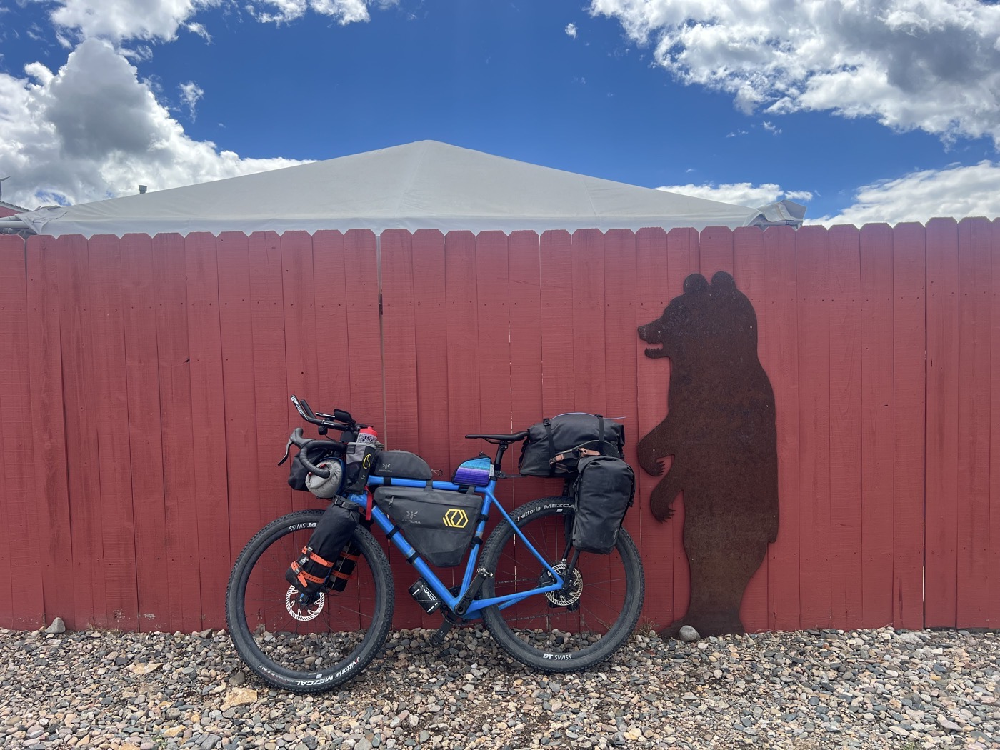
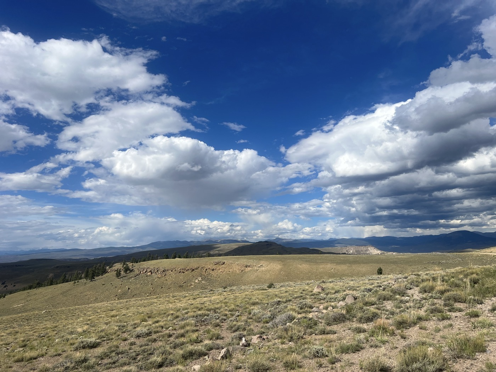

# Cow-Girl

<figure markdown>
{ width=“300” }
</figure>

I leave Salida in the late afternoon. The bike is operational again. I sleep not far away, then tackle two passes over 3,000 m. I encounter my first Cow-Girl! It rains every afternoon, but the weather is improving.

<!-- more -->

# The Fairer Sex

Although we are far from gender parity, I’ve encountered many women who are hiking the CDT (very tough and particularly wild), who are doing the Divide (both as couples and solo). A female bike mechanic. A cow-girl who knew how to drive her cattle! And there’s even a woman running for president 😁. In short, there are no limits, and I think it’s quite wonderful. I hope to inspire women to pursue their adventure dreams in all forms.

# Dream

The landscape is slowly changing. Fewer animals, I’m starting to discern cliffs in the prairies, but the photos aren’t quite telling yet. The trails mention names of Indian tribes like the Comanches or Apaches. This brings back childhood dreams for me, as I was a big reader of the adventures written by Karl May, for example, or comics like Blueberry or Comanche, in fact. I hope to immerse myself in that atmosphere soon!

# Weather

It rains every day. I’m trying to plan a bit. By the end of the week, I hope the weather stabilizes; otherwise, it will be a hassle in New Mexico. I’m also waiting for a part for the bike; Andrew from Absolute Bikes in Salida did a remarkable job (complete disassembly of the Campi EKAR derailleur). But for the rear axle, a part got lost in one of the previous bike shops. We’ve improvised as best we could; I’m trying to have the original Tailfin part delivered; I hope it works out!

!!! hint ""
    Click on the photos to see the comments.

<figure markdown>

{ width=“300” }

{ width=“300” }

{ width=“300” }

{ width=“300” }

{ width=“300” }

</figure>
