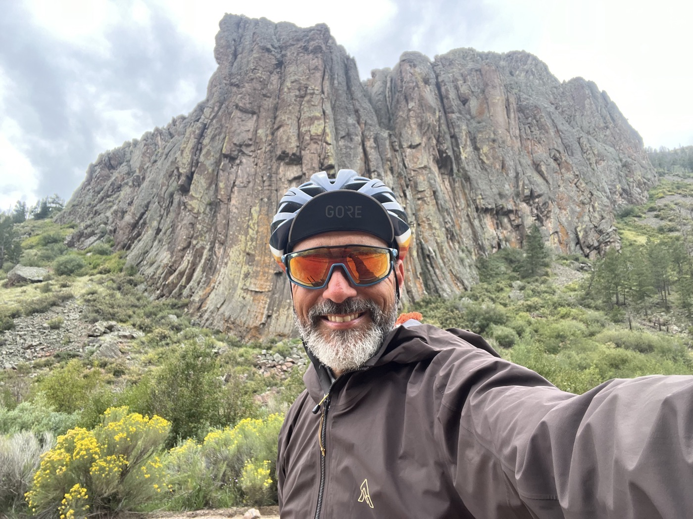
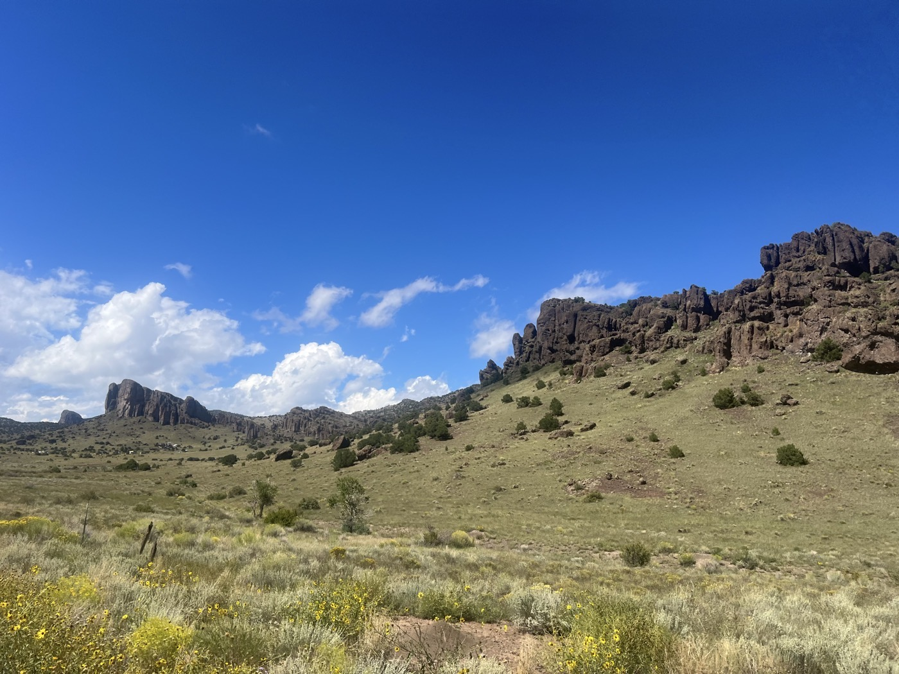
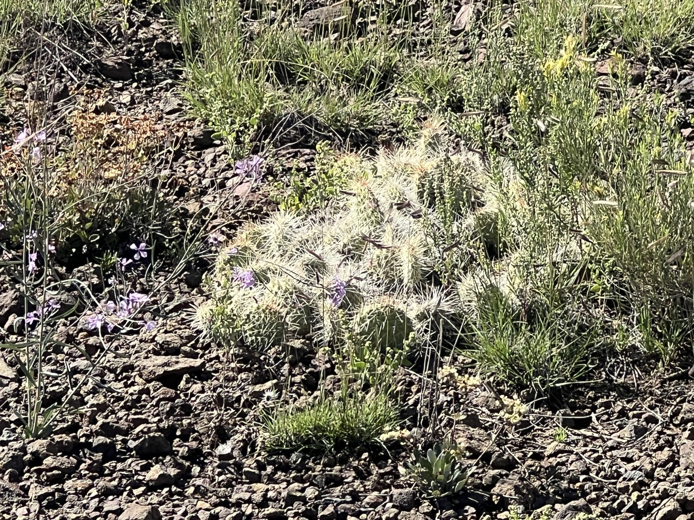
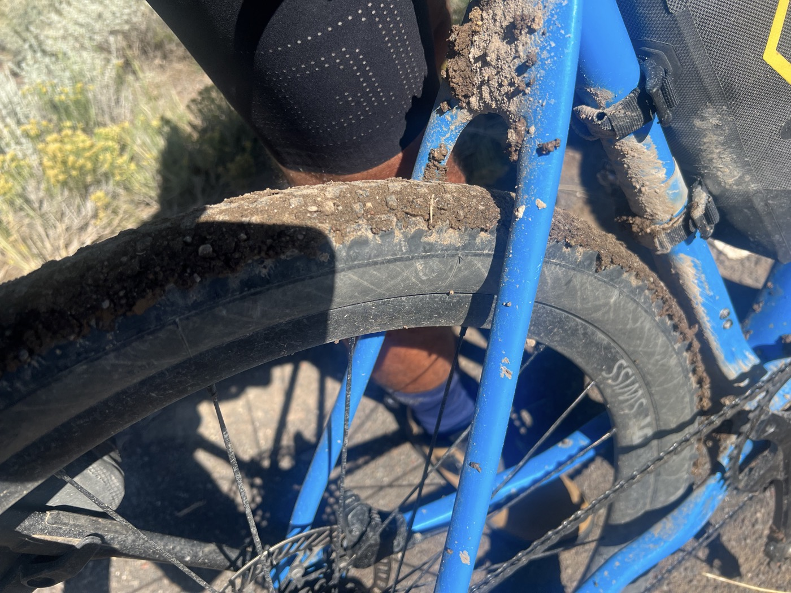
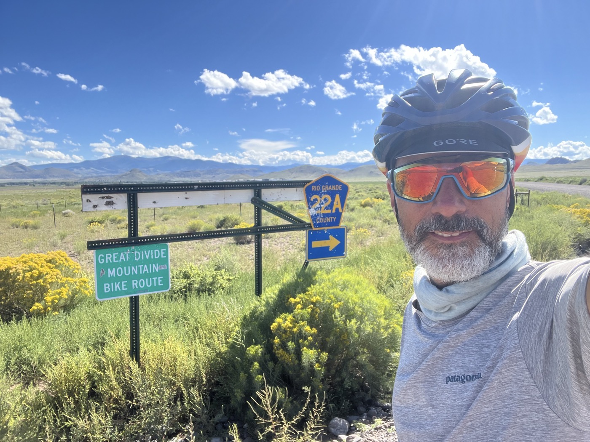
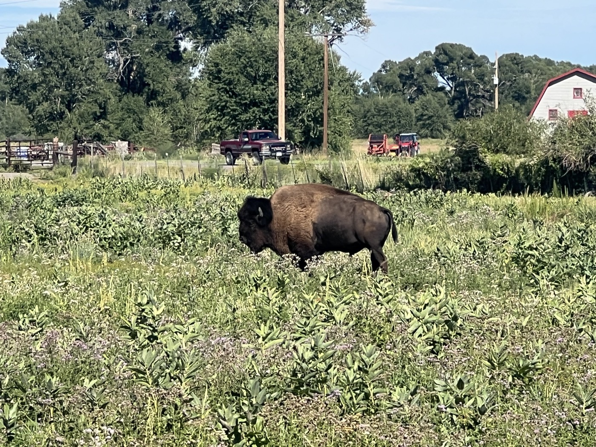
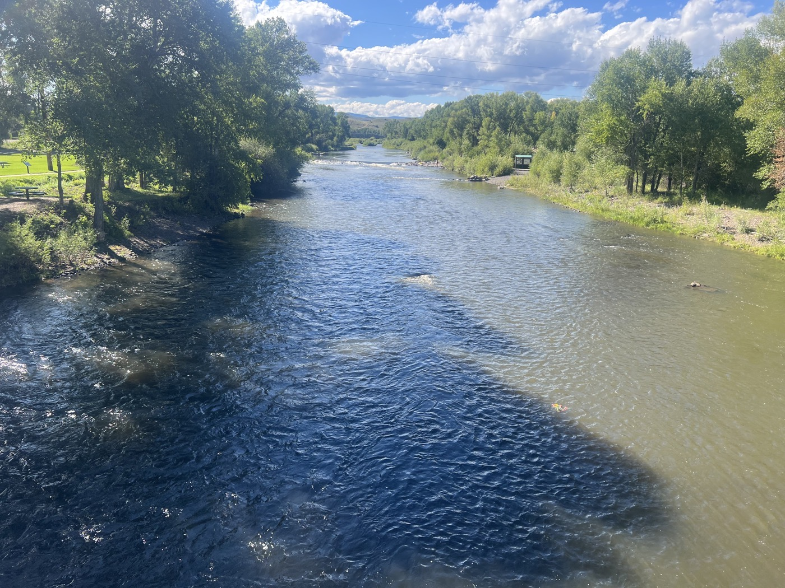
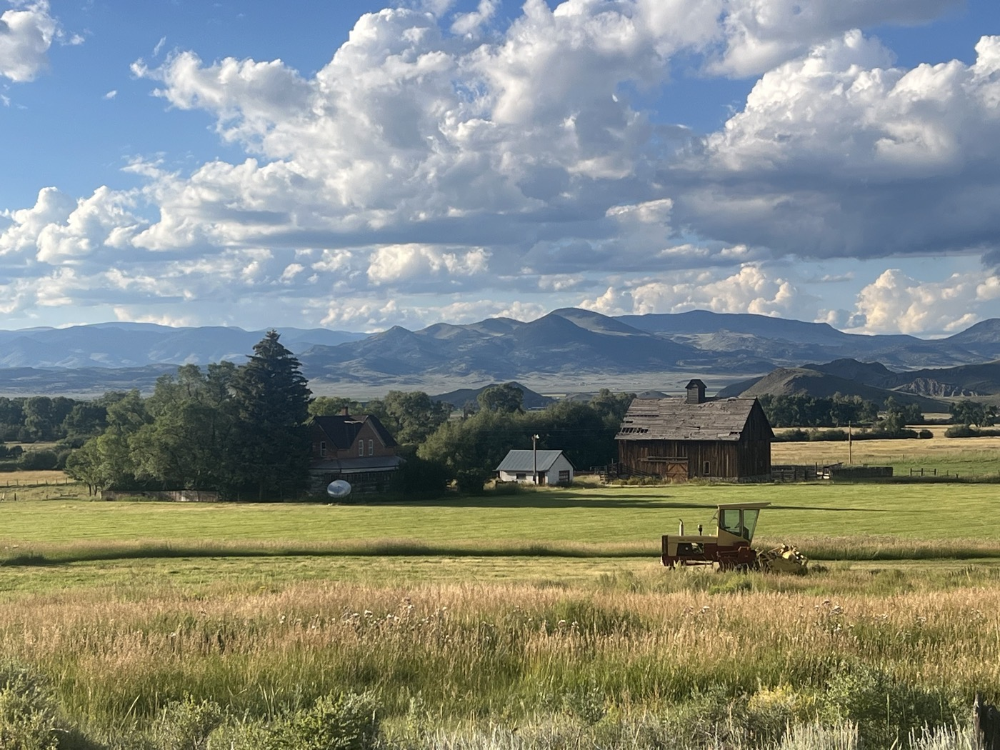

#  Del Norte - le Colorado sauvage

<figure markdown>
{ width=“300” }
</figure>

Je plie la tente ⛺️ encore humide des pluies nocturnes, au son des coyotes. Un col à passer dans le gris matinal, puis longue descente. Vers la Garita. Je poursuis vers Del Norte, le soleil se montre enfin. Les roches deviennent colorées, je passe le Rio Grande. Quelques courses puis bivouac dans la montée de l'Indiana Pass.

<!-- more -->

# Je retrouve le sourire

Ces derniers jours manquaient de nouveauté. Mais cet après-midi, le soleil et le beau temps reviennent. Le Colorado se met à ressembler au Colorado comme on l'imagine. La trace devient ludique et joyeuse. Single trail. C'est top.

# Ce qui est devant

Cette partie contient un maximum de dénivelé (2'000m tous les 100km au lieu des 1'000m de ces derniers temps). Je sais pas encore le rythme que je pourrais prendre. Je dois augmenter mes réserves en eau car cela redevient un peu aride aussi. Et le terrain évolue aussi. Plus de pierres et de sable. J'ai eu un avant goût de la peanut butter sur mes pneus aujourd'hui.

# Reprendre un rythme

Je me disais aujourd'hui que je passais cette difficulté du 30eme kilomètre du marathon. Le gros est fait, mais il faut puiser dans les réserves pour se relancer en visant l'arrivée. Mais tout le monde me dit que le Nouveau-Mexique est très beau donc ça me motive. J'essaie aussi de plus manger pour trouver un meilleur équilibre 😁.

!!! hint ""
    cliquez sur les photos pour voir les commentaires

<figure markdown>

{ width=“300” }

{ width=“300” }

{ width=“300” }

{ width=“300” }

{ width=“300” }

{ width=“300” }

{ width=“300” }

{ width=“300” }

{ width=“300” }

</figure>

