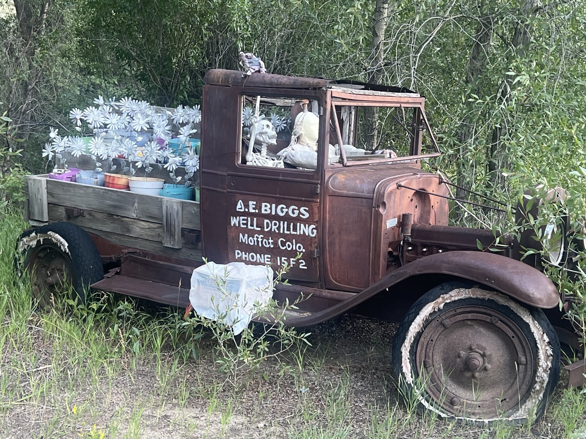

# 31. Del Norte - The Wild Colorado

<figure markdown>
{ width=“300†}
</figure>

I fold up my tent ⛺️ still damp from the night rains, to the sound of coyotes. One pass to get over in the morning gray, then a long descent. Toward Garita. I continue toward Del Norte, and the sun finally appears. The rocks become colorful as I cross the Rio Grande. After a few errands, I set up camp during the climb to Indiana Pass.

<!-- more -->

# I'm Finding My Smile Again

The last few days lacked novelty. But this afternoon, the sun and good weather return. Colorado starts to look like the Colorado we imagine. The trail becomes playful and joyful. Single trail. It’s fantastic.

# What Lies Ahead

This part has a maximum elevation gain (2,000 m every 100 km instead of the 1,000 m of recent days). I don’t yet know the pace I can maintain. I need to increase my water reserves as it’s becoming a bit arid again. And the terrain is evolving too. More stones and sand. I got a taste of the peanut butter on my tires today.

# Getting Back Into Rhythm

I was thinking today that I’m passing the difficulty of the 30th kilometer of the marathon. The bulk is done, but I need to dig into my reserves to get back on track, aiming for the finish. But everyone tells me that New Mexico is very beautiful, which motivates me. I also try to eat more to find a better balance 😁.

!!! hint ""
    Click on the photos to see the comments.

<figure markdown>

{ width=“300†}

{ width=“300†}

{ width=“300†}

{ width=“300†}

{ width=“300†}

{ width=“300†}

{ width=“300†}

{ width=“300†}

{ width=“300†}

</figure>
