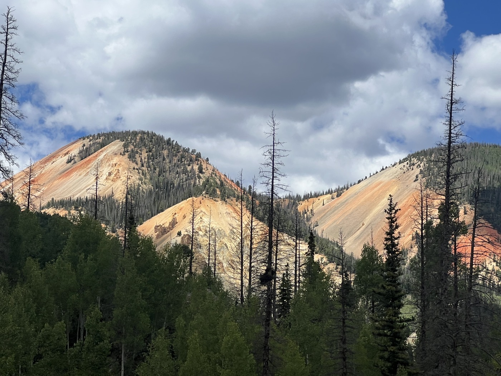

# 32. Altus Maximus

<figure markdown>
{ width=“300†}
</figure>

I tackle the Indiana Pass, which tops the Divide passes. It’s a long climb, but the weather is nice. After that, it plunges down to follow a beautiful river. Views of the colorful mountain slopes (rich in iron). I take a break in Platoro. Then onto Manga Pass: bivouacking on the border, I sleep in New Mexico!

<!-- more -->

# Indiana Pass

It’s climbing! Today I accumulated 2,200 m of elevation gain. I’m wandering between 2,500 and 3,500 m. Even being acclimatized, it’s tough. You have to hang on during the climbs!

# Adventure, Always

I’m finding my sensations again. Today the trail is wilder, still no network (sorry for the lack of updates). But this is what gives me joy: being a nomad alone on my bike, grappling with the adventure that changes every day. Exploring and pushing my limits. Enjoying the invigorating environment and raw nature. 💪!

# The Next Steps

I need to find a signal to properly assess my options. Between Abiquiu, Cuba, and Grants, it's complicated. At worst, I’ll take the road if the trail isn’t passable. I’m aiming for El Rito and Abiquiu in the next 48 hours. I have just over 1,000 km left to the border. But it’s the elevation gain that will set the pace. To be continued...

!!! hint ""
    Click on the photos to see the comments.

<figure markdown>

{ width=“300†}

{ width=“300†}

{ width=“300†}

{ width=“300†}

{ width=“300†}

{ width=“300†}

{ width=“300†}

</figure>
