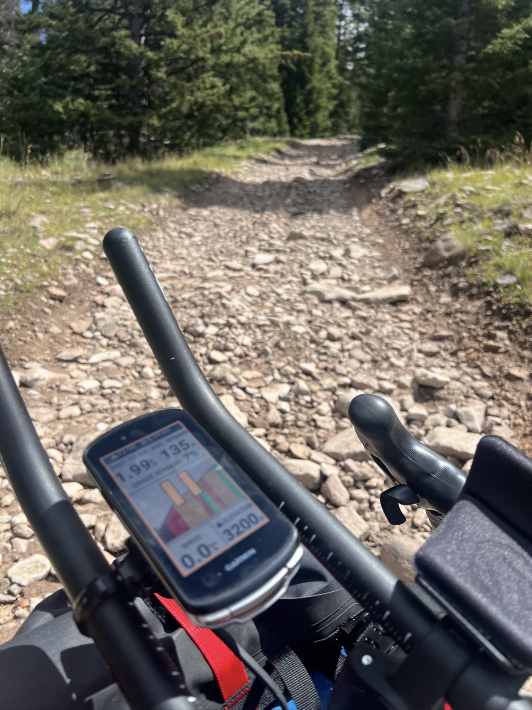

# Land of Enchantment - Really?

<figure markdown>
{ width=“300†}
</figure>

I am in the Land of Enchantment, my last American state before the border 💪. It’s getting tough—I quickly taste the unique relief of the Tusa Mountains. I escape the rain, but not the terrain my route traverses. I get bogged down and waste a lot of time trying to get past the peanut butter muck. Adventure and challenge are here!

<!-- more -->

# Defiant

The trail is totally impassable! Lots of gravel, and I’m flexible and riding in a standing position. Gravel is stylish for that 🕺. But it climbs, and soon I find myself in a bed of stones. I have to push. In the descent, my bike bounces everywhere. It’s like hard rock AC/DC in fast forward. Forget about being smooth... I pray that nothing breaks.

# Letting Go

It’s impossible to control things today. My average speed is ridiculous. But that’s okay; my fighting spirit keeps me going. No matter how long or where, I push forward. I clear my mind and face the difficulties head-on. I’m like a fakir on the saddle, I accelerate downhill, and I push when it’s not moving. I dodge puddles and mud.

# Peanut Butter

I pick up speed and notice a bike tire track? I think I can catch up. Then, I see nothing coming; the surface looked just sandy, but it sticks to the wheels. I skid and, whoops, I fall. My knee is a bit scraped; I’ll have bruises, but it’s nothing serious. Except that... the bike won’t budge. I push it 1.5 meters, and the wheel is stuck. The mud sticks to the wheel and thickens. I go to the edge where there are some stones. Well, the stones stick to the wheel too! 😱. I grab a stick to clear the mud. I make another meter. Now I need to think about my options... Night is approaching, and I don’t plan to linger. I push/clean, I carry. It’s really a hassle, and it takes me 1.5 hours to get out of it. But I made it out; that’s what counts. I ride a bit at night to make up some of my lost time.

Tomorrow I’m aiming for a lodge in Abiquiu. The weather isn’t improving enough, so I’ll probably adapt my route for the next few days (Cuba, Grant). There’s no need to persist with the peanut butter; I’ve learned my lesson 😉.

!!! hint ""
    Click on the photos to see the comments.

<figure markdown>

{ width=“300†}

{ width=“300†}

{ width=“300†}

{ width=“300†}

{ width=“300†}

{ width=“300†}

{ width=“300†}

{ width=“300†}

{ width=“300†}

</figure>
