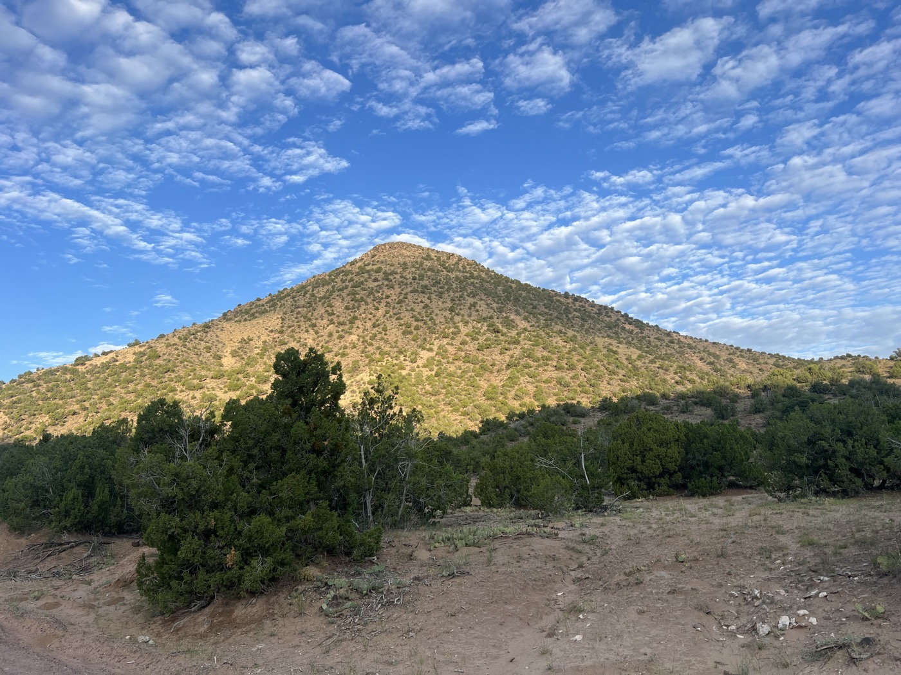
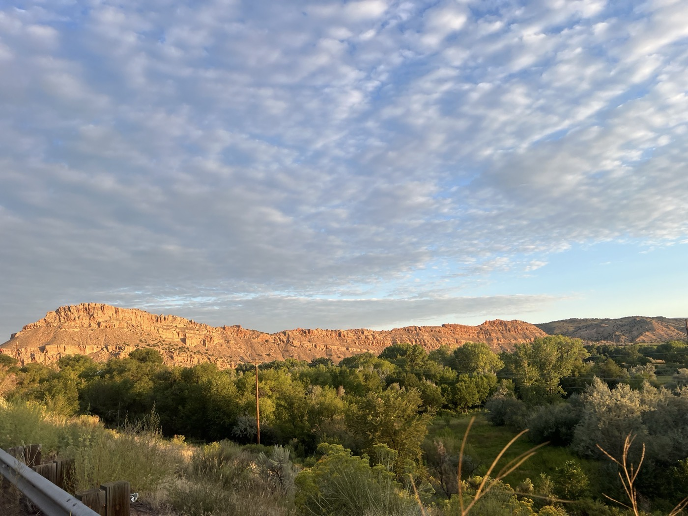
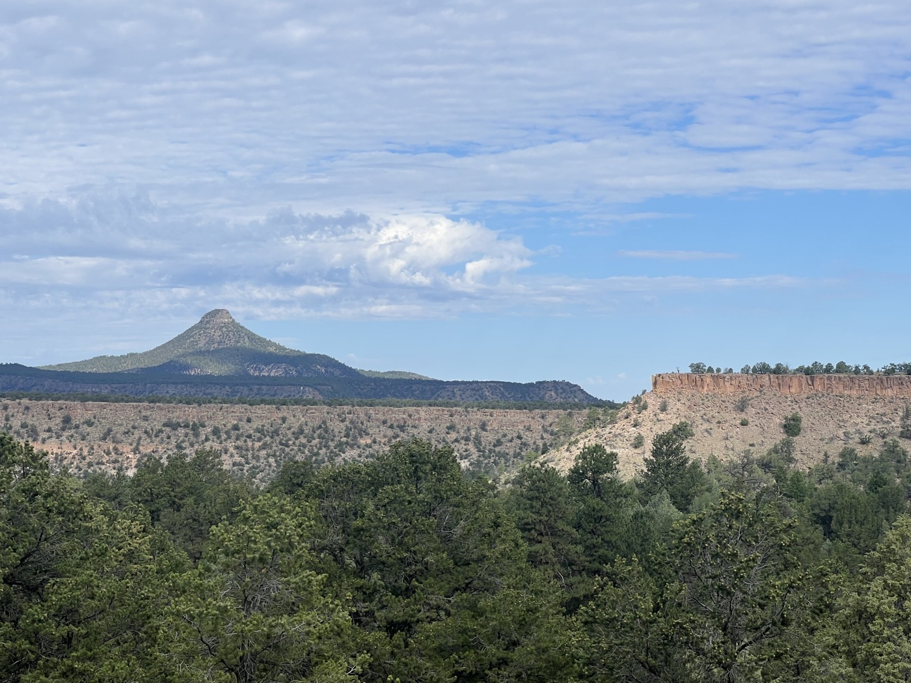
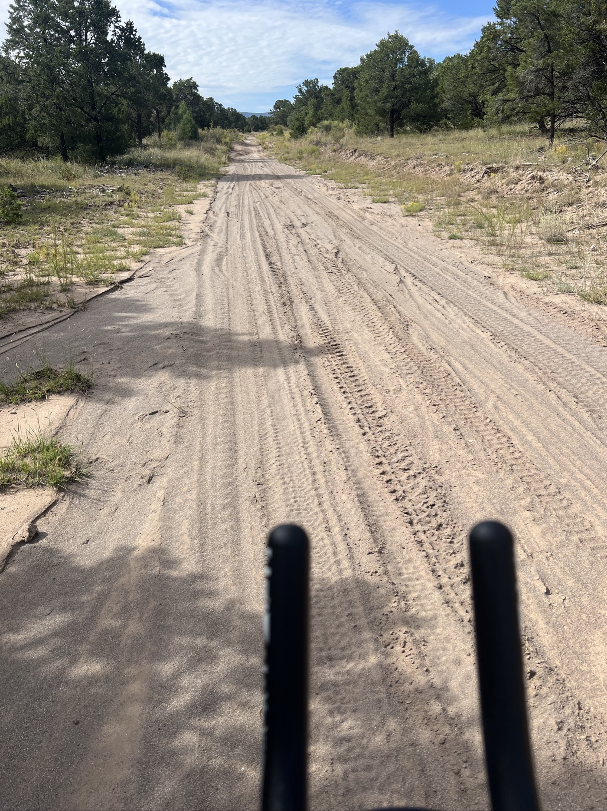
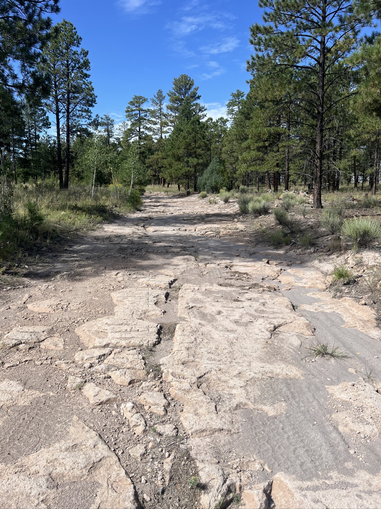
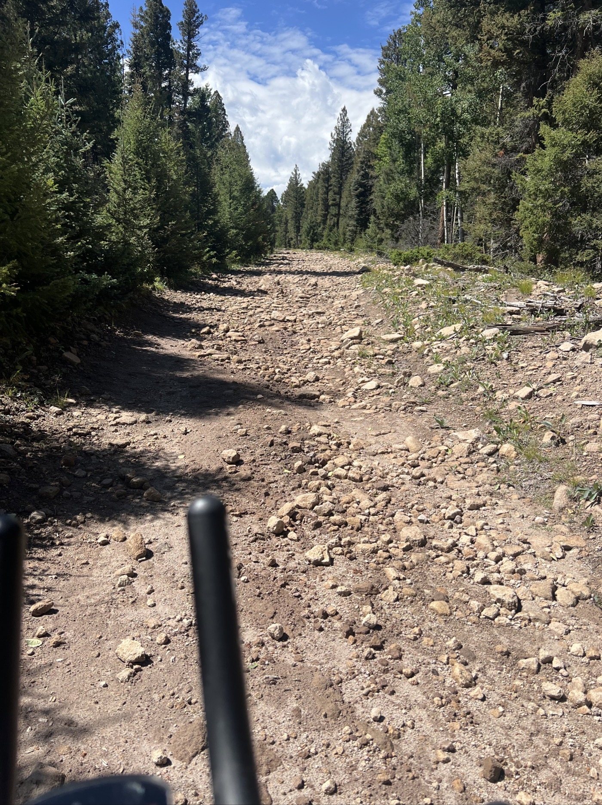
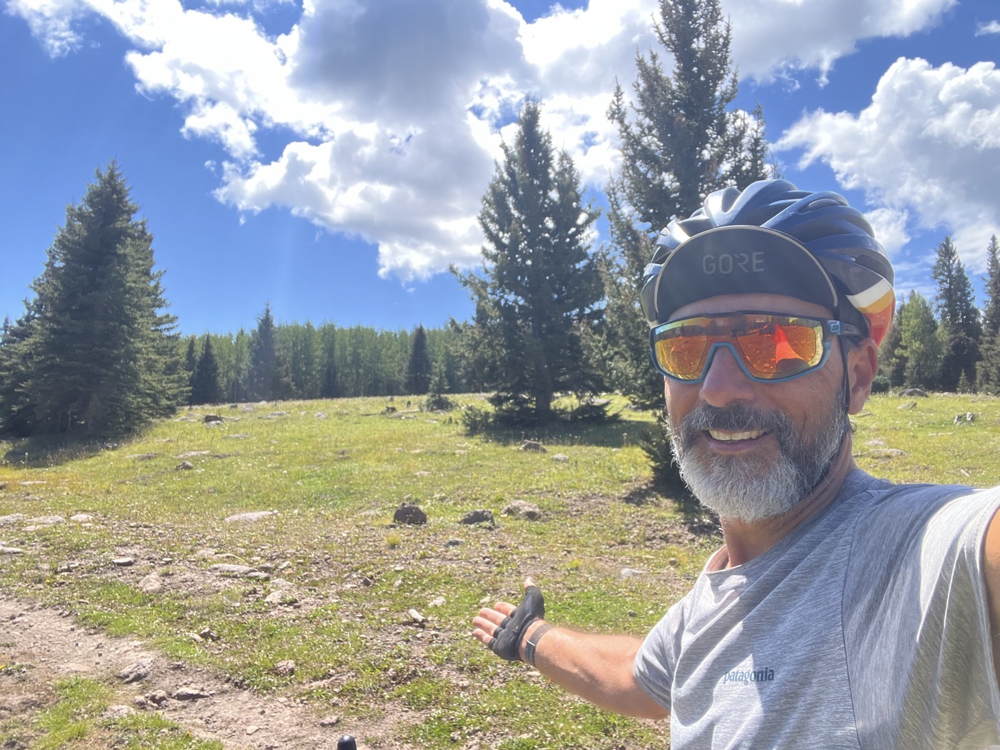
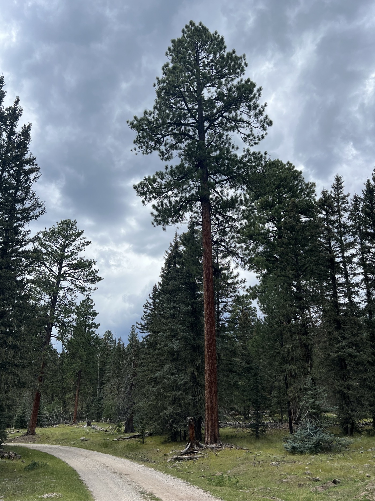
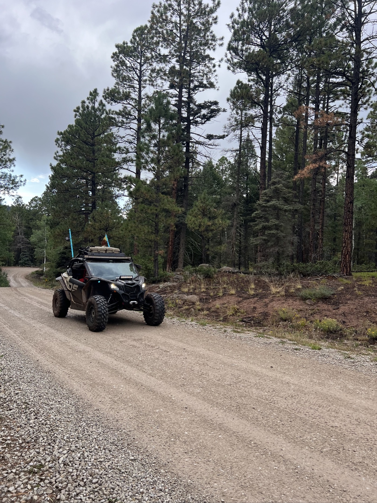
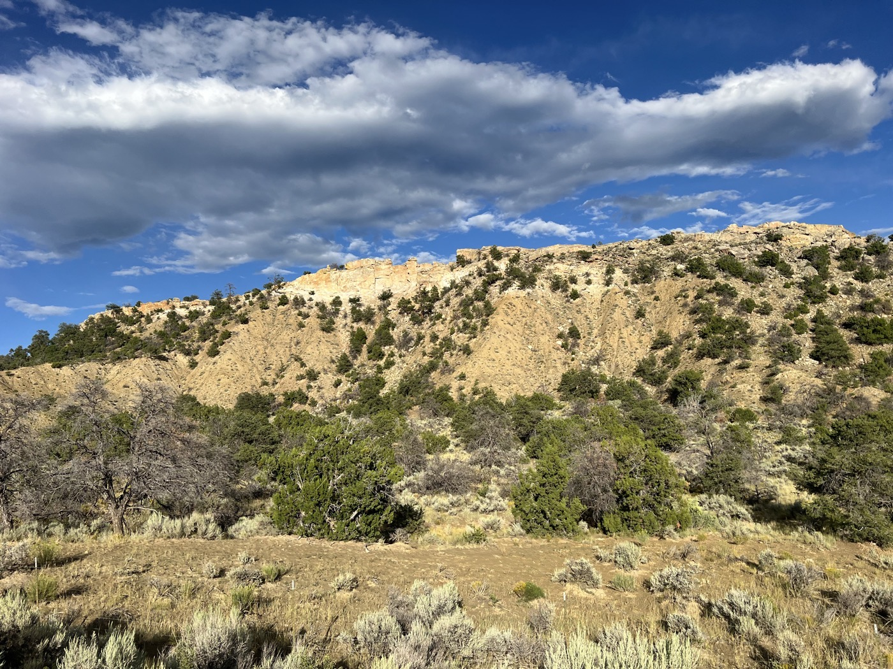

# 35. Abiquiu to Cuba

<figure markdown>
{ width=“300” }
</figure>

Finally, the weather seems to be holding up, and I set off on the route to Cuba. It’s a big stage (125 km and 2,400 m of elevation gain), and I take off around 6:30 a.m.—a record for me. The climb is known to be the hardest (in terms of terrain and length) on the GDMBR. It’s a fantastic route, and I'm happy I didn’t take the detour on the road like others. At the end of the climb, I raise my arms to the sky 💪.

<!-- more -->

# From Abiquiu to Cuba

The beginning goes well; it’s fairly rideable. But then the terrain becomes complicated. Sand, sharp volcanic stones, rocky slabs. In total, there are 25 miles of climbing, and I reach the top at 12:30 p.m. This is the last time I exceed 3,000 m. I grit my teeth and don’t let up. Incredible what gravel can handle. They recommend a full-suspension bike (with a telescopic fork for cushioning and wide tires), but I managed 😅. Upon arrival, I raise my arms to the sky and let out a victory cry. I want to be humble, but this feels earned, in all modesty ☺️.

The afternoon is a succession of climbs and small descents. I still need to gain an additional 1,000 m of elevation before enjoying the descent toward Cuba (on the road, but it’s 15 km of pleasure). 

# The Next Steps

I continue to plan. The weather is bothering me. Rain/storms are expected later in the day. From Cuba, they strongly recommend the paved road toward the Chico Indian Reservation as an alternative route to reach Grants. The route through the track has a significant peanut butter factor. I’ll decide at the last minute.

The border is in sight; after Grants, there are only 2 towns left (Pie Town and Silver City). But they also forecast east winds (which will be lateral for me) with gusts up to 40 km/h. I feel like it’s going to be a challenge until the end!

!!! hint ""
    Click on the photos to see the comments.

!!! question ""
    🇫🇷 If you’ve followed me this far, a comment is welcome! 🇺🇸 If you followed me until here, a comment will be welcome! [>> Click here](https://forms.office.com/r/5TiedXLRaN)

<figure markdown>

{ width=“300” }

{ width=“300” }

{ width=“300” }

{ width=“300” }

{ width=“300” }

{ width=“300” }

{ width=“300” }

{ width=“300” }

{ width=“300” }

{ width=“300” }

{ width=“300” }

</figure>
