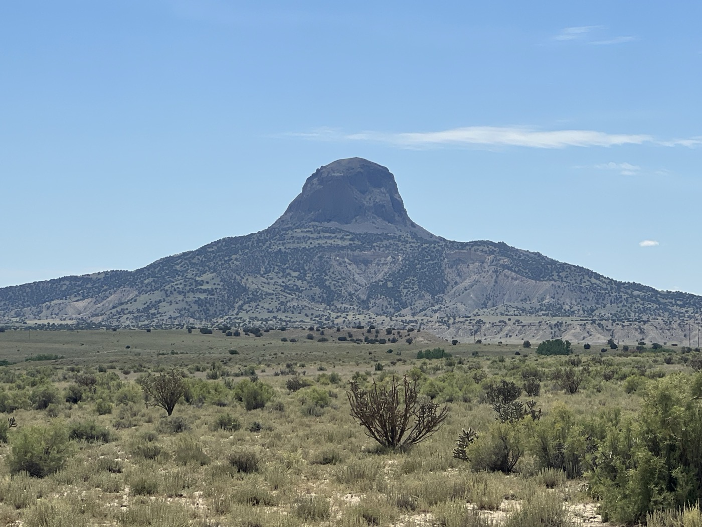
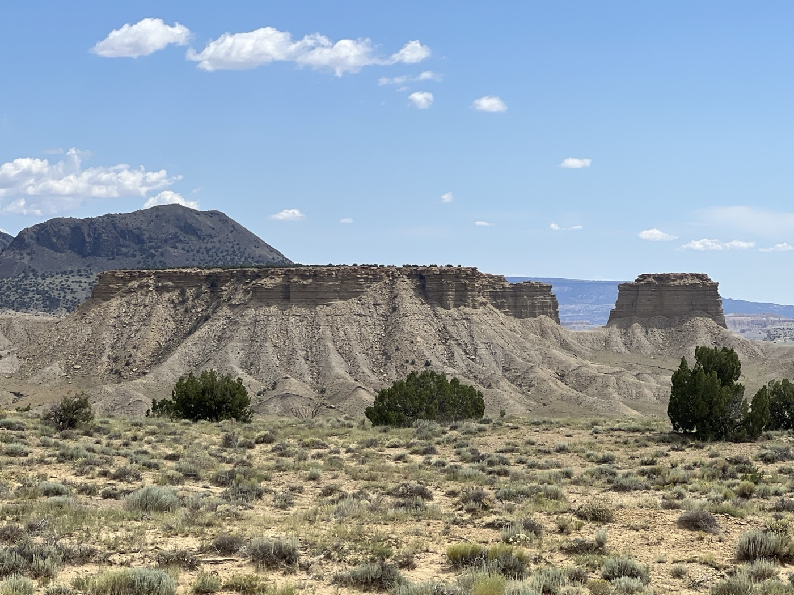
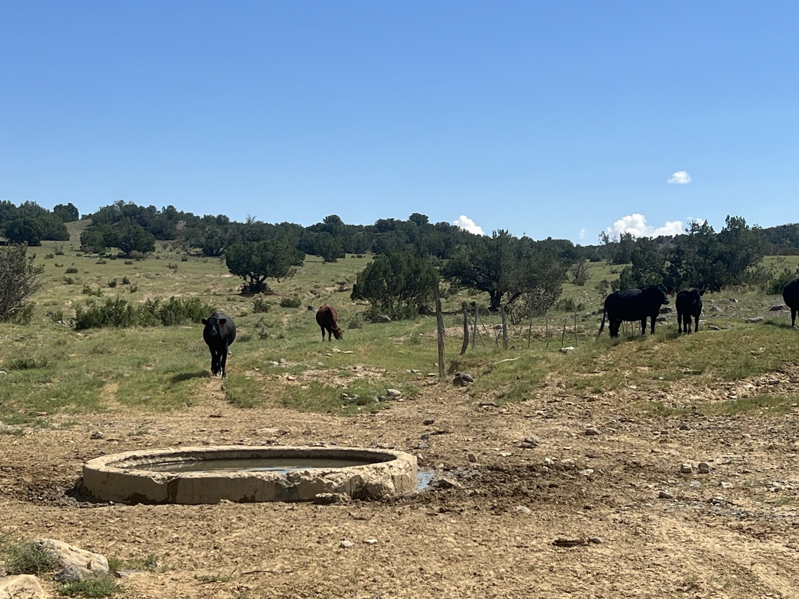
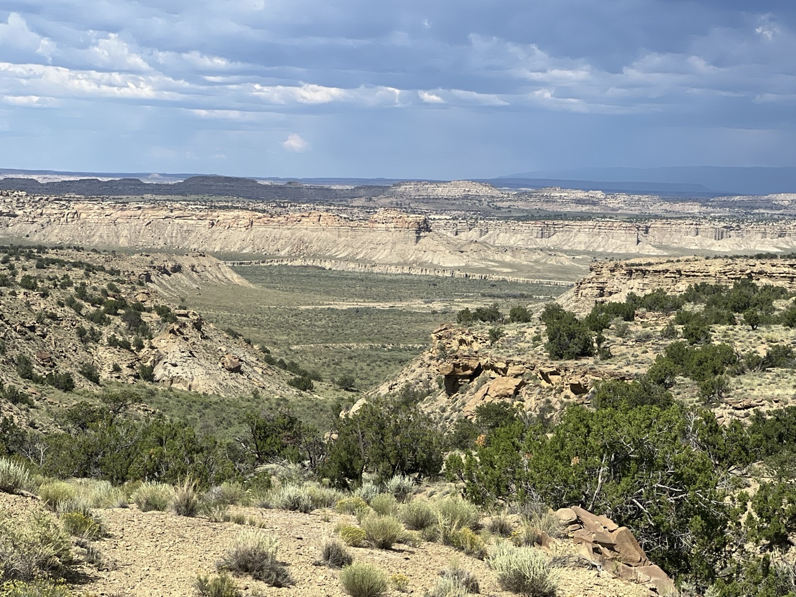
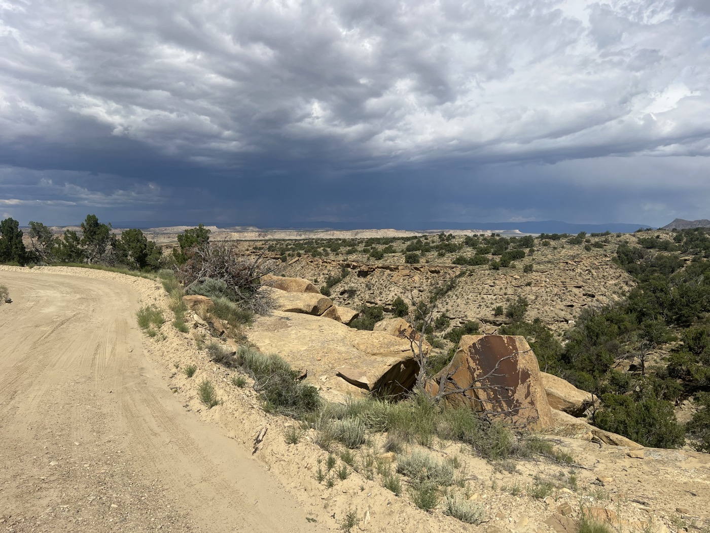
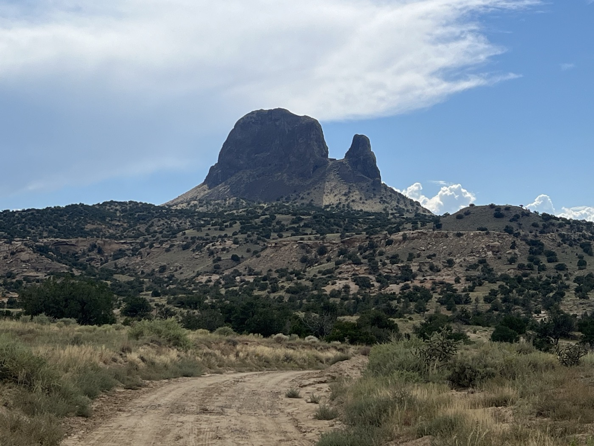
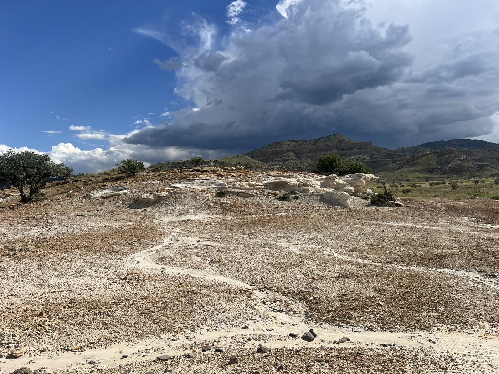
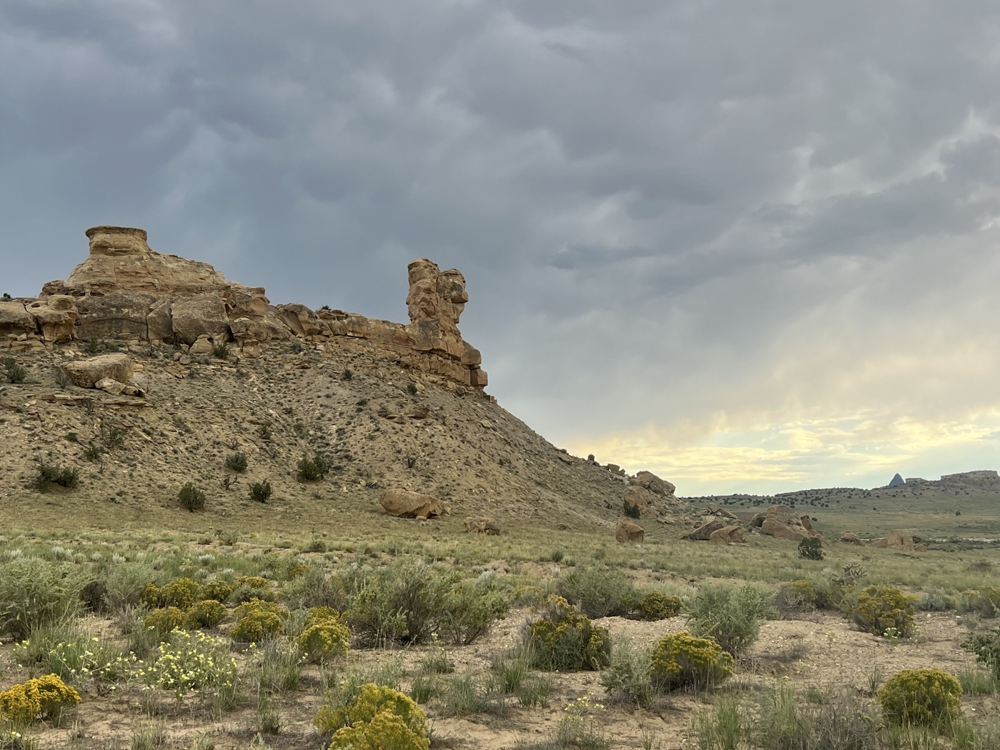
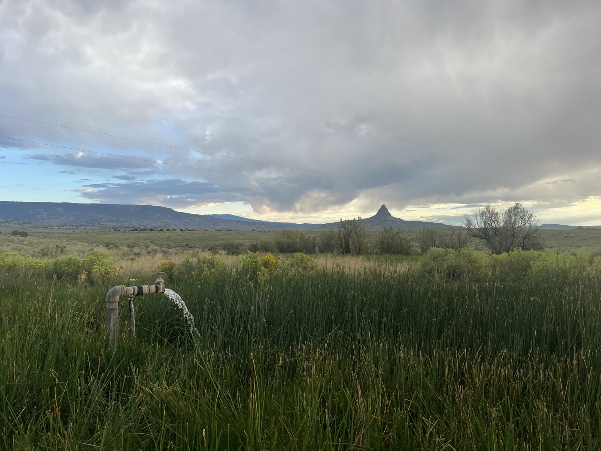
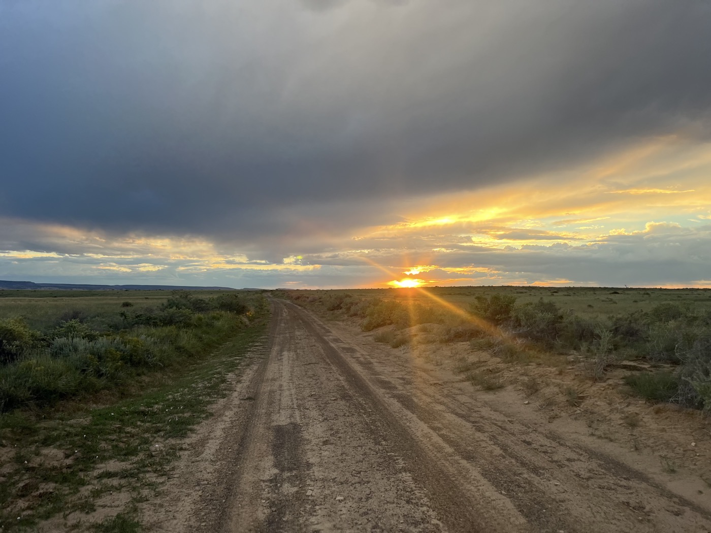

# Deserticus

<figure markdown>
{ width=“300” }
</figure>

I leave Cuba betting that it won’t rain. I set off in the late morning to make sure everything is dry. The route is beautifully wild. Sand, rocks, 🌵, and no one around. Just one difficulty: not enough water, which I only find at the end of the day. I set up my bivouac in preparation for the climb that will take me to Grants tomorrow.

<!-- more -->

# Wild and Beautiful

The track is nice, and I'm making good progress with a tailwind. The landscapes are stunning. I’ll share as many photos as possible; it's hard to choose. Try to imagine!

# Today's Challenges

First, I realize that the water sources are very relative. The water is anything but clear. It’s unappealing but eventually stresses me out. I resign myself, telling myself that a filter + Micropur + boiling should work. As night falls, I finally find clear water 🙏.

Otherwise, I keep telling myself that speed is my ally. Except when I encounter a patch of sand. Or when there’s a big crevice across the path. I take quite a few spills (3-4), but I’m learning to fall on the sand. The cactus spines still sting a bit.

# The Surprise

The sun becomes low, and then I hear a loud rustling to my right. I slow down and look: a big snake (rattlesnake, 🐍). I was in a hurry, and it seemed busy too, so I hurried past. I didn’t have the presence of mind to take a photo. I ended up sleeping in my tent 👍 😁.

!!! hint ""
    Click on the photos to see the comments.

<figure markdown>

{ width=“300” }

{ width=“300” }

{ width=“300” }

{ width=“300” }

{ width=“300” }

{ width=“300” }

{ width=“300” }

{ width=“300” }

{ width=“300” }

{ width=“300” }

{ width=“300” }

{ width=“300” }

{ width=“300” }

{ width=“300” }

</figure>
