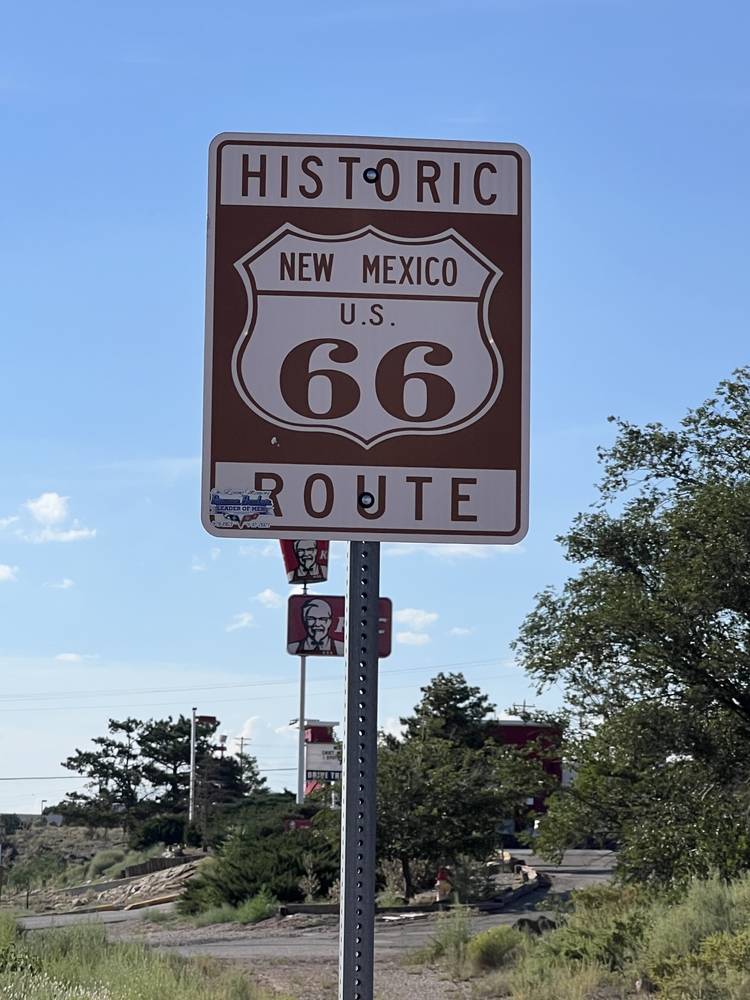
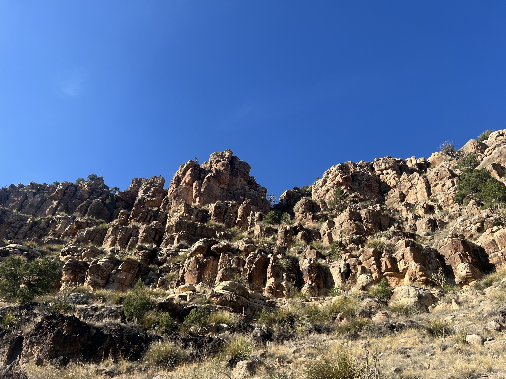
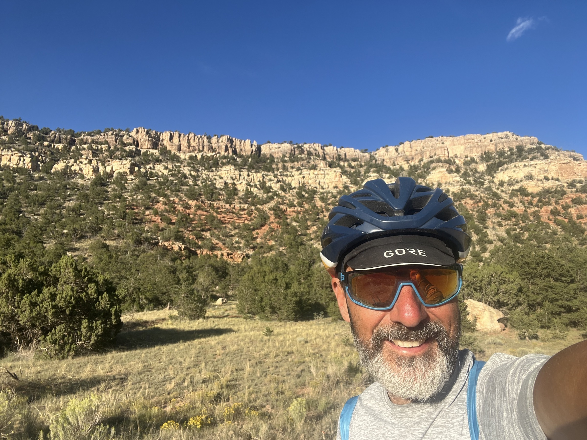
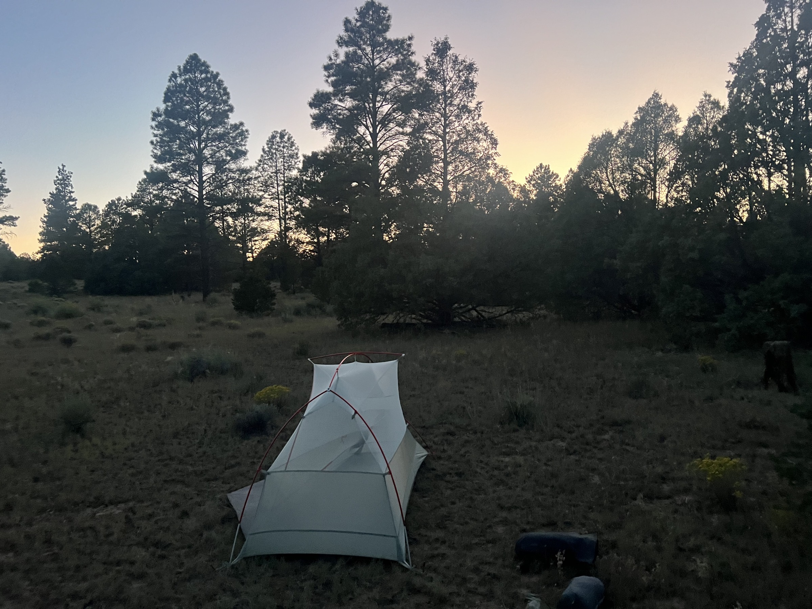

# Grants

<figure markdown>
{ width=“300” }
</figure>

I finish the crossing of Mesa Chivato and Chaco Mesa. After the beautiful peak of Cerro Alesna, I have one more climb in the San Mateo Mountains before arriving in Grants. The historic Route 66 runs alongside the town. My legs have taken a beating. After some shopping, I set off again to bivouac on the way to Pie Town. It’s been a day of transition.

<!-- more -->

# San Mateo Mountains

The climb from my bivouac is tough but not too hard. I can feel my legs tiring more than usual. I’m feeling the effects of the last two days. A bit of peanut butter finishes me off, but I’m rewarded with a long descent.

# Grants

Entering the town, I pass a correctional facility, surrounded by barbed wire and a watchtower. I shop to stock up for two days of autonomy and treat myself to a pizza break. I wash my bike, which really needs it. Then, it's back on the road.

# On the Way to Pie Town

I start planning the end of the journey. The border should be around September 5th or 6th. I contact Jeffrey, who specializes in logistical support for those arriving at Antelope Wells, where there’s absolutely nothing, and who don’t want to leave by bike. We’ll see how it all works out.

I stop and sleep with just my mesh tent (mosquito net). I admire the stars above my head!

!!! hint ""
    Click on the photos to see the comments.

<figure markdown>

{ width=“300” }

{ width=“300” }

{ width=“300” }

{ width=“300” }

{ width=“300” }

</figure>
