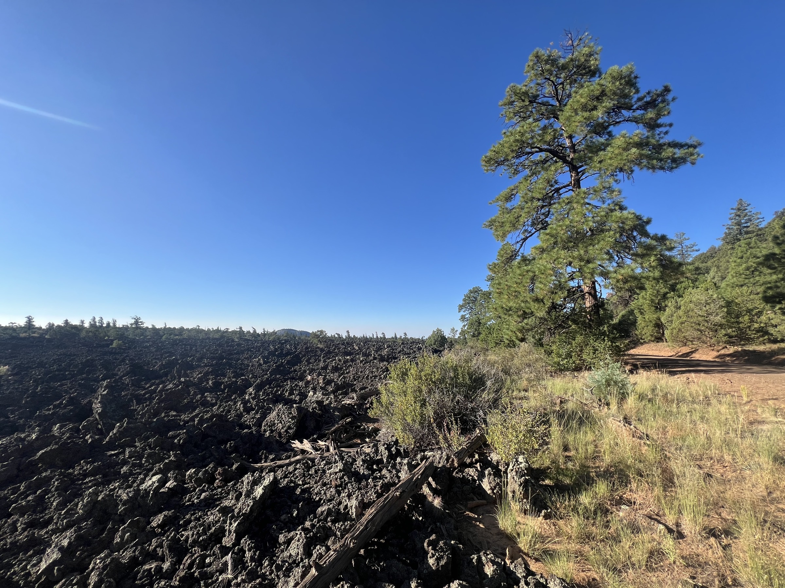
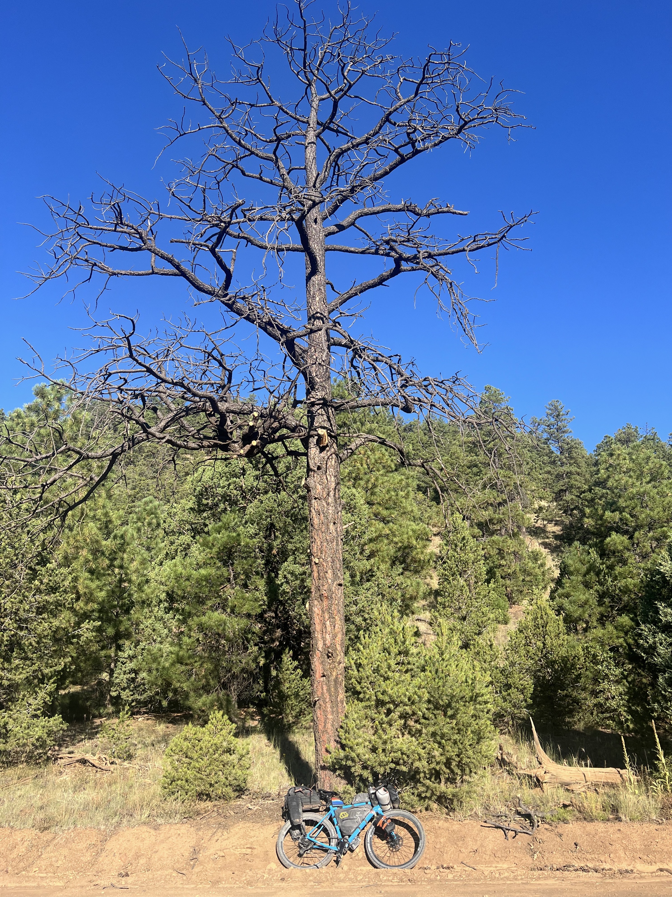
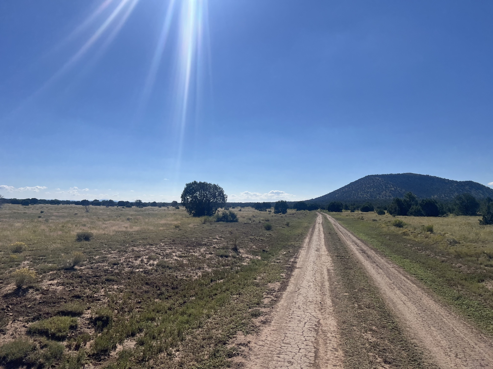
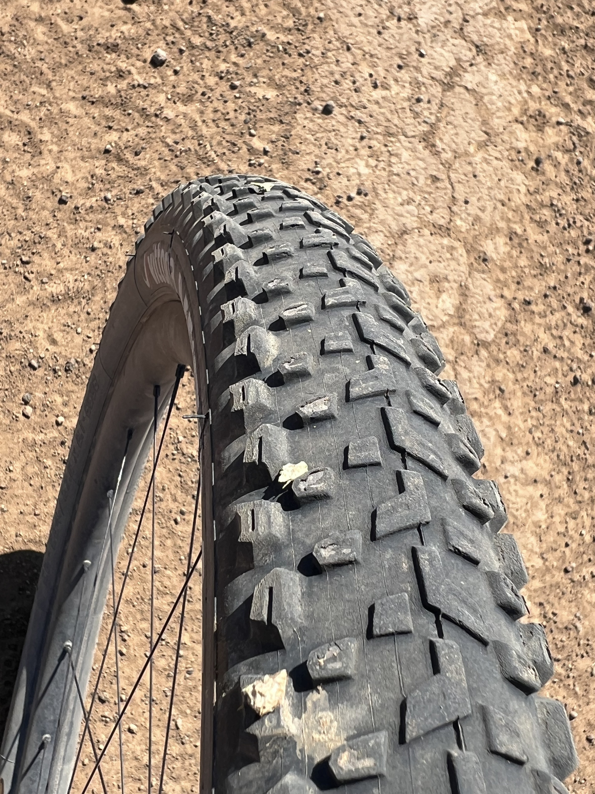
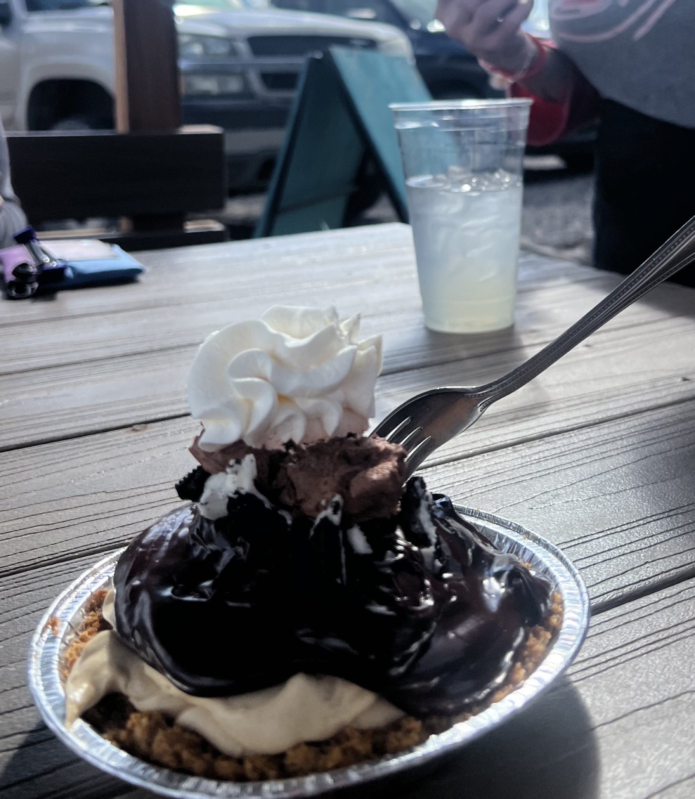
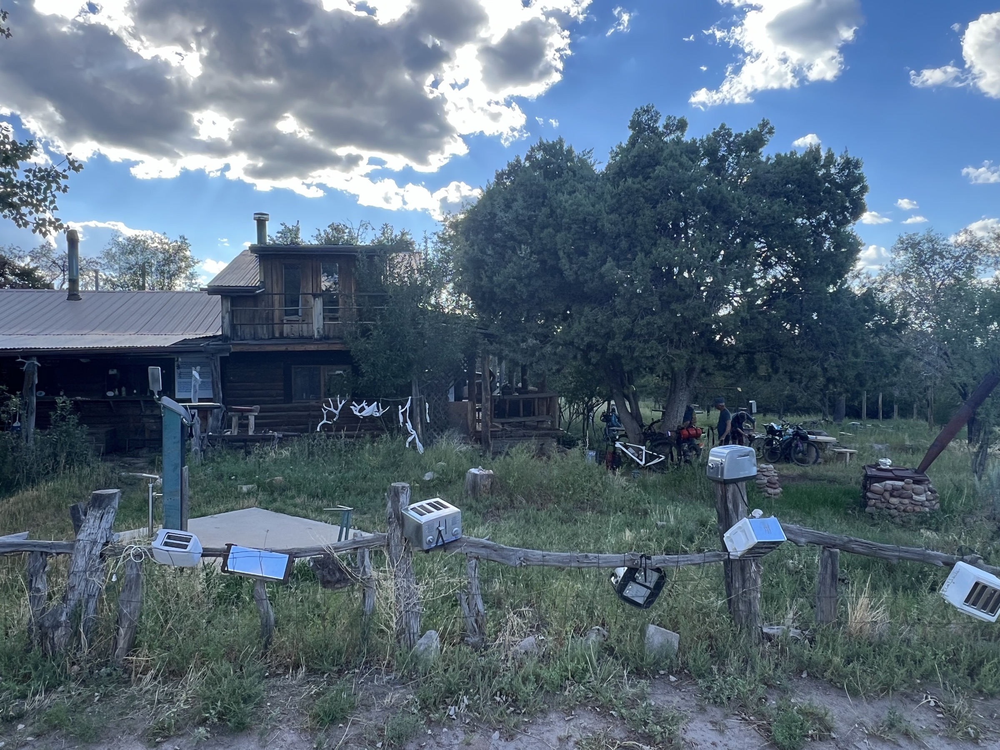

# 38. Pie Town and Toaster House

<figure markdown>
{ width=“300” }
</figure>

The route takes me into the badlands of Malpais Park. The terrain is very volcanic. I get a lot of cactus thorns in my tires, which are starting to show the miles. It's nice to overtake a group of French people, a Swiss from Grisons, and to run into Sarah again, whom I’ve crossed paths with before. Everyone ends up in Pie Town, at the Toaster House...

<!-- more -->

# Badlands of Malpais Park

Morning in Malpais Park. Volcanic terrain, but more importantly, I see white spots on my front wheel. On a bike, a new detail needs to be checked pretty quickly. It turns out to be cactus thorns stuck in the tire. I pull one out, and air immediately starts leaking, but it's sealed by the sealant, the liquid inside the tire (there’s no inner tube except for emergencies). I pull out the rest. I set off again, and 5 minutes later, another ten thorns are stuck in the tire 😳. After sealing so many holes, the tire starts to feel soft, and I have to pump it up. I also notice that the tire is pretty worn, I'm down to the soft rubber part of the tread 🌵😱. It needs to last another 500 kilometers!

# Pie Town

A nice group comes together unexpectedly (eight in total). Pie Town boasts having very good pies, with a contest scheduled for mid-September. Both restaurant-cafés are open (even though it's Labor Day). Everyone takes advantage. I chat with Sarah, whom I’ve run into for the third time. She’s combining GDMBR and Tour Divide, which gives her a smoother route. But she’s also fast and on Trackleader. Her boyfriend will pick her up at the border later than my schedule, but we’ll try to ride together to Silver City.

# Toaster House

It's a house in Pie Town that’s been donated. It has everything hikers and bikers need. And the entrance is covered with (...) toasters! It's simple, but it provides a roof, a bathroom, and a kitchen. You just come in and settle down. It’s a bit strange. You can sleep inside, but I set up my (mesh) tent outside. It’s simpler. Tomorrow, I’ll leave early and won’t disturb anyone. For the next stages, I want to keep the clock running! It will be back to the wild (little clear water, no supplies for 260 km, 3,800m elevation gain, the last climbs before the big flat stretch that takes me to the border).

!!! hint ""
    Click on the photos to see the comments.

<figure markdown>

{ width=“300” }

{ width=“300” }

{ width=“300” }

{ width=“300” }

{ width=“300” }

{ width=“300” }

{ width=“300” }

</figure>
