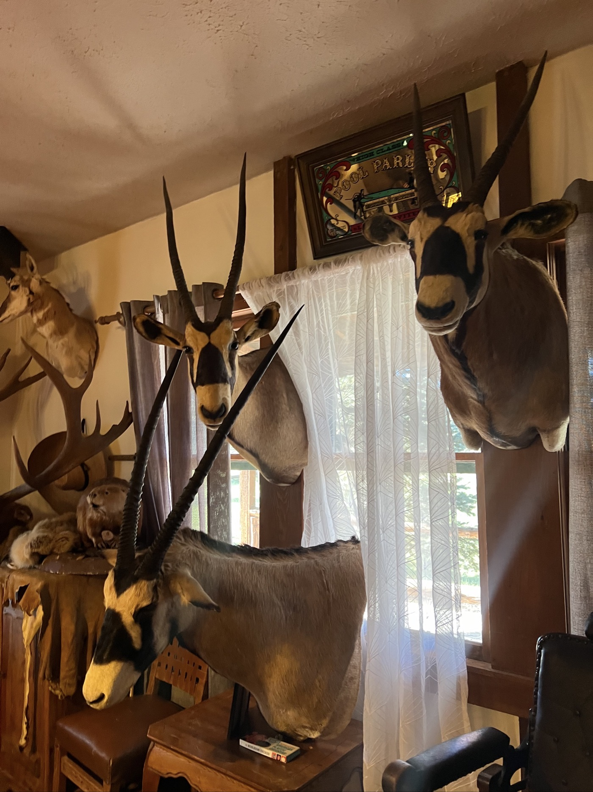
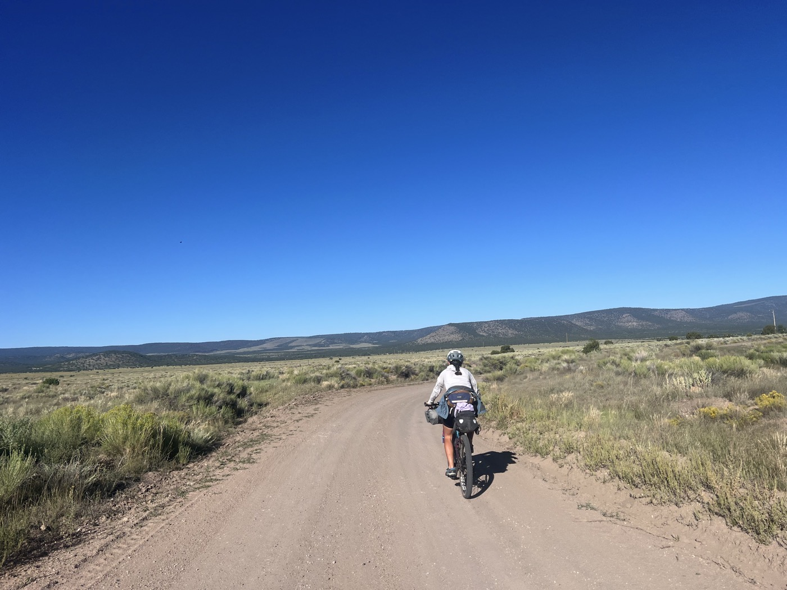
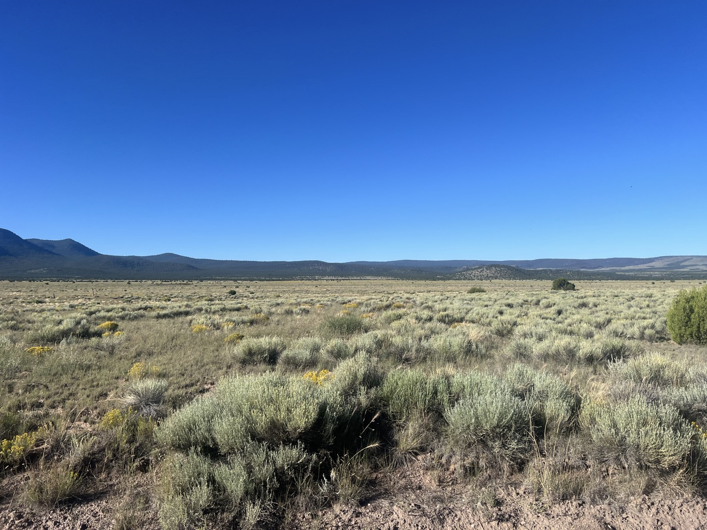
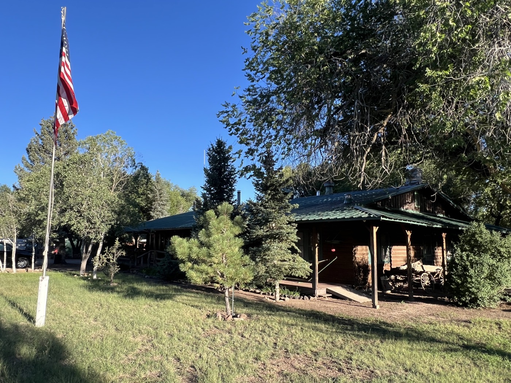
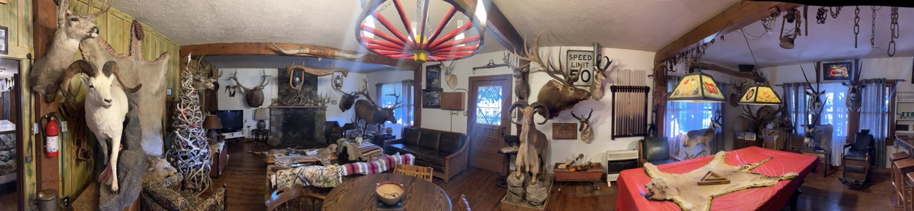
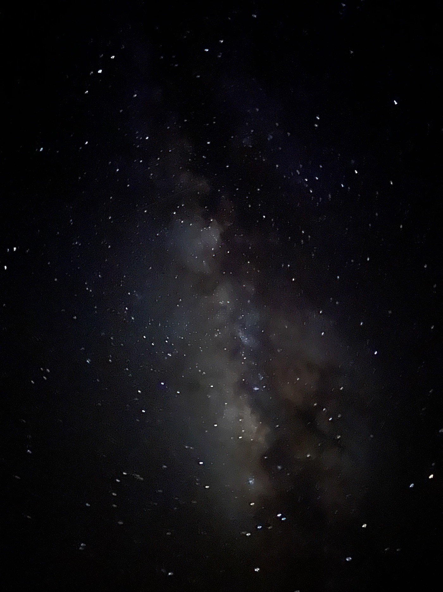

# 39. Beaverhead Ranch

<figure markdown>
{ width=“300” }
</figure>

Today’s route takes us through the plains of San Agustin. The day is beautiful, with little elevation gain, and Sarah and I are making good progress. But the Swiss from Grisons overtakes us, and we catch up with him 155 km later at Beaverhead Ranch. He used to be part of Nino Schurter's team, which explains a bit 😁. The ranch hosts hunters, and there’s a trophy room that makes you think 🤔. Otherwise, the welcome was impeccable. Tomorrow, we're aiming for Silver City as a group of three. It’s also nice to ride with others.

<!-- more -->

# Plains Landscape

Not much elevation (1,200m, we’ll make up for it tomorrow), but beautiful scenery. Some small forests, but mostly I remember the vast open spaces. There are also a few cliffs.

# Beaverhead Ranch

On the route, water is once again limited. Given the heat, I consume it quickly. We decide to ask the ranch if we can refill, as there’s another day to manage. In the end, we are allowed to camp on-site, take a shower, have dinner, and breakfast. There’s a service here because a group of hunters is staying at the ranch—they’re hunting elk with bows. The ranch has a trophy room, which I’ll let you discover through the pictures.

# Milky Way

The evening ends with a photo contest. There’s no moon, and the Milky Way is particularly visible. With our mobile phones and a few settings, the result is surprising.

!!! hint ""
    Click on the photos to see the comments.

<figure markdown>

{ width=“300” }

{ width=“300” }

{ width=“300” }

{ width=“300” }

{ width=“300” }

{ width=“300” }

{ width=“300” }

</figure>
