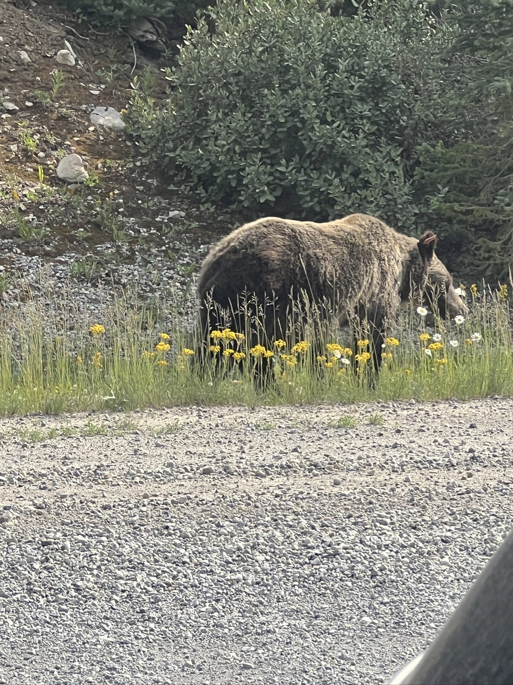
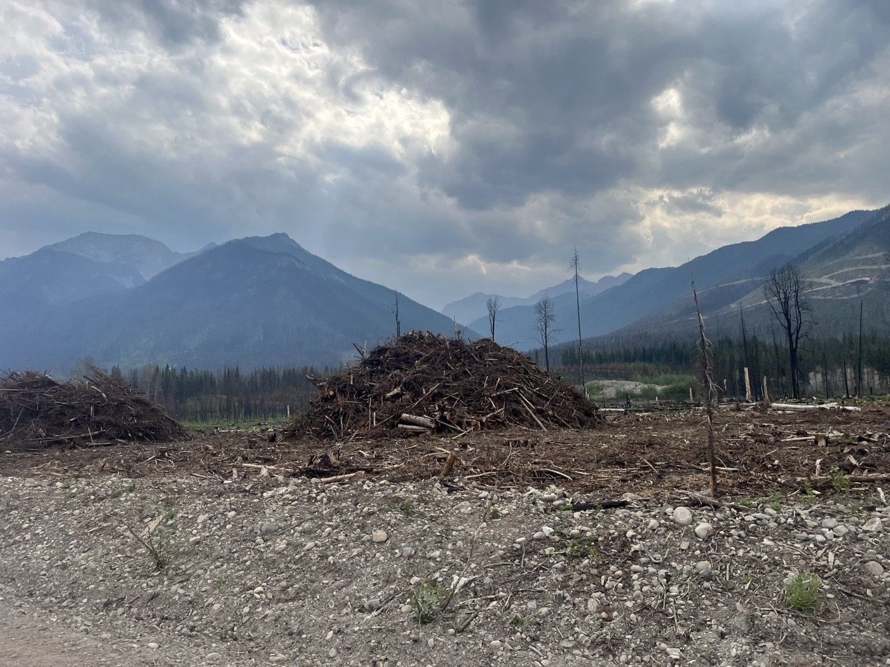

# 4. The King

<figure markdown>
{ width=“300” }
</figure>

Barely set off, and I have the big encounter of the day: my first Grizzly. It's a stunning moment, I tell you, after that, pedaling is a breeze (adrenaline + joy). But the rest of the day is also beautiful, and especially it rolls smoothly, allowing me to finally increase my average speed.

<!-- more -->

I leave my little lake and take the gravel highway. Fewer cars, and they slow down as I pass. Then, a lady I meet shouts, "Wow!" The gravel and the 4x4 engines are loud. But the tone didn't sound much like a "safe journey." I hesitate, and 5 minutes later, I see two cars stopped. Could it really be a bear? I approach, positioning myself well behind the car for protection. Wow - it's a big one. I quickly take photos; great, it lifts its head, how nice. But it completely ignores us. Majestic to the end. I speed off, and suddenly pedaling is easy.

After 30 km, I finally find a bike path, then a real trail. Not only is there the scenery, but I’m also having a blast on the bike. I aim for 120 km. The "Elk Pass" trail is superbly endless, with small climbs and long descents.

I arrive in Elkford - a bit tired (after 7 hours on the bike and 120 km). And look, there are still 6 km of mountain bike trails, rodeo style. There's no denying it - I have to respect my bike; it’s taking it all in stride.

What will tomorrow bring? In 2 days, I think I'll cross the border into the USA. I also need to increase my average. Now, it’s time to rest!

P.S. Yesterday, I had no mobile network coverage... sometimes the news is delayed. But the GPS maps always show my progress in real-time!

<figure markdown>
{ width=“300” }

{ width=“300” }

{ width=“300” }

{ width=“300” }

{ width=“300” }

{ width=“300” }

{ width=“300” }

{ width=“300” }

{ width=“300” }

{ width=“300” }

{ width=“300” }

{ width=“300” }
</figure>

