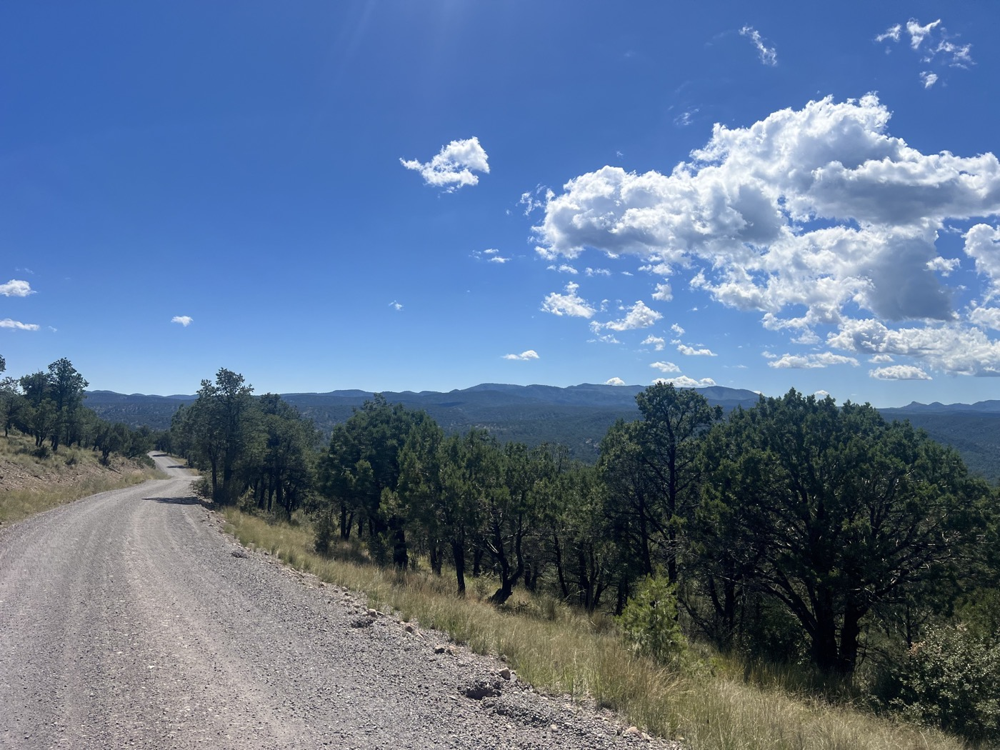

# 39. Camaraderie

<figure markdown>
{ width=“300†}
</figure>

It was hard to leave Beaverhead. Dinner, breakfast, and burritos to go were all offered to us. Sarah insists that this place is probably the closest to the American way. We set off through Gila National Forest, an endless series of climbs and descents on rough gravel in the heat. This last challenge is spicy 🌶️.

<!-- more -->

# A Team That Rocks!

And here we are, three Great Dividers with such different journeys. Each one solo. But for today—we ride together. Each of us takes turns attacking the next climb, our well-trained legs spinning fast, and we wait for each other at the summits. We yell in excitement during the descents. I can't even tell you how many tight turns on the gravel required some daredevil braking 😅. No doubt about it, the Divide has made us solid riders 💪.

# Camaraderie

Together we are stronger. Each of us gives it our all with immense respect for the other two. Performance doesn’t matter, but this desire to give our best drives us beyond our limits. This day under the scorching sun was pure joy and will be unforgettable. I took on this project solo, but I'm grateful to have also spent this day with my companions. The cycling community has spoken again. By the way, take a good look at Gian-Andrea's bike. I can barely lift it! This bike has done Australia, Tajikistan, Canada, Norway, and the Divide. And yet, Gian was far ahead on one of the big climbs of the day. Incredible. It’s really cool that this impromptu trio has such great chemistry (with a 10-year age gap between each of us). We stop at Lake Roberts and raid the ice cream jars of the little local shop (which opens just for us).

# What Lies Ahead

The border is near. Each of us feels the imminent change approaching. Emotions are mixed. There’s one last climb, then Silver City, the desert, and the arrival at Antelope Wells. Tomorrow, I’ll do my solo marathon, sleep, and finish on Friday morning. The logistics are in place, and I’m just waiting for one last confirmation. But if all goes well, I’ll be in San Diego on Saturday. My return flight takes off on September 10. Stay tuned 🤞I’m almost there! Let’s hope I don’t have to battle the wind too much!

!!! hint ""
    Click on the photos to see the comments.

<figure markdown>

{ width=“300†}

{ width=“300†}

{ width=“300†}

{ width=“300†}

{ width=“300†}

{ width=“300†}

</figure>
