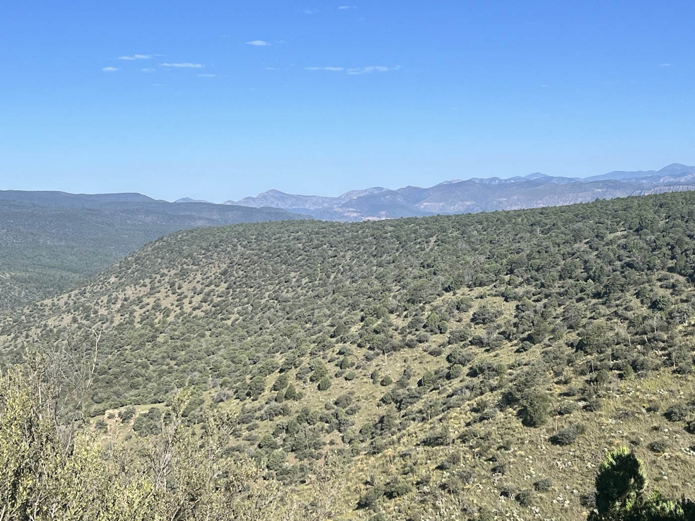
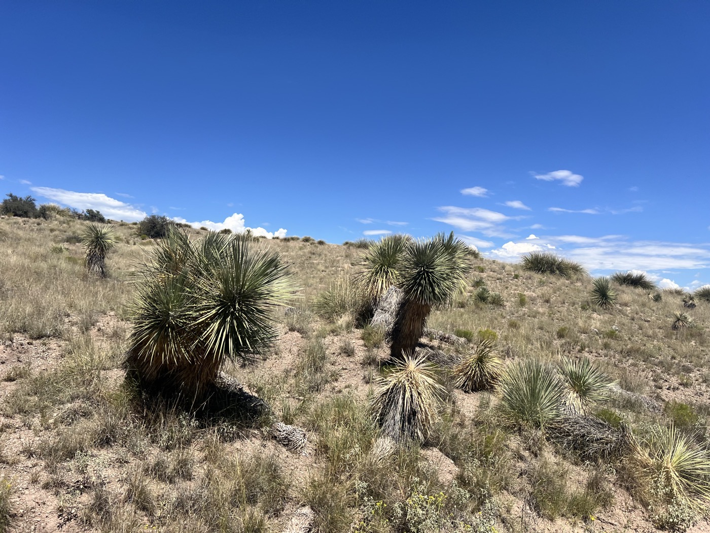
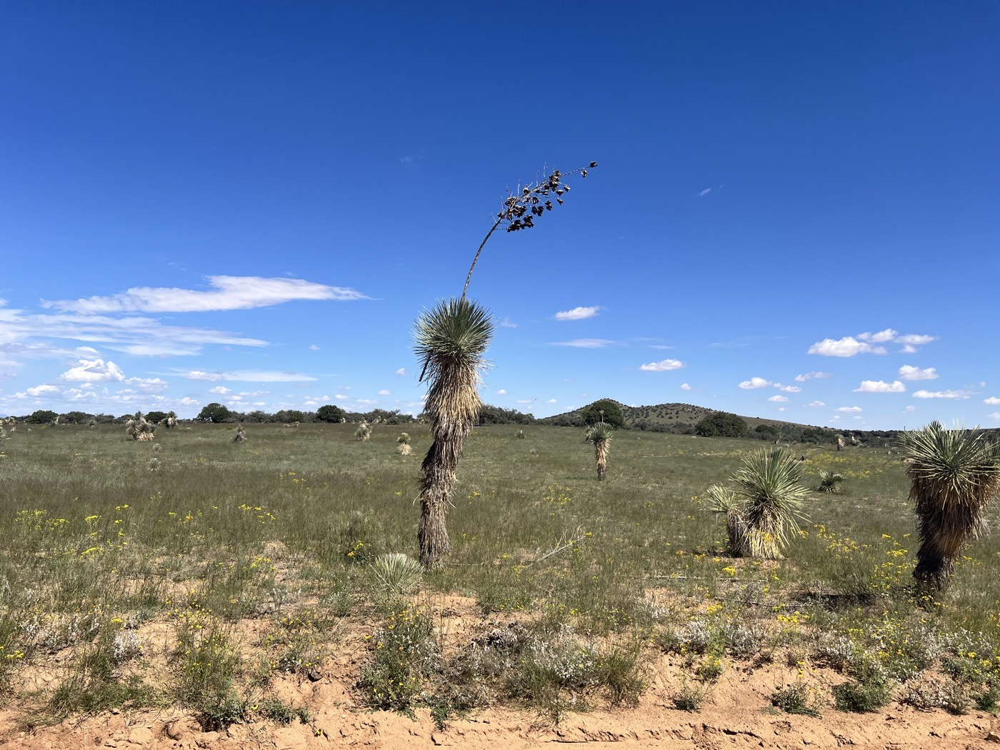
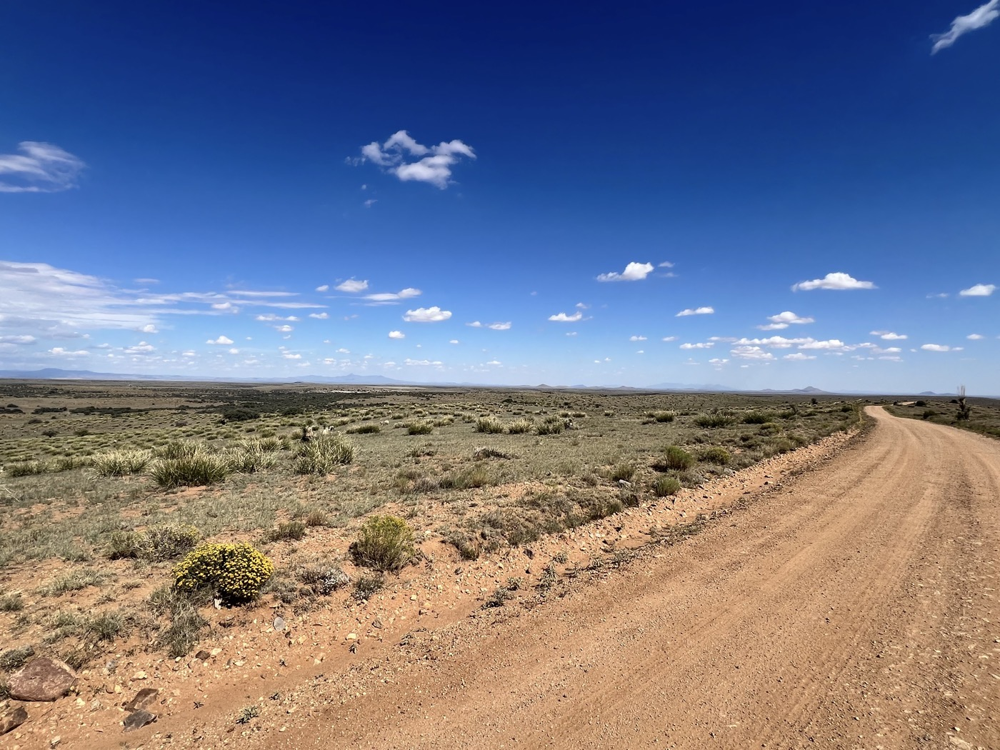
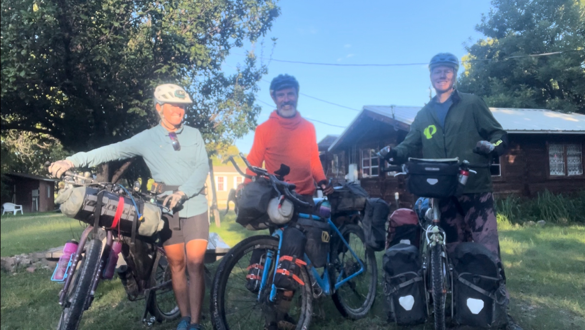

# Hachita

<figure markdown>
{ width=“300” }
</figure>

We leave Lake Roberts as a trio for one last climb, still just as great. It's strange to see the end approaching on the GPS, the last climbs can be counted on one hand. We leave the mountains, forests, and Gila Park for good. I continue alone, pass through Silver City (which is pretty nice, by the way), and start my marathon. 188 km under a scorching sun. The wind is tough at times but manageable. I drink a lot. I stop in Hachita at nightfall and run into a group of Swiss who left in late June. There are 70 km left 💪.

<!-- more -->

# The trio enjoys it one last time

We depart at 8 a.m. for the last climb (600m elevation gain). A beautiful climb on the road, with magnificent views of the hills of Gila Park. It gets hot quickly. We say our goodbyes in front of the saloon in Pinos Altos. Sarah and Gian will take more rest in Silver City.

# A big effort

I have 155 km to cover today. I set off, pass through Silver City, which has a pretty downtown that reminds me of Salida. A good stopover. The exit from the city takes place on a small path, a single trail. Those who made the route were playful. It ends on sandy tracks in a desert landscape. Check out the photos; I drink as much as I can and keep pedaling.

# Hachita 

I arrive after sunset and sleep in the community center with four other Swiss. Tomorrow, I'll be up very early. I need to finish the section I started today: 70 km and I'll reach the border with Mexico. Not many hours of rest, but the excitement will make up for it. It's hard to realize that the odometer is reaching zero. Makes you wonder if there’ll be a sequel 🤔😉! In any case, I'm also excited to see family and friends soon, and I’m definitely in the mood for some rest 😁.

!!! hint ""
    Click on the photos to see the comments.

<figure markdown>

{ width=“300” }

{ width=“300” }

{ width=“300” }

{ width=“300” }

{ width=“300” }

{ width=“300” }

{ width=“300” }

{ width=“300” }

{ width=“300” }

</figure>
