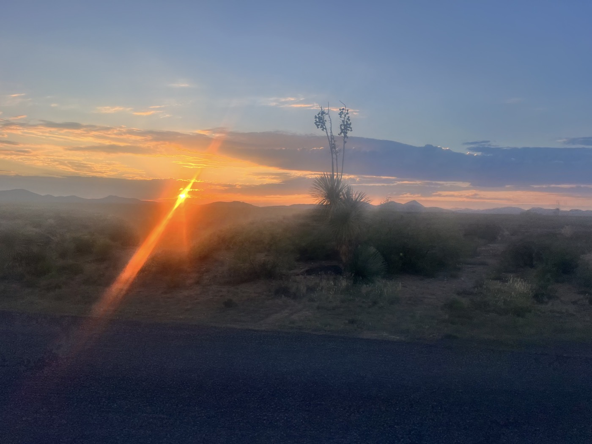
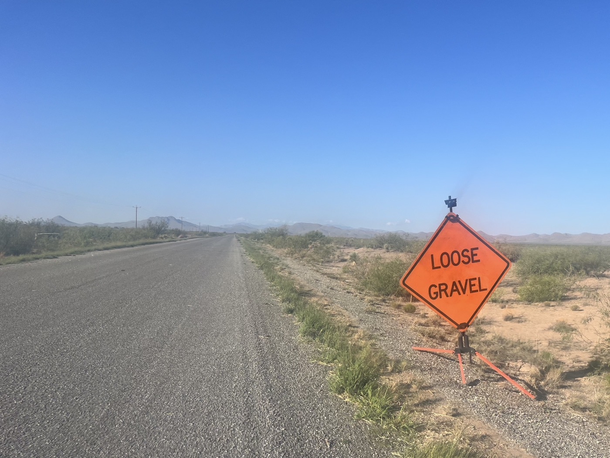
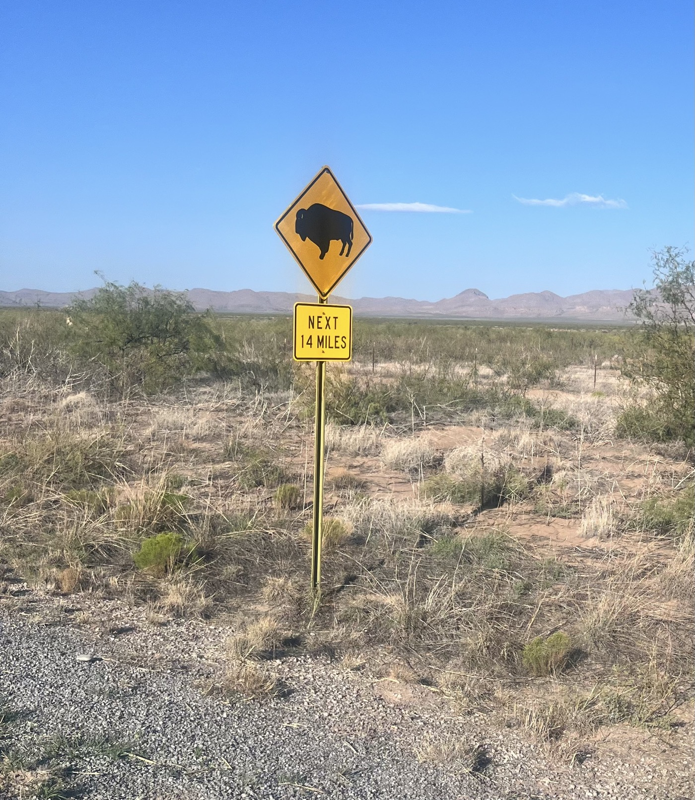
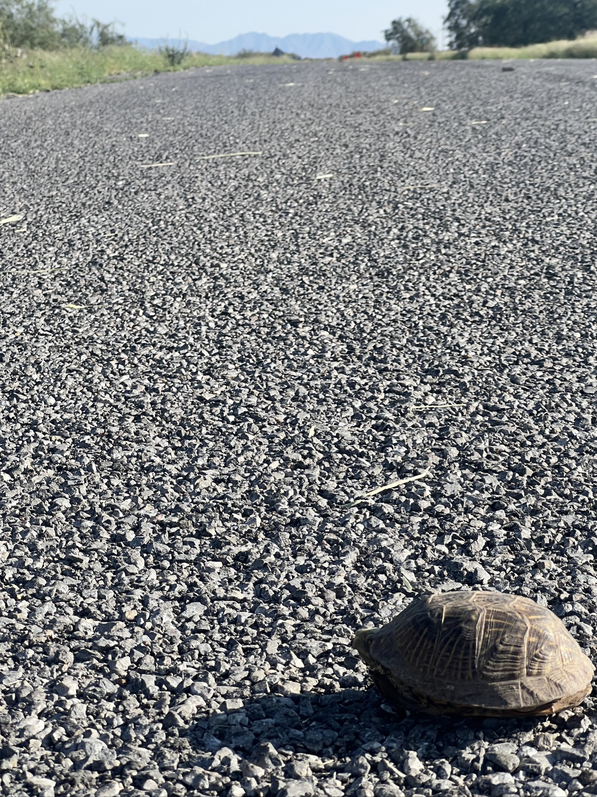
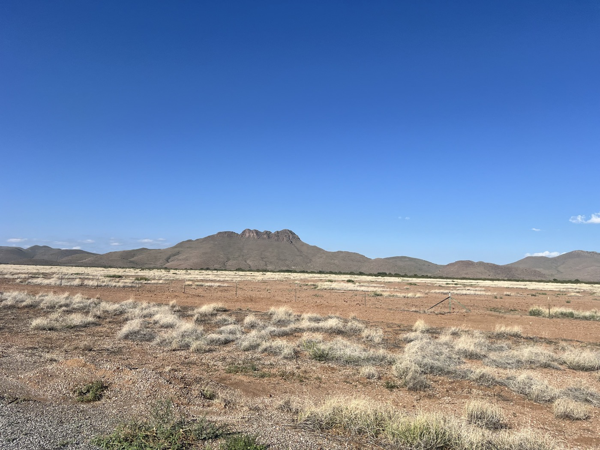
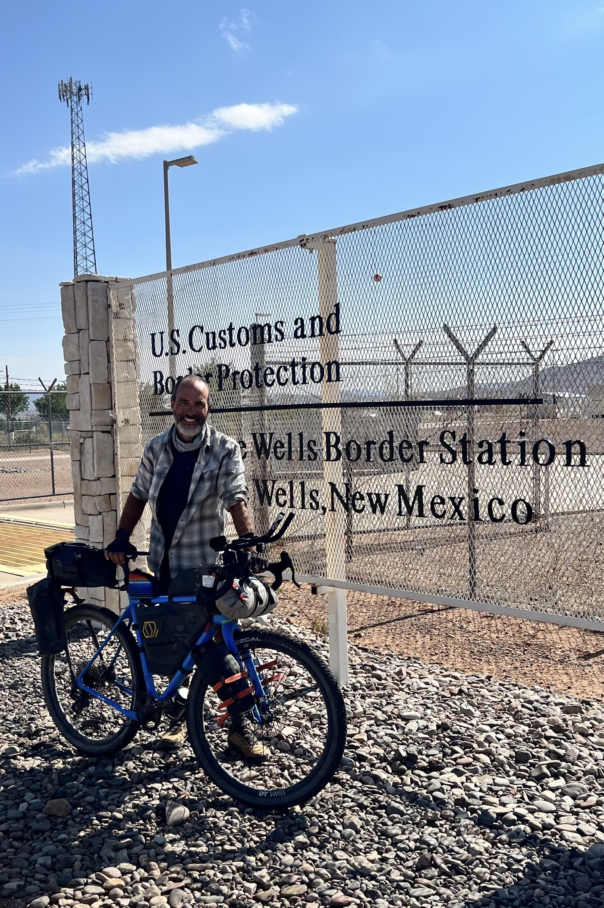
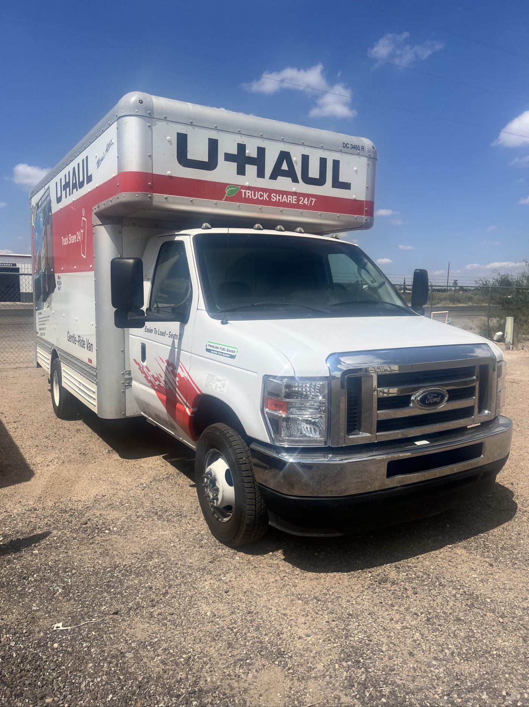
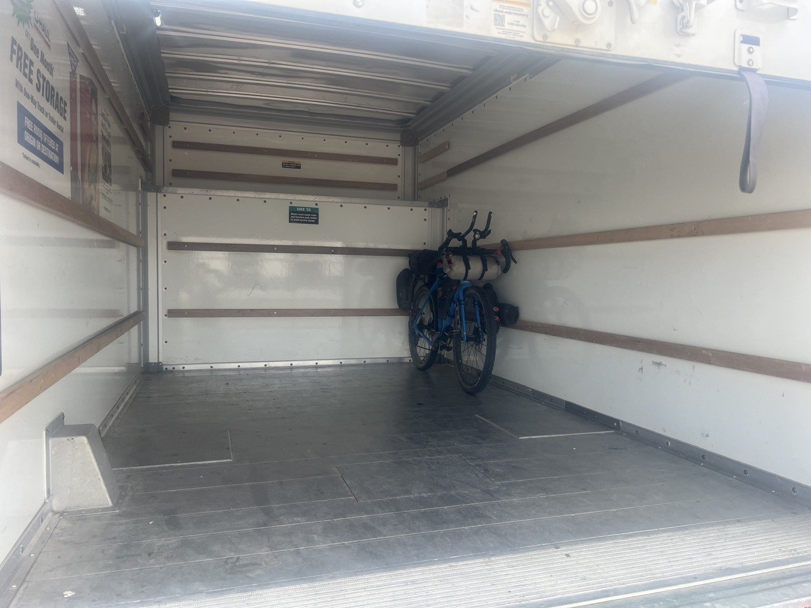

# 42. Antelope Wells: the final stretch 💪. Really?

<figure markdown>
{ width=“300” }
</figure>

It’s finally the day for the last push. I leave at dawn to avoid the wind and stick to my schedule. The asphalt turns into gravel, the wind is manageable, and I make good progress. Emotions rise as I realize it’s the end. So much effort, joy, sacrifice, and moments of truth. Yes—I’ve hit my limits more than once during this adventure, but I was never alone.

<!-- more -->

# The final stretch

The ride is pretty short, and I arrive right at 10 a.m. Jeffery from Hachita has specialized in logistical support, as the border post is in the middle of nowhere. Everyone needs an extraction solution, and I definitely didn’t want to leave on my bike! He arrives 15 minutes later to take me to Deming.

The border is easy to spot. An endless wall marks the territory. Illegal immigrants get injured when they fall off it. I see radars, I’m told about drones—an ultra-monitored border...

# Emotions

On the way, the pedal strokes follow one after another, but they are different each time. A few gut-wrenching moments, hard to process it all. I’ll come back to this post in the coming days to organize my thoughts. But the emotion turns into laughter when I have to squint to make sure there’s actually a (...) turtle in my path! Can you believe it? I’ll name her Antelope and gently place her safely on the side of the road.

# Thank you!

First of all, to my wife Valérie for allowing me to go on this long adventure. My kids. Also to family and friends: to everyone who also encouraged me with kind words and messages. Thank you for your prayers, this journey brought me back to the essentials, and God was always by my side. In the end, I truly enjoyed it.

# Final stretch?

One of my lessons: a real journey never truly ends, but renews itself every day. You never fully arrive, and in what lies ahead, everything is still possible. That’s what I’m going to try to put into practice! And the whole gravel-bikepacking-encounters-challenges thing is something I definitely love to do.

I’m pointing my compass: no more heading south, now it’s westward to San Diego. I’ll try to take 3 days of rest before my return flight. I’m renting a van and off I go!

Check back around the 10th or 11th of September, I’ll likely have posted my latest updates on the blog. Looking forward to seeing you all soon.

With thoughts of you, best wishes, Christian.

!!! hint ""
    Click on the photos to see the comments.

<figure markdown>

{ width=“300” }

{ width=“300” }

{ width=“300” }

{ width=“300” }

{ width=“300” }

{ width=“300” }

{ width=“300” }

{ width=“300” }

{ width=“300” }

</figure>
