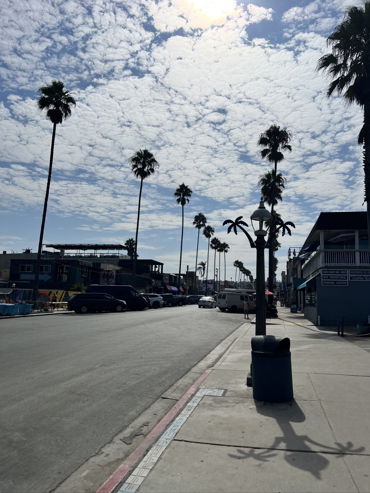
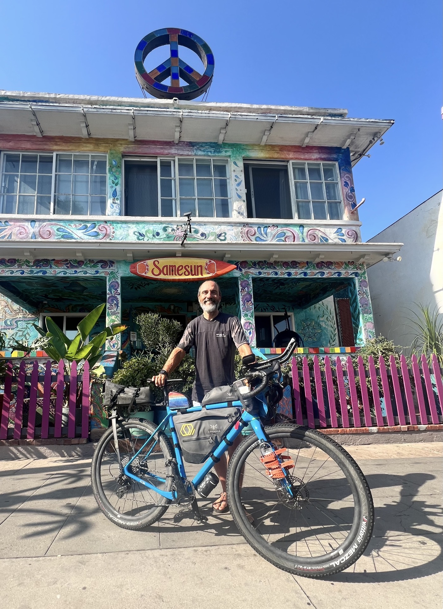

#  Sunset Post

<figure markdown>
{ width=“300†}
</figure>

San Diego is definitely worth a detour! With my bike Salida, I chose to stay in the Ocean Beach area. Beachfront: the beach is mere 50 meters away! The atmosphere is relaxed, alternative, even hippie, with definite surfing vibes. I meet some really cool people, and I feel the need to talk about my adventure. I also get my fill of sensations without being too adventurous in my activities. After 40 days in the wilderness, it's easy to feel overwhelmed in a big city. My body starts to reflect its fatigue. A beautiful kind of blues, really: I'm ready to head back home!

<!-- more -->

# Rock of Ages

It's Sunday, I decide to visit a local church. What an organization! I estimate around 2,000 people in attendance. And there's a second service right after! The worship is impressive and moves me deeply. Everything is remarkably well-orchestrated. I take away several things, but most of all, making space in your mind, as I’ve been fortunate enough to do, brings you closer to what really matters, with sharper discernment and new perspectives. How can I extend this experience when I return? 🤔

# San Diego

I'm discovering the city. I’m sharing quite a few photos this time. I spend two days walking around my neighborhood and on the third day, I take care of packing up the bike. I get to know Tim and Christel, who have been living here for six years. A French guy tells me about his week at the Burning Man festival in Nevada. I try a bike ride, but I quickly realize that riding in the city is nothing like the Divide... I cut it short, especially since I'm having a hard time keeping up : you really have to stay focused to follow the route in the city with traffic and signs! I already miss the wide open spaces. But at least the vibe here is super relaxed.

# Camaraderie - wrap-up

I’m happily rereading my blog-journal and catching up with people. K.K. and Gomitha are already super active. Unfortunately, John & John dropped out fairly early (in Ovando), but they plan to continue in sections. John-Sr. is building a house near Salida. He and his partner won a trip to Switzerland, so we might meet again! Sarah arrived on the same day as me, late at night after riding 215 km 💪! She’s thinking about doing the race version next year, dreaming of challenging the women’s single-speed record (18 days, no derailleur). What courage. Gian finished yesterday, and I hope to ride with him in Switzerland ☺️.

# And me?

First, I have a huge (like, really huge) need to reunite with my family 🥰.

Physically, I’d like to visit an osteopath to get everything realigned. I also want to test myself on some nearby climbs (Barillette, Faucille, etc.) and then go on outings (bike or otherwise ☺️) with friends.

On a deeper level, I’m looking for my next professional step, one that aligns better with the priorities I’ve drawn from my Divide experience (gotta dream big!). That will keep me busy as well. I’d like to revisit the blog, expand it with summaries, advice, and translate it into English before promoting it to inspire others. I also want to dive deeper into nutrition vs. exertion. But all this while staying true to the Divide spirit: staying focused, channeling energy where it matters most, overcoming challenges, and enjoying the ride. I hope I don’t lose my fitness too quickly!

In the end, there’s still so much to discover—the adventure continues.

Thank you all again, especially those who sent me a little message. See you soon for hugs and more interactive chats 👊. And most importantly—tell me, what will be your next challenge? 😉.

!!! hint ""
    click on photos to see details and comments

<figure markdown>

{ width=“300†}

{ width=“300†}

{ width=“300†}

{ width=“300†}

{ width=“300†}

{ width=“300†}

{ width=“300†}

{ width=“300†}

{ width=“300†}

{ width=“300†}

{ width=“300†}

{ width=“300†}

{ width=“300†}

{ width=“300†}

{ width=“300†}

</figure>

