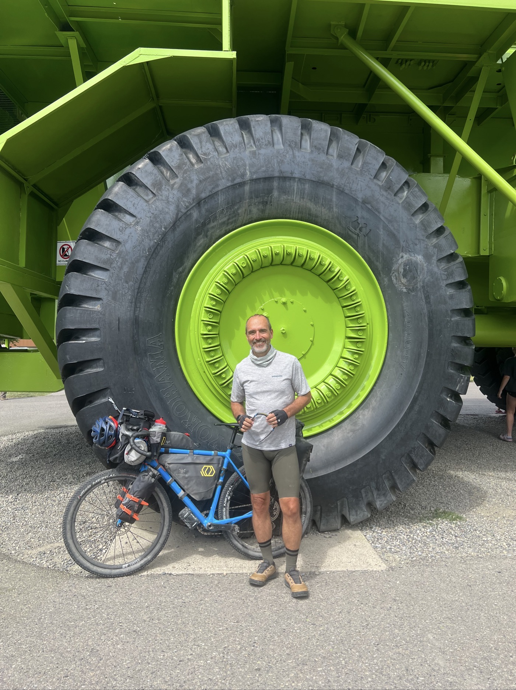

# The Titan

<figure markdown>
{ width=“300†}
</figure>

The rear tire is deflating, so I aim for Fernie where there are bike mechanics. In Sparwood, I come across Titan. A photo is a must. Then I head to Fernie, pumping air every few kilometers. A nice evening with John and John, a father and son riding together on the Divide.

<!-- more -->

I spent the night at a motel run by Indians (from India, that is) who invited me to eat in their kitchen. Very good and vegetarian for a change!

On my way to Sparwood, my rear tire goes flat. It's tubeless, yet I can't find any holes or leaks. But as soon as I reinflate, it deflates again after a few kilometers. I’m not too keen on getting out the artillery and putting in a tube. I'm aiming for Fernie as my destination (50 km) where there are three bike shops that can take a closer look. I keep inflating as I go - it's manageable.

In Sparwood, I come across Titan. You’ll see the details in the photo of its plaque, but it's the first time I’ve walked under a truck. It must be in the Guinness World Records! It's true - the whole region here lives off coal mining. You see museums and monuments everywhere. And you mainly see Titan ☺️. At night, we hear endless coal trains. I checked, the longest ones have 150 cars and measure over 2.4 km. It's a different dimension here.

Arriving in Fernie, I get the bike checked. They tell me everything is fine, they inflated it fully and added tubeless liquid. I also buy a small gas cartridge, useful for resealing, I think. It seems to be holding; I'll stay more vigilant.

A local resident is proud to show me the famous Ghost Rider - when the sun shines on the mountain, you can see the shadow of a horse and rider emerging from the mountain. A local specialty, the name is used everywhere. I eat with John and John from New York, a father and son (62 and 28), who are following the Divide. Very nice!

On today's ride, I really strained my back on the cobbled stones. Respect to all those who do Paris-Roubaix!

Camping out tonight, I still aim for the USA tomorrow. John tells me that it rides better after the border. I hope so! 🤞

<figure markdown>
{ width=“300†}

{ width=“300†}

{ width=“300†}

{ width=“300†}

{ width=“300†}

{ width=“300†}

{ width=“300†}

{ width=“300†}
</figure>

