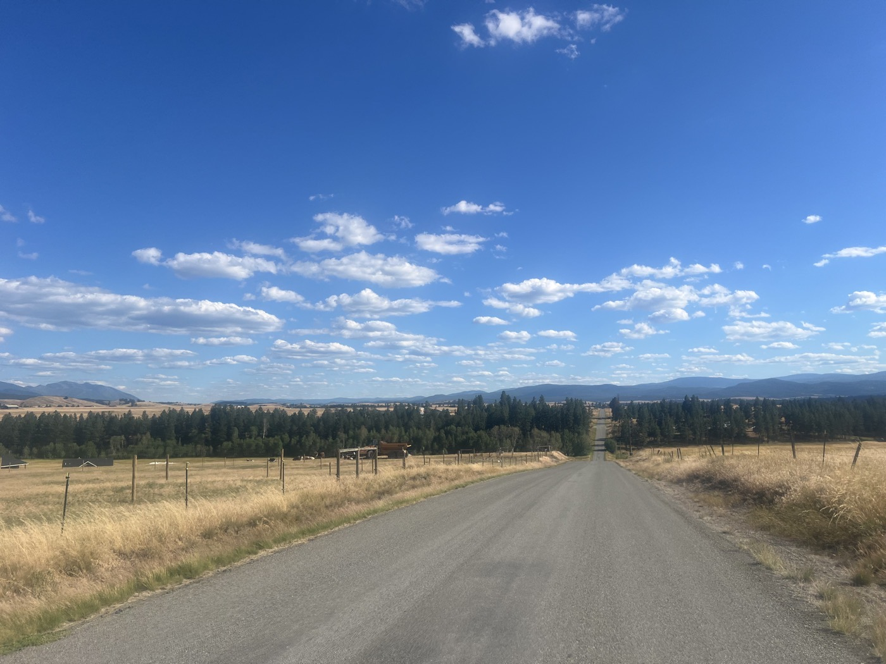

# 6. The 49th Parallel

<figure markdown>
{ width=“300” }
</figure>

And here I am, I've crossed the border. The landscape has changed significantly. Ranches everywhere. The first town, Eureka, is quite nice. And especially an exceptional campground for cyclists. I managed to ride 130 km with 1,000 m of elevation gain. It's great.

<!-- more -->

Last discussions with John & John, I love how they talk about their country. Too bad we don't move at the same pace. I meet 3 other "Great Dividers," and we share our experiences. Those who are going south to north share some good tips. I jot them down, and I will try to plan my stops accordingly. For tonight, they also validate my choice: "the bicycle station."

I say goodbye to Canada. The border crossing went smoothly. Except for the size of the border guards (very, very strong and very, very tattooed). You don't mess around. Off I go again - the American flag is everywhere. Some are huge. Here I am in Montana after the provinces of Alberta and British Columbia in Canada, entering my first American state.

The landscape has changed significantly. Lots of prairies and grass. It's 33 degrees! I stop in the first town, Eureka, to eat. I've never seen so many churches with different names. Otherwise, very pretty. The meal is the same on both sides of the border: Burger (I'll tell you more about the food).

Speaking of the border - I wondered why it was drawn so straight. Wikipedia teaches me that it's actually the 49th parallel that defines the border. So, I am exactly at the same latitude as Paris tonight. Funny.

I arrive at my campsite: the bicycle station. A welcome reserved for cyclists. There's no one but everything is open. They have set up cabins to leave the bike and sleep next to it. There are showers, a garden, a bike repair workshop, a kitchen, fridge, and living room. And all of this is at your disposal. There are a few such places along the route that are extraordinary. I finally meet the owner Siri, who comes from Norway. Her husband Chris, a carpenter, built everything. It's a beautiful place - a heart-wrencher to be leaving tomorrow morning.

On the way, I saw an incredible number of does and deer. At first, I took pictures, but they are truly everywhere. Siri confirms that they are indeed wild but jump all the fences to go look for the lush green grass. I think I saw at least 20 in one hour.

Tomorrow I will try to maintain the same pace! Happy Swiss National Day 🇨🇭!

<figure markdown>
{ width=“300” }

{ width=“300” }

{ width=“300” }

{ width=“300” }

{ width=“300” }

{ width=“300” }

{ width=“300” }

{ width=“300” }

</figure>
