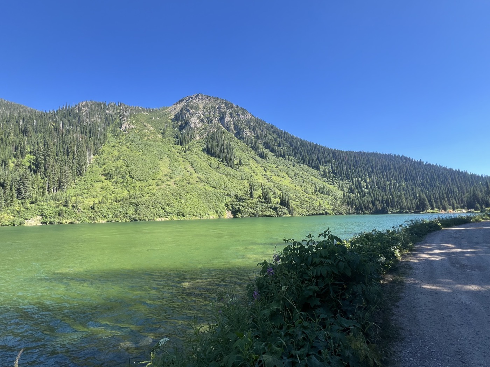
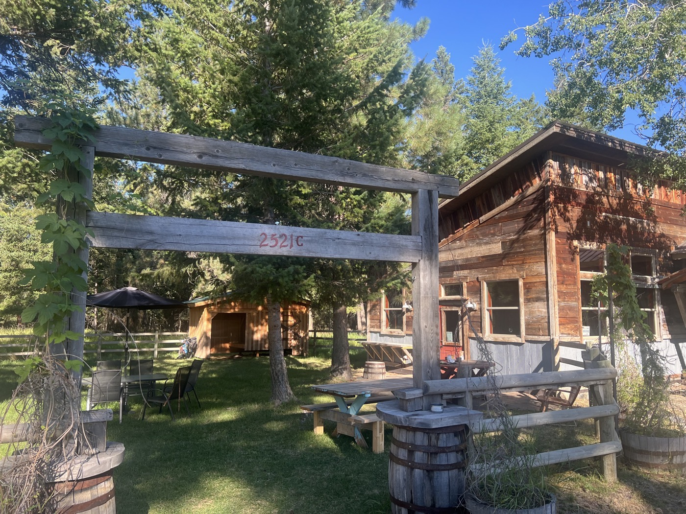
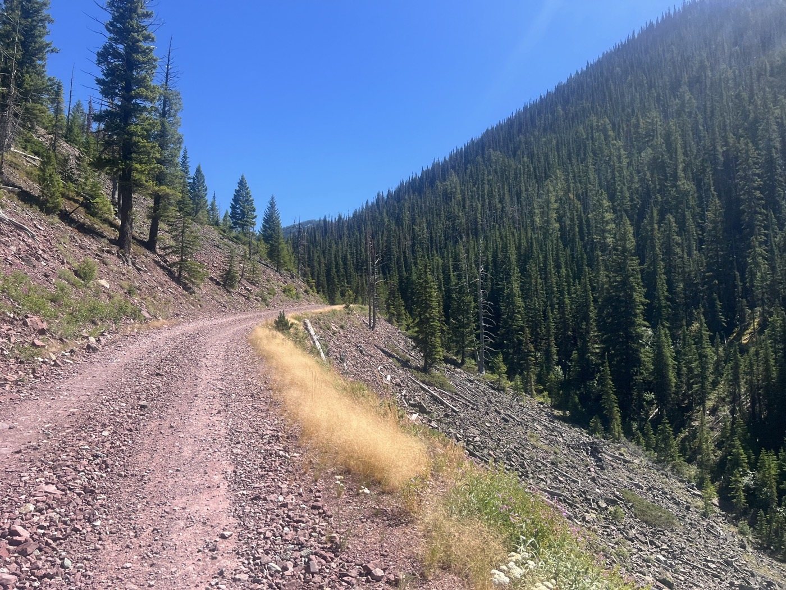
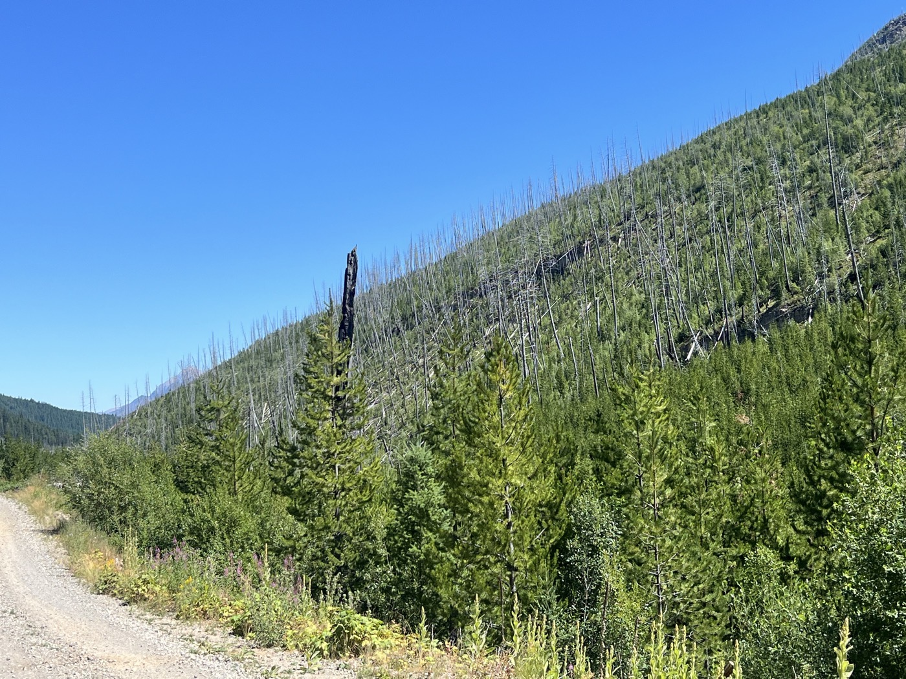
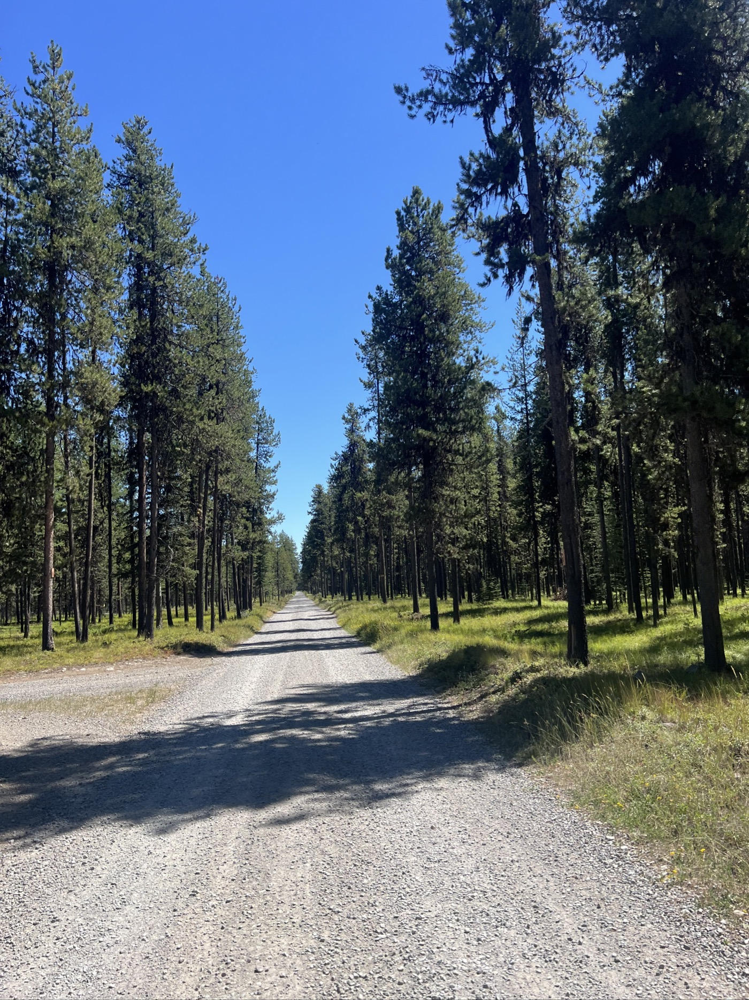
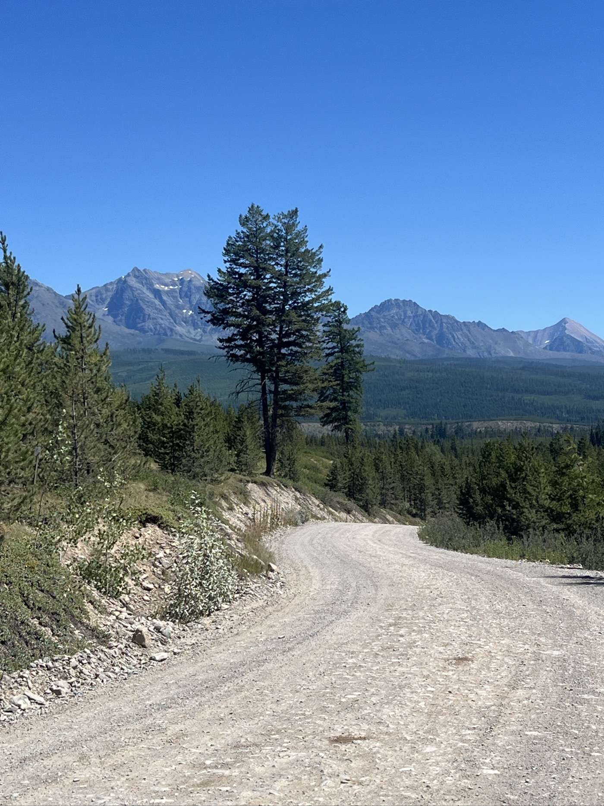
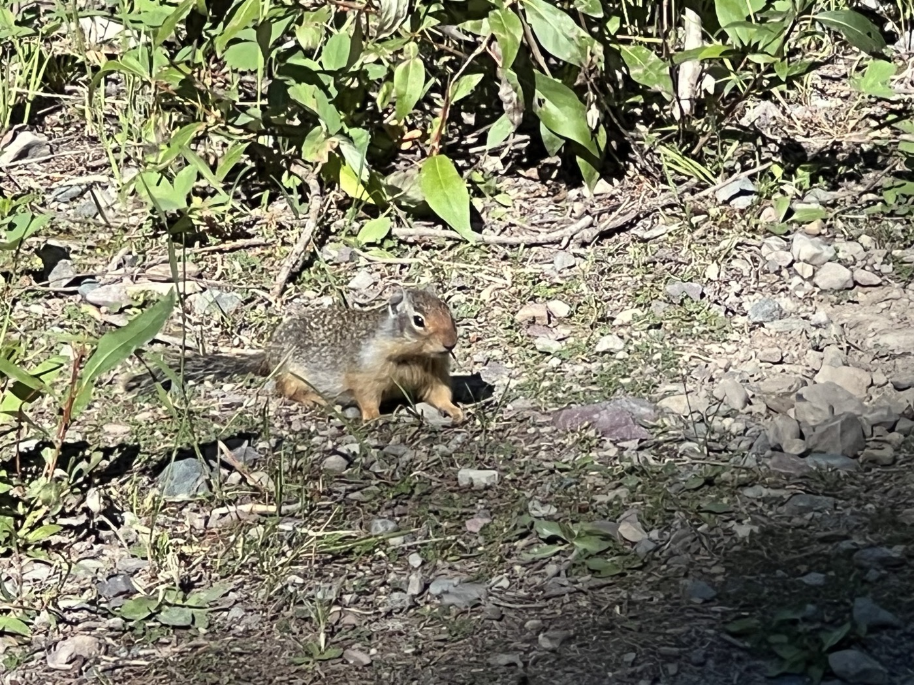
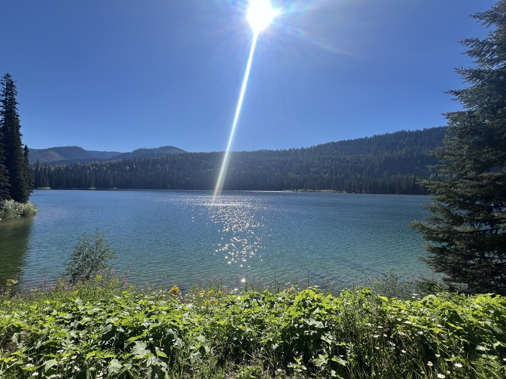
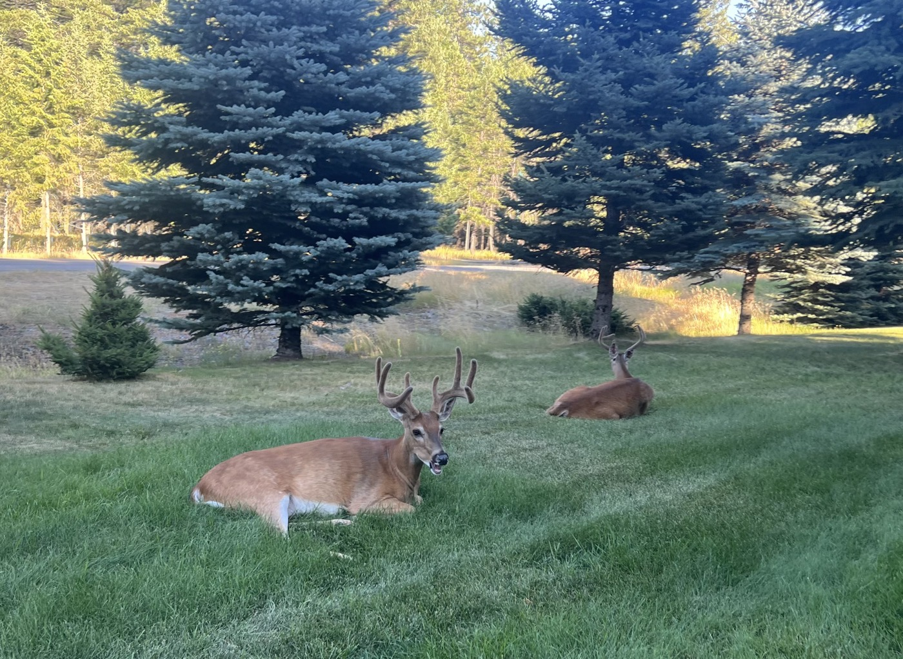

# une semaine déjà!

<figure markdown>
{ width=“300” }
</figure>

Aujourd'hui j'ai mis le turbo. 130km/1'700m de dénivelé positive avec 2 cols à passer. Pas un nuage, j'ai roulé non-stop sur du gravier (dur dur pour les fesses) pour prendre la dernière place au camping de Whitefish.

<!-- more -->

Ce matin je fais connaissance avec Chris Neil, le mari de Siri. Un couple de cyclistes passent. Curieux mais seulement le temps de discuter (Dieter et Monika , Allemands donc). Globalement chaque rencontre est joyeuse car on est tous dans la même aventure. Mais ils ont tous 60 jours ou 3 mois, pas grand monde pour avancer ensemble à mon rythme. Il reste les rencontres.

Chris m'alerte qu'un feu s'est déclaré à Lincoln dans le Montana et sur le tracé. On espère qu'il sera contenu sinon je devrai faire un détour. C'est à 330km, j'ai encore 2 jours pour voir venir.

Le défi du jour est le dénivelé avec 2 cols à passer. Je trouve que je m'en sors bien, presque 18km/h de moyenne. Il fait super beau et chaud et je profite des rivières sur le chemin. J'ai résisté à la baignade mais ça va plus durer longtemps. L'eau est super claire et fraîche. Aujourd'hui je suis allé non-stop pour voir ce que cela donne. Heureusement que je me suis préparé ☺️.

Le plus incroyable est que sur 130km j'ai dû faire 120km de gravier dans la nature.  Tout est très vert et la trace passe à côté de lacs aux couleurs incroyables.

Mon seul échec est que je n'ai pas pu finir la pizza "Large" en ville ce soir. Je pense qu'il faut 2 jours de vélo pour y arriver 😄.

Demain je vais essayer de garder ce rythme. Je fais gaffe aux fesses qui commencent à se manifester. C'est vrai que ça secoue mais j'ose pas encore filmer en descente pour vous montrer. 

Suis content de la médaille de bronze de Roman au 200m dos, c'est le fils d'un ancien collègue. Bravo 👏!

<figure markdown>
{ width=“300” }

{ width=“300” }

{ width=“300” }

{ width=“300” }

{ width=“300” }

{ width=“300” }

{ width=“300” }

{ width=“300” }

</figure>

