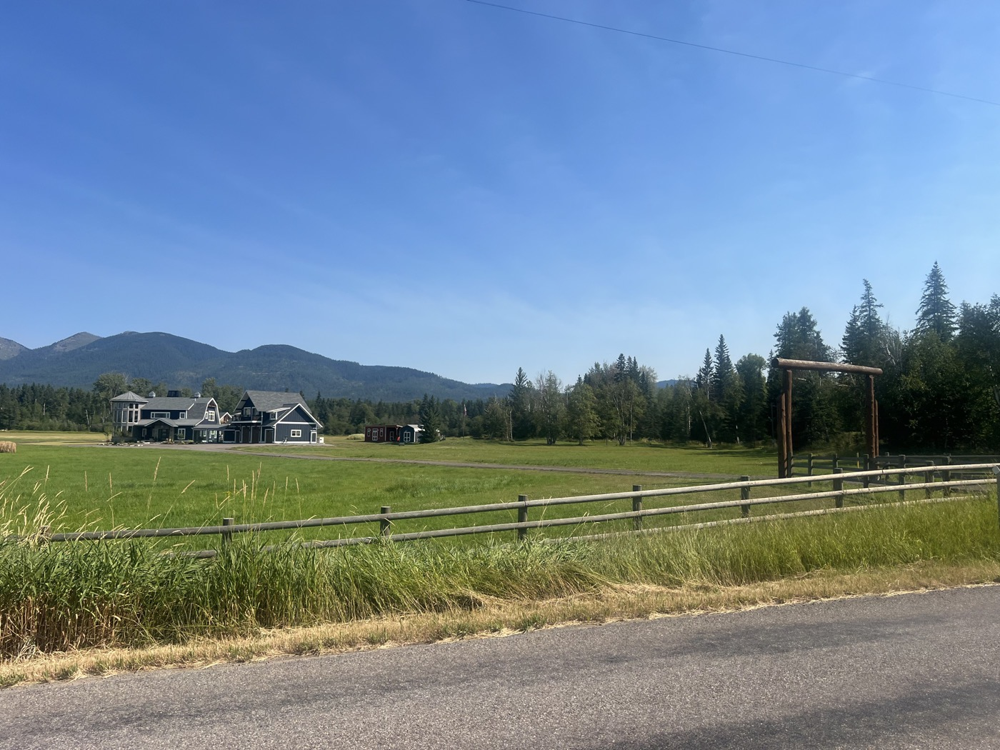
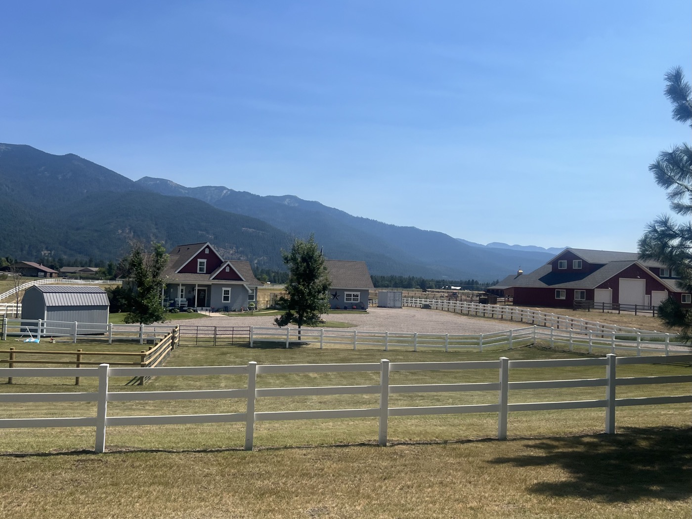
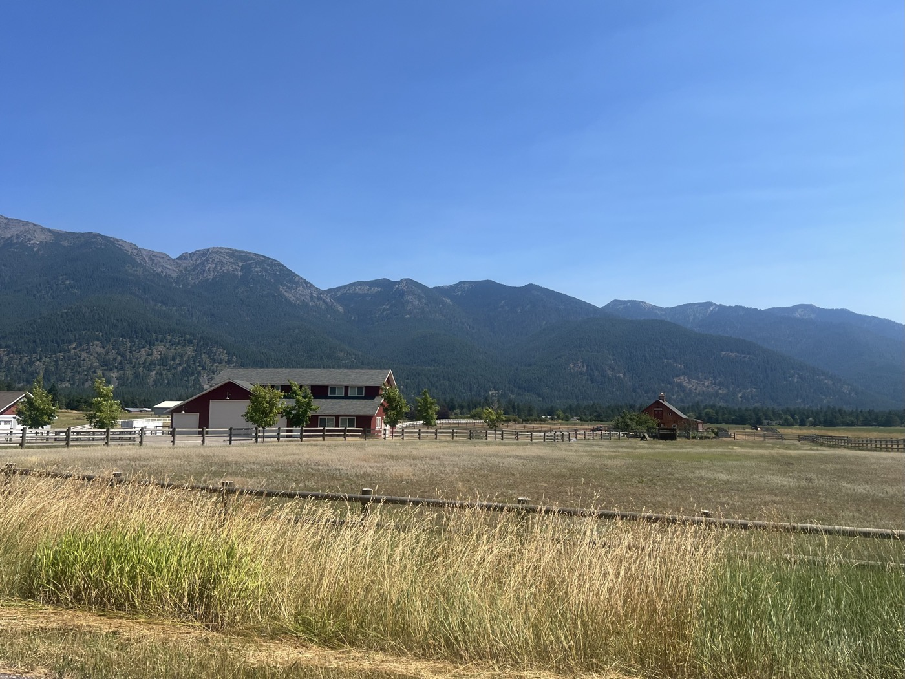
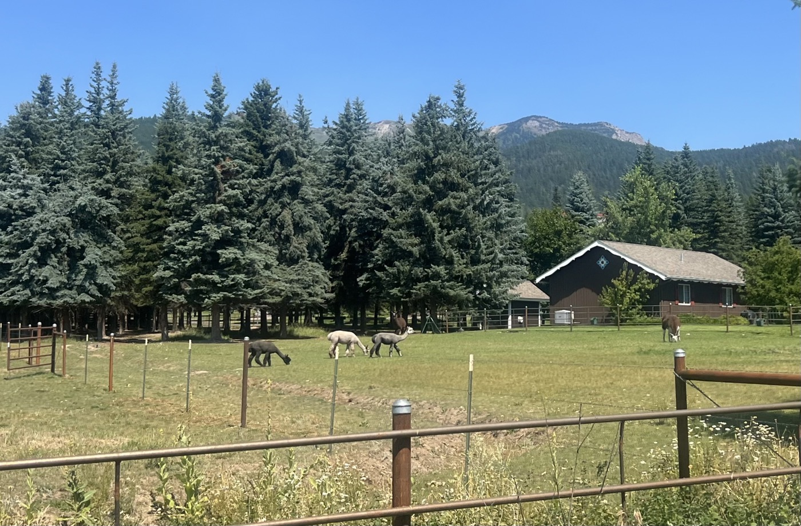
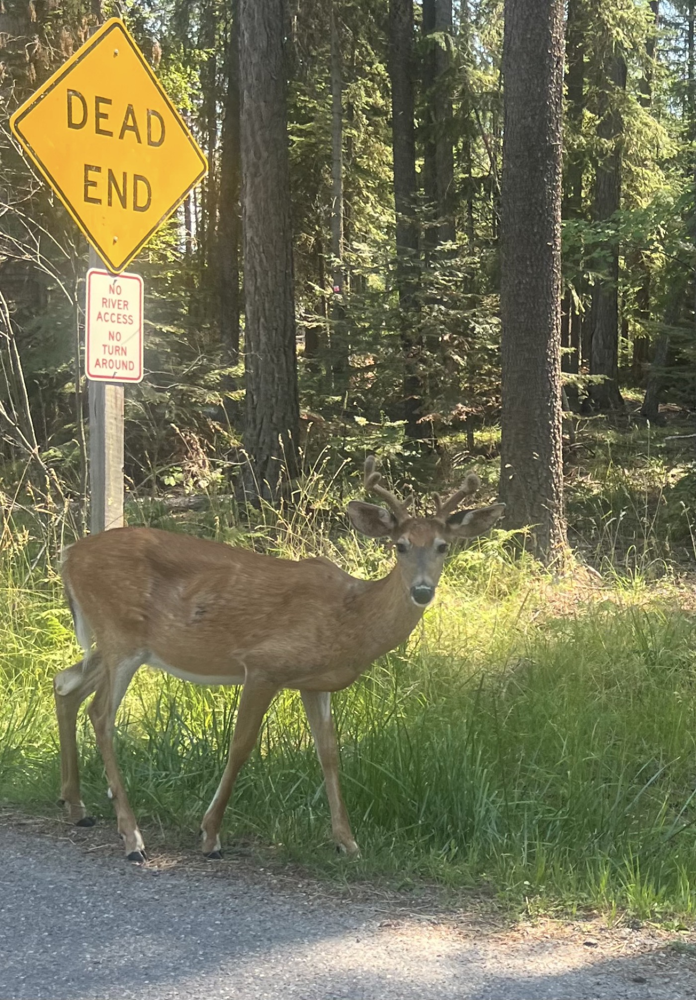
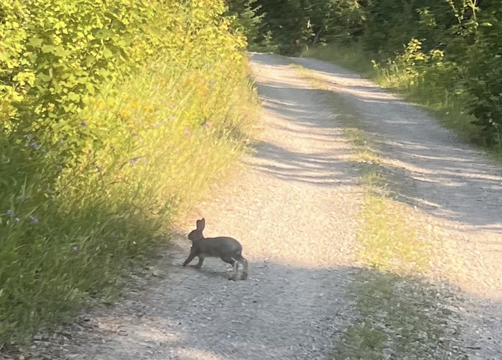
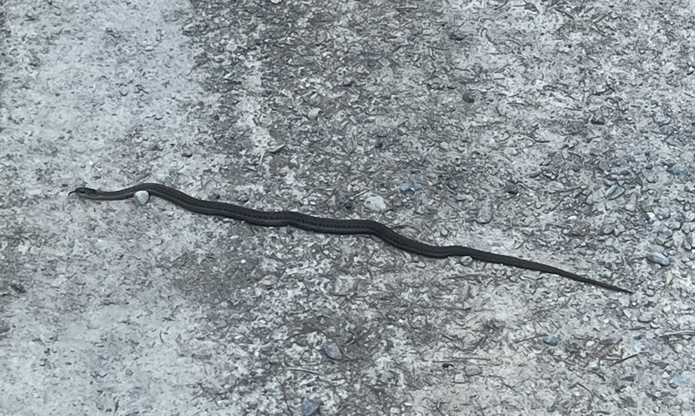
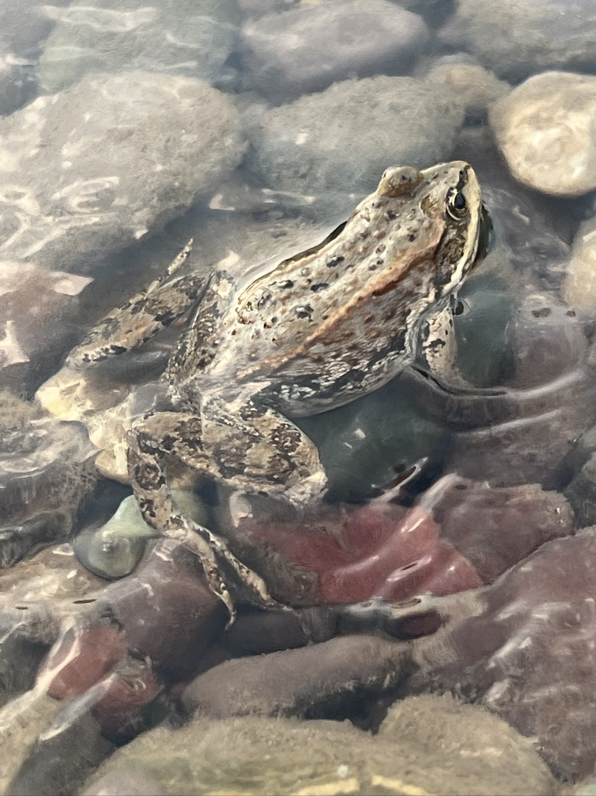
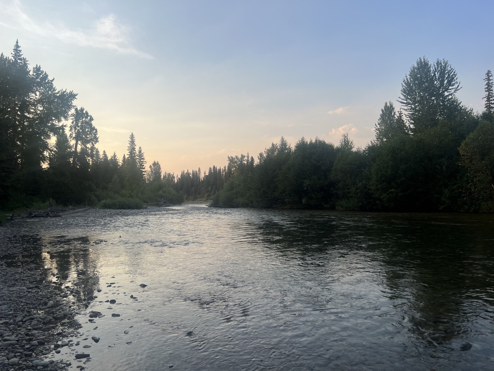

# Camping at Swan!

<figure markdown>
{ width=“300” }
</figure>

I'm making good progress, but the road is still closed due to the fire between Ovanda and Lincoln. Montana is one of the challenging passages of the Great Divide. I have a lot of elevation to gain in the coming days. I’m trying to manage well!

<!-- more -->

A not-so-early departure; I do some shopping in Columbia Falls. In a large supermarket (Smiths), I head to the drugstore/pharmacy section (here pharmacies are directly in supermarkets like Walmart or Smiths). I discover an entire assortment of cortisone creams. Available over the counter without a prescription here 🤔. I grab a tube to get rid of the little bumps that inevitably come with sweat and friction. Oops, I tossed the box—any side effects? We’ll see; I’m still in the preventive stage, so small doses.

It’s rolling nicely, 60 km on a small road followed by a climb. I visit the plains; the villas/ranches are immense. The photos don’t do it justice. Some even have a closed garage to fit their entire RV (extra large, you know, the ones where you push the walls). I’m sure I’ll see some again, and I’ll show you. They really have too much space. At the same time, who cleans these palaces (because that’s all there is)?

Then it’s climbing on gravel, with another animal festival around 5 PM. Two rabbits, three little snakes (I almost ran over one) for a change. I set up my tent by the river. Here, wild camping is generally allowed (except on private property). Two other campers: one from Oregon and the other from California. They give me a lesson on bears: you need to make a triangle between the tent, the food bag suspended, and the place where you eat. I used to eat right next to my tent. Epic fail.

We talked about Trump and the elections; they too don’t understand how the USA has come to this. I note that red states are mostly rural and vote Republican. At the same time, they receive funds from blue/Democrat states (big cities like New York or California pay a lot more taxes and are **more populated**). It's the red vs. blue equalization, so to speak. I note that who pays what is important. Montana is one of the least populated states.

Rain is forecasted for the day after tomorrow. The pace will slow down due to a lot of elevation gain. I plan for a recovery day in the next 2-3 days.

<figure markdown>
{ width=“300” }

{ width=“300” }

{ width=“300” }

{ width=“300” }

{ width=“300” }

{ width=“300” }

{ width=“300” }

{ width=“300” }

{ width=“300” }

</figure>
