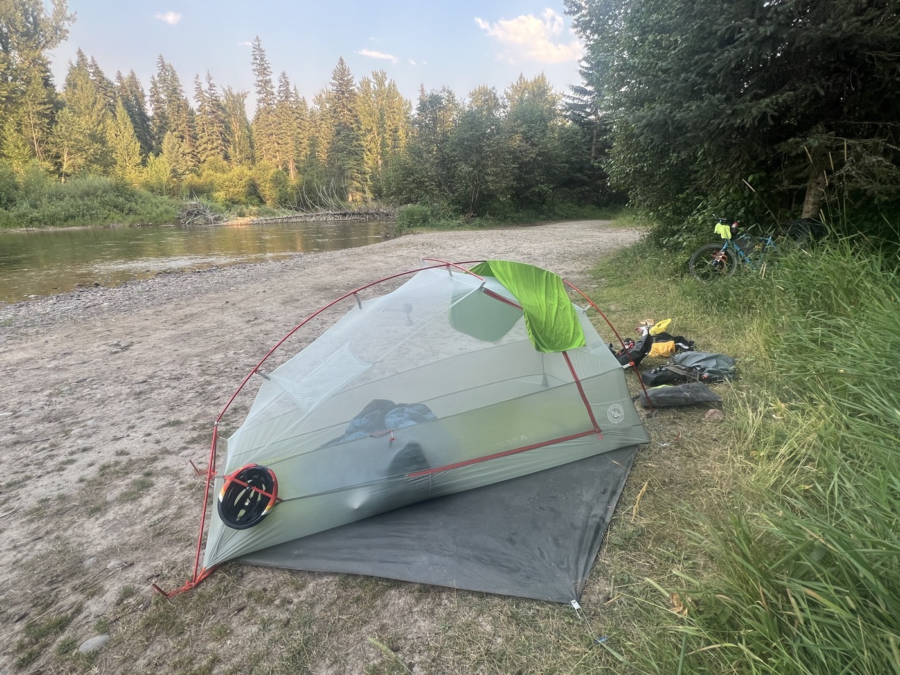

# Camping chez Swan!

<figure markdown>
{ width=“300†}
</figure>

J'avance bien mais la route est toujours fermée pour cause du feu entre Ovanda et Lincoln. Le Montana fait partie des passages difficiles de la Great Divide. J'ai beaucoup de dénivelé à faire ces prochains jours. J'essaie de bien gérer!

<!-- more -->

Départ pas très matinal, je fais des courses à Columbia Falls. Dans un grand supermarché (Smiths) je vais au rayon droguerie/pharmacie (ici les pharmacies sont directement dans les supermarchés style Walmart ou Smiths). Je découvre un assortiment entier de crèmes à la Cortisone. En vente libre sans ordonnance ici 🤔. Je prends un tube pour me débarrasser des petits boutons inévitables avec la sueur et les frottements. Oups j'ai jeté la boîte - des effets secondaires? On verra bien - j'en suis encore au stade préventif donc petites doses.

Ça roule top, 60km sur petite route puis grimpette. Je visite en plaine, les villas/ranchs sont immenses. Les photos sont pas assez parlantes. Certains ont même un garage fermé pour y mettre leur caravane en entier (taille XL hein, celles où on pousse les murs). Je suis sûr que je vais en revoir, je vous montrerai. Ils ont vraiment trop de place. En même temps, qui fait le ménage dans ces palaces (car il n'y a que ça)?

Ensuite c'est de la montée sur gravier, avec vers 17h à nouveau le festival des animaux. 2 lièvres, 3 petits serpents (j'ai failli en écraser un) pour changer. Je monte la tente au bord d'une rivière. Ici le camping sauvage est globalement autorisé (sauf sur un domaine privé). 2 autres campeurs : l'un de l'Oregon et l'autre de Californie. Ils me font la leçon sur les ours : il faut faire un triangle entre la tente, le sac de nourriture suspendu et l'endroit où on mange. Moi je mangeais bêtement à côté de ma tente. Échec. 

On a parlé Trump et élections, eux non-plus comprennent pas que les USA en soient là. Je retiens:  les états rouges sont plutôt ruraux et votent républicains. En même temps ils reçoivent des fonds des états bleus/démocrates (les grandes villes style New York ou la Californie paient beaucoup plus de taxes et sont **plus peuplées**). C'est la péréquation rouge vs bleu quoi. Je note que qui paie quoi à son importance. Le Montana est un des états les moins peuplés.

Pluie annoncée pour après-demain. Le rythme va baisser car beaucoup de dénivelé. Je prévois un jour de récupération d'ici 2-3 jours.

<figure markdown>
{ width=“300†}

{ width=“300†}

{ width=“300†}

{ width=“300†}

{ width=“300†}

{ width=“300†}

{ width=“300†}

{ width=“300†}

{ width=“300†}

</figure>

