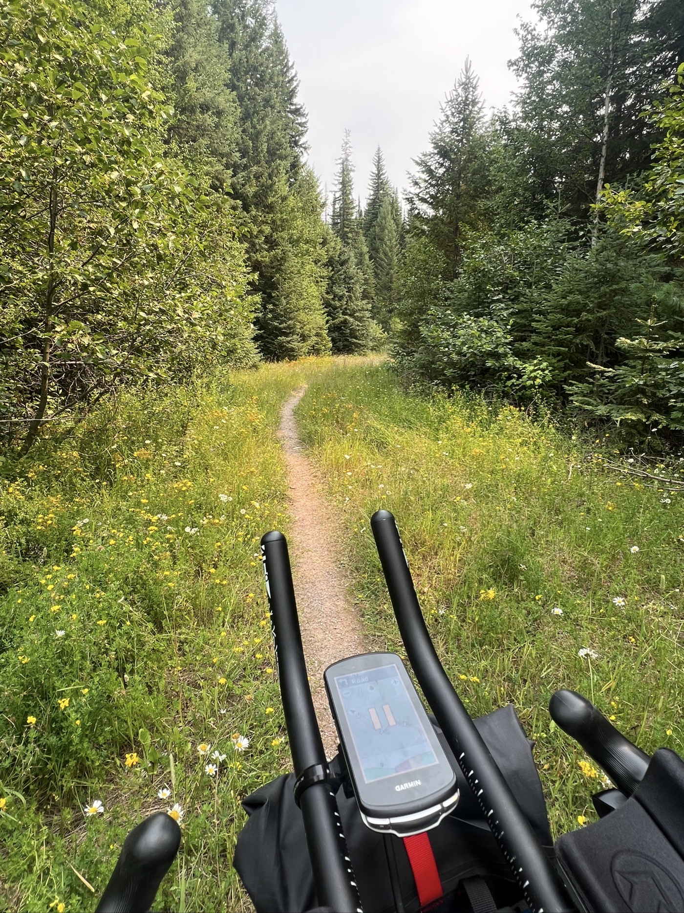
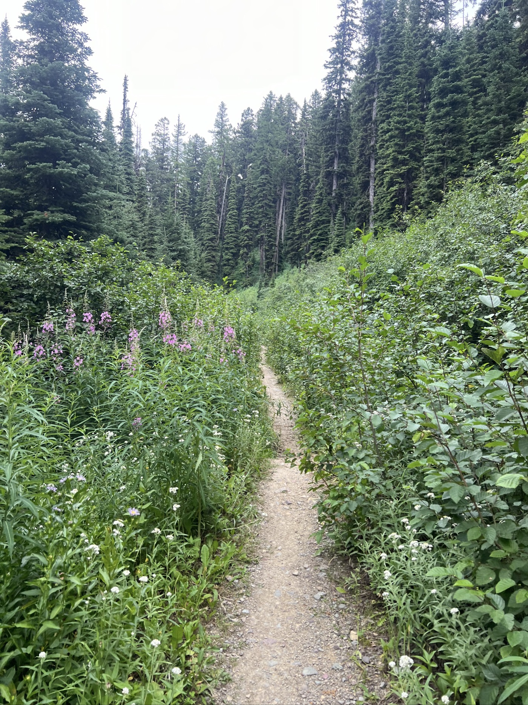
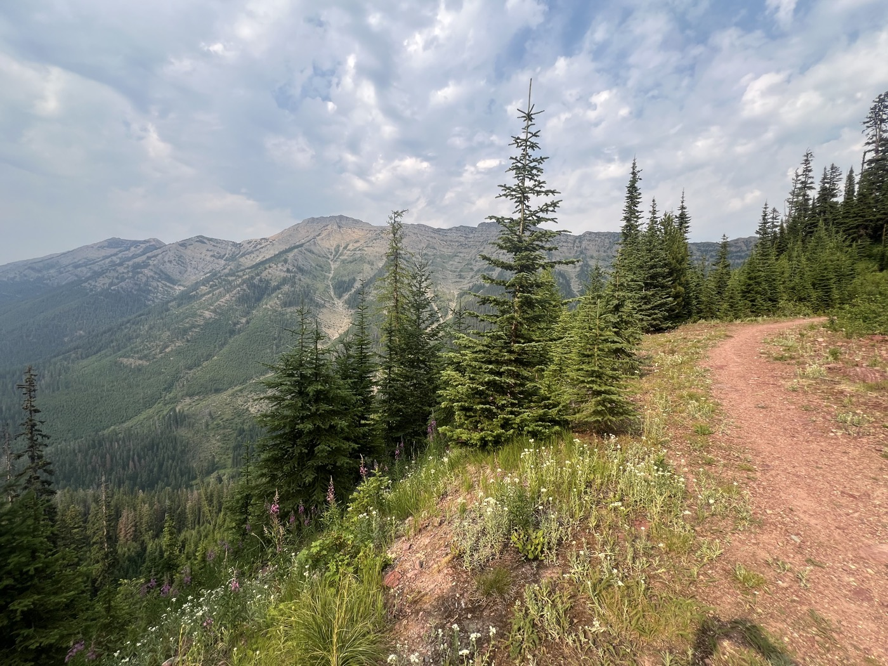

# 2075mD+

<figure markdown>
{ width=“300†}
</figure>

I continue my journey, still on gravel and without passing through any towns. I aim for Seeley by the lake. There’s a big elevation gain: I pass over 2,000 meters of climbing (Elevation+). I’m in such a hurry to arrive that I miss the exit and end up back in a wild campsite. A family of rabbits welcomes me—there's another tent with a Canadian. My biggest day with 8 hours and 15 minutes in the saddle.

<!-- more -->

I realize that I enjoy taking my time in the morning. I leave around 10 AM, and I notice that even though I ride fast, it takes me a long time to catch up to my two early American riders. I’m sure La Fontaine rode a bike too 😉! Tomorrow, I’ve decided, I’ll start at 9 AM!

The whole day is on gravel with two climbs. Long ones with steep sections. I go at a steady pace; due to the heat, I soak my head in the rivers and refill my water by filtering it. I didn’t do it yesterday, but the American (the same one) reminded me that there’s a bacteria that takes two weeks to take effect. Even in mountain stream water. Anyway, I need to be wiser.

The second climb is never-ending, and I dig into my reserves. The descent rewards me with a single trail, a narrow and lively path on a long descent. At the end, everything has burned; I notice that there are also few animals.

I’m so eager to arrive that I forget to look at my map. I miss the town of Seeley; never mind, I camp and eat freeze-dried food. Surrounded by a family of not at all shy rabbits!

<figure markdown>
{ width=“300†}

{ width=“300†}

{ width=“300†}

{ width=“300†}

{ width=“300†}

{ width=“300†}

{ width=“300†}

</figure>
