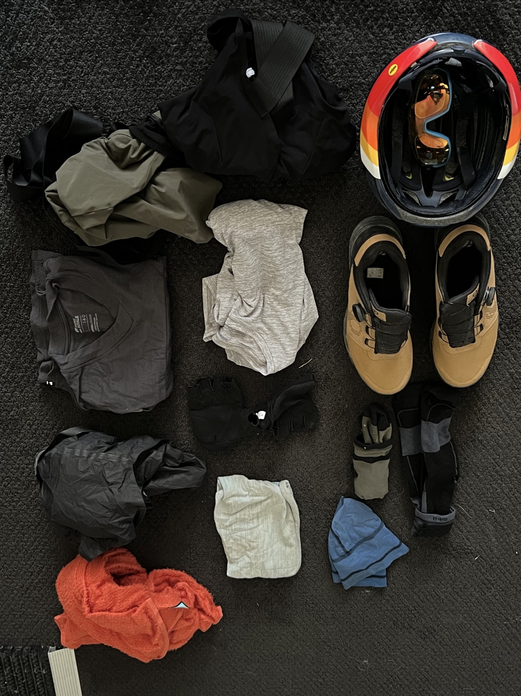
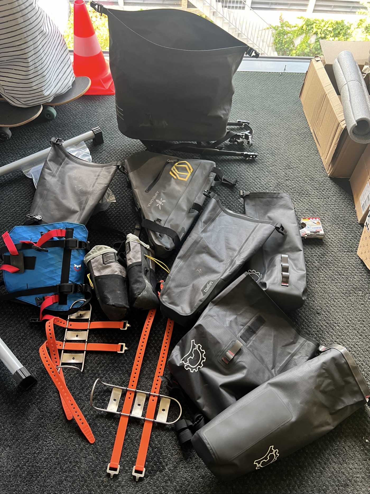
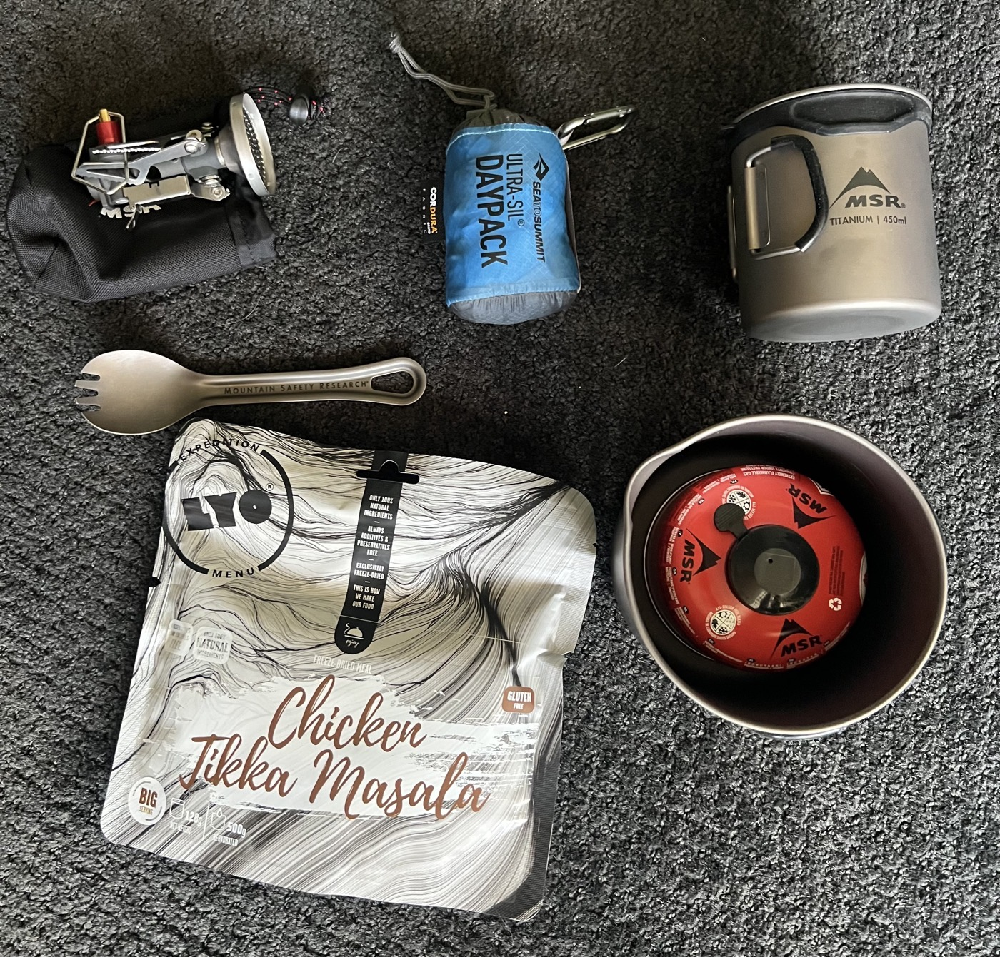
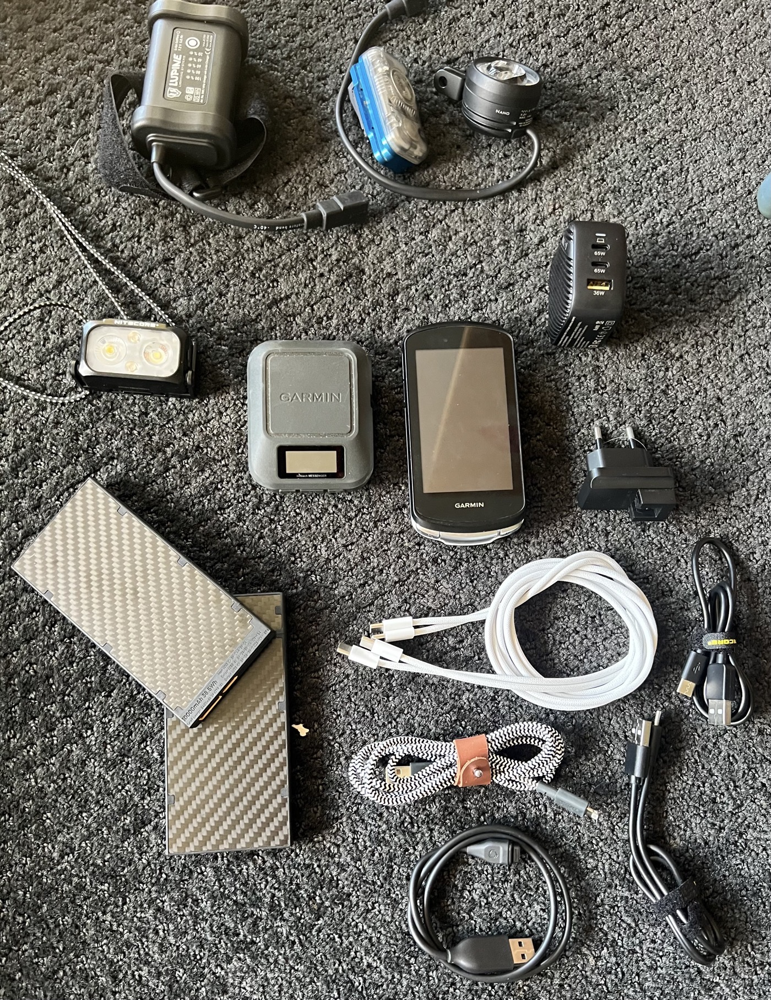
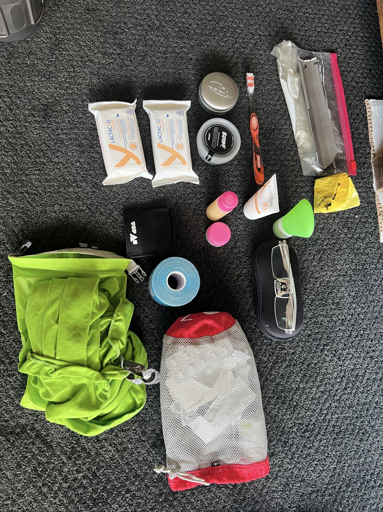
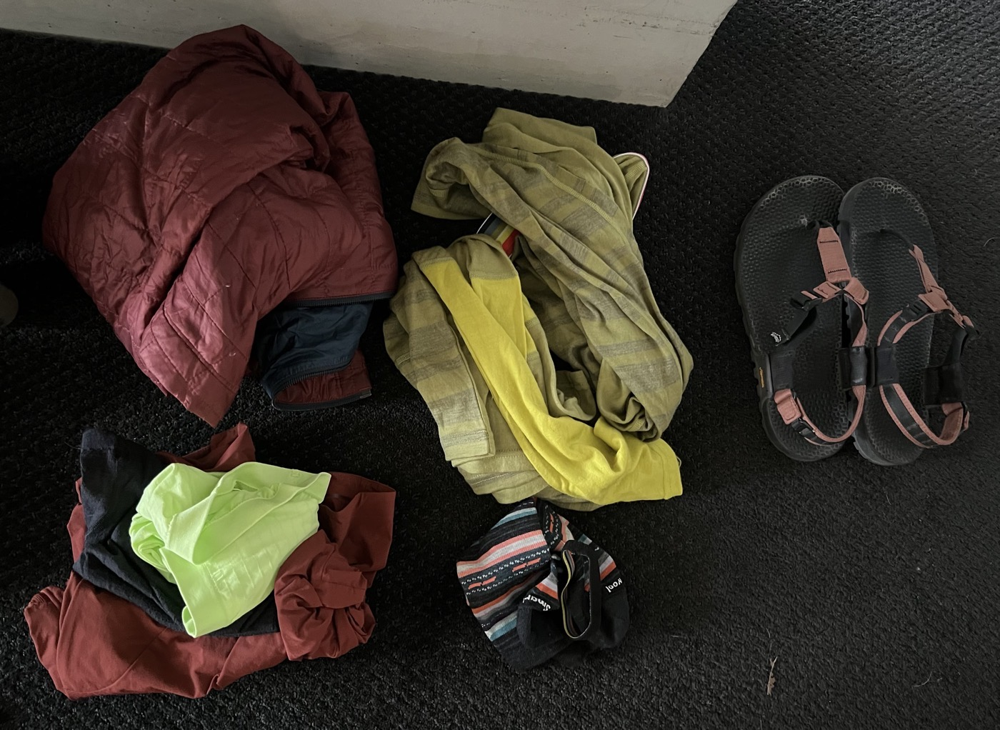
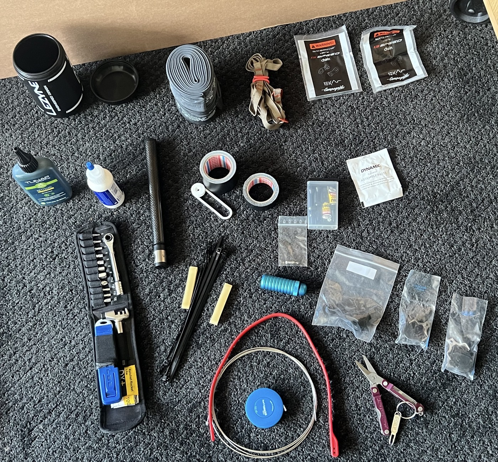
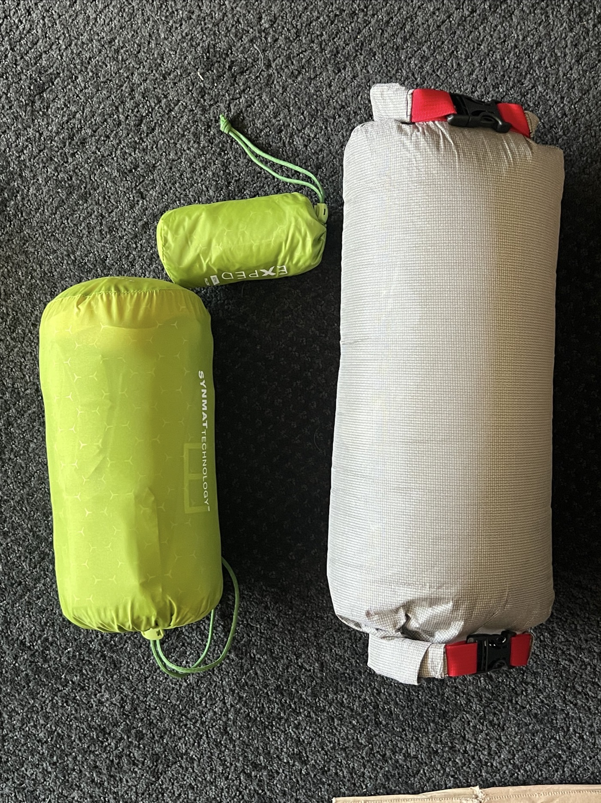
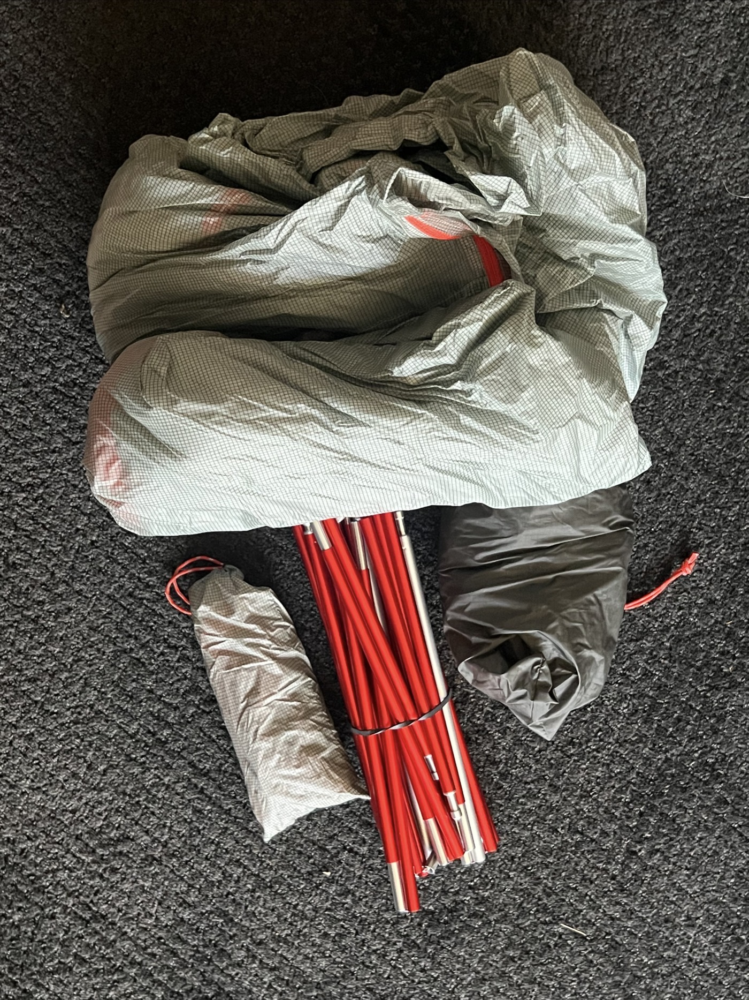
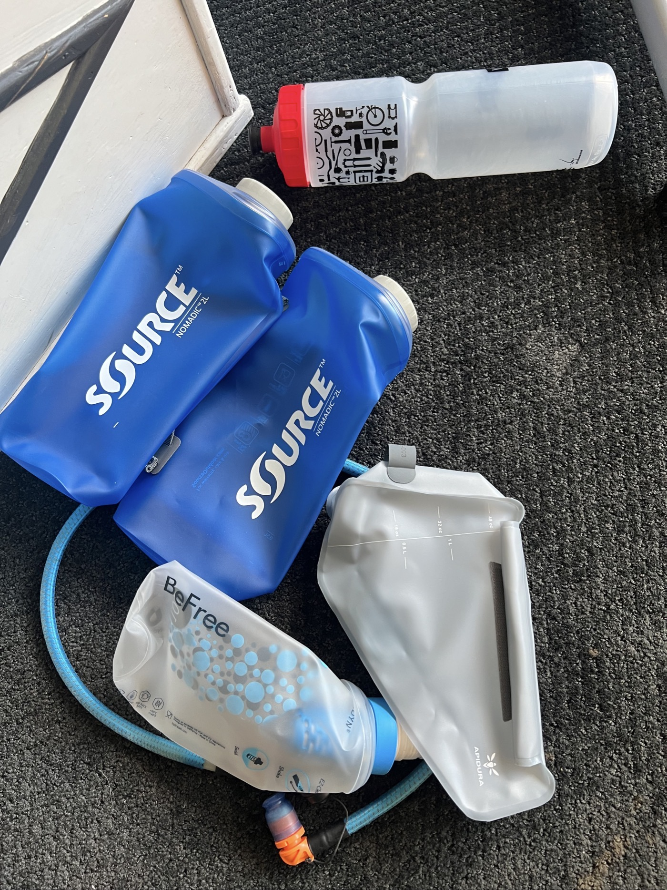

# Rig

This page will display all equipment related content and aims at explaining some of my (more or less difficult) choices. It should also develop into picks and flops based on actual reality check 😉 so will get some updates.

Obviously while functions/purposes are key, the other driver for trade-offs is weight (and volume). How much do I want to carry?

# Lighterpack

My objective was to stay below 22Kg (bike and all gear, excluding myself and  water/food consumables). To give this some perspective my weight when departing for the great divide is 71Kg for 175cm and my (carbon) bike frame  allows a max of 120Kg. Now that makes a total of 92Kg. Adding water and consumables I will get close to 100kg in motion.

Considering the rough terrain and the effort of biking leaving 20Kg of spare sounds like a good idea 👍.

Some difficult questions and considerations tackled:

 - I need to plan for heat/hot days as well as cold and potentially long/rainy days
 - I need to be able to carry water : from 4L to 8L (in some areas). Some areas are seriously limited in water supply
 - Do I need to have a gas cooker with me? Opinions vary but I decided to go for it.
 - Dynamo as power recharge? Solar panels? I decided not needed as I will not be racing nor will I bike during the night or go high speed.

I have been estimating my weight using the [Lighterpack](https://lighterpack.com/) website.
You can have a peak below, it is quite straightforward and detailed. Some tuning is still ongoing as I write (e.g some items have not been weighted, others are deemed optional). In the end I also decided to be less restrictive. If something is not useful, I can send it back home - I should know after 1 week. Ergo: I probably am closer to 23kg in the end.

<iframe src="https://lighterpack.com/r/bzytct" frameborder="0" width="100%" height="550" allowfullscreen></iframe>

# Rig(s) in more detail

For active wear I tried to think dual so that one part could be washed/drying while the other part is in use. Thus Merino wool and very light/compressible materials (Polartec Alpha 60, Shakedry Goretex) were preferred. Apparently mixing wool with some synthetic is best of breed (doesn't smell, dries quickly).

<figure markdown>

{ width="500px" }
<figcaption>2 bibs, 2 t-shirts, 2 pair of socks, 1 wind jacket, 1 hoodie, neck and head.</figcaption>

</figure>

I went for mixed bags (😜). Apidura for frame, tube and food pouch bags. Revelate in the front (pronghorn system and fork bags). Tailfin panniers in the rear. Apidura and Revelate are very light, Tailfin will prime on functionality. Impressive by the way the amount of choice by now. I tested most of it during a Morocco trail early 2024. One Tailfin pannier was torn open. They replaced it without discussion and it seems very unusual (at least from my forum readings). I decided to stick with them.

<figure markdown>

{ width="500px" }
<figcaption>Tried to minimise volume, maximise functionality and still leave some flex if needed (e.g. water).</figcaption>

</figure>

I finally decided for a small and light gas cooker. The MSR one checked the marks (canisters are easy to find in stores and stations, light and tiny). I opted for the DLX version which has a larger burner and an integrated lighter. Otherwise I picked Titanium cup and pot.

<figure markdown>

{ width="500px" }
<figcaption>Ready for my first meal! The sea-to-summit daypack is super handy for buying food in department stores).</figcaption>

</figure>

Electronics (more than 1Kg!). Ok there are 2x10'000mA Powerbanks. And the Lupine Aku can be used as Powerbank reserve as well. So many cables: can't wait to see more USB-C standardised... tried to pick the best compromise with lightweight vs charging speed in terms of power plug charger. Anyway maybe I will investigate the dynamo option in the future.

<figure markdown>

{ width="500px" }
<figcaption>Garmin Edge 1040, large screen w/o solar. Garmin Messenger as tracker. iPhone.</figcaption>

</figure>

Hygiene and a bit of anti-everything. My biggest worry is skincare in relation with my saddle. A sore bum still is number 1 reason for abandoning...

<figure markdown>

{ width="500px" }
<figcaption>Ever tried toothpaste from Lush in tablet form 🙃? Tape should alleviate tendinitis (Knee/shoulder). I hope border crossing will be fine, I ✂️ the packaging to use as reference. Did you spot the dig dig tool?</figcaption>

</figure>

Passive clothes to enjoy after the riding journey. Warmth, comfort, relaxing and dry.

<figure markdown>

{ width="500px" }
<figcaption>Love my bedrock sandals 😎</figcaption>

</figure>

Repair kit wow so many items. I really like my Topeak Ratchet even if not the lightest it is really practical. Ah did you notice I ride with an Campagnolo EKAR group set? Which is not very common. So you can see replacement EKAR campa brakepads, dérailleur cable, chain quicklinks. Otherwise a derailleur hanger, puncture kit, I just hope I will not have to use any of it. Chain lube, tubeless liquid, I will take care of my Open Up.

<figure markdown>

{ width="500px" }
<figcaption>All about taking care of my bike! (and she doesn't even have a name as of yet)</figcaption>

</figure>

A good mat, a must-have pillow and a favorite down quilt : what else!

<figure markdown>

{ width="500px" }
<figcaption>Simple but comfortable.</figcaption>

</figure>

Quite happy about Big Agnes 1p tent. The 2 person version could have been the better choice (marginally heavier but spacier). Couple of additional tent tarps just in case - they are easy to loose on a site.

<figure markdown>

{ width="500px" }
<figcaption>Big Agnes Copper Spur 1p</figcaption>

</figure>

How do you scale from 4L to 8L, filter water if running dry... still to be seen. I opted for 2x2L flasks, a 1.5L bladder, 1L filter, 800ml bottle. And worse case, I plan to attach Smartwater bottles on my fork cages with Voile straps. Should be fine and rapidly tuned with feedback from other riders on the trail.

<figure markdown>

{ width="500px" }
<figcaption>A good water system?</figcaption>

</figure>

# Picks & learnings

As I prepared for my adventure I came across some really nice goodies. Bikepacking is a kind of niche use case therefore solutions are not mainstream like you would find them for mountaineering or skiing. In this section I would like to highlight some which other's could benefit from as well. It will expand in coming weeks!

 - Ever used a Quilt?
 - Are you familiar with Polartec?
 - What is a self-standing tent?
 - waterproof socks?
 - Voile straps?
