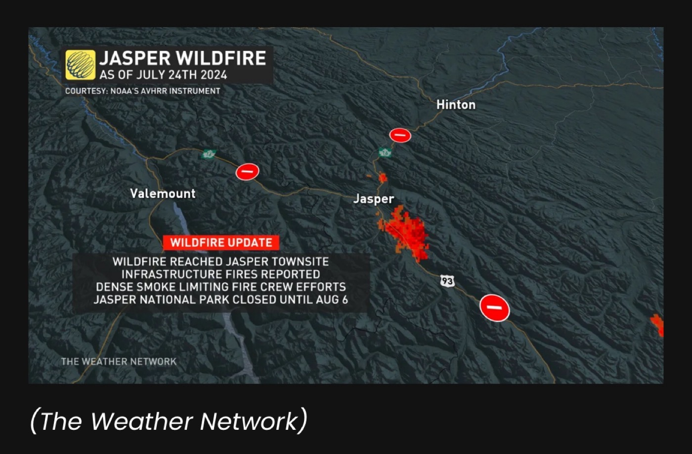
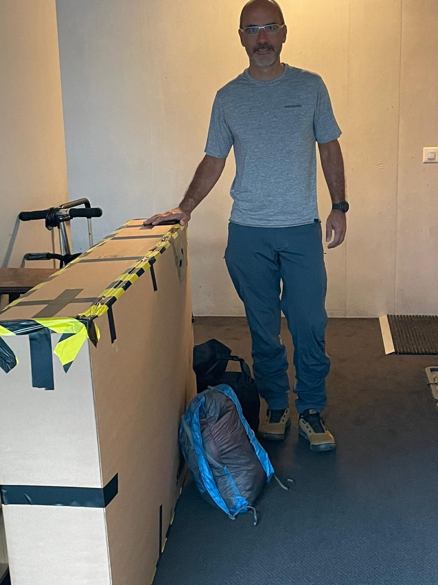
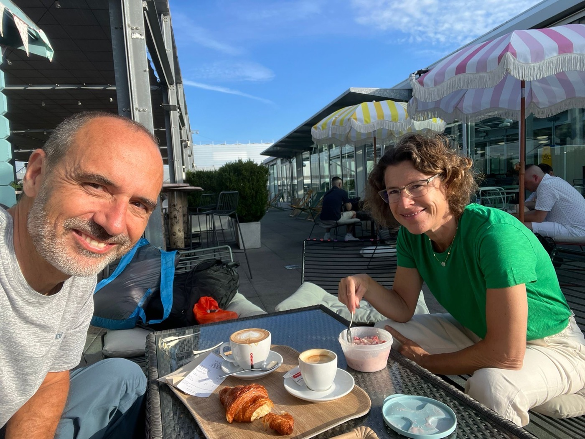
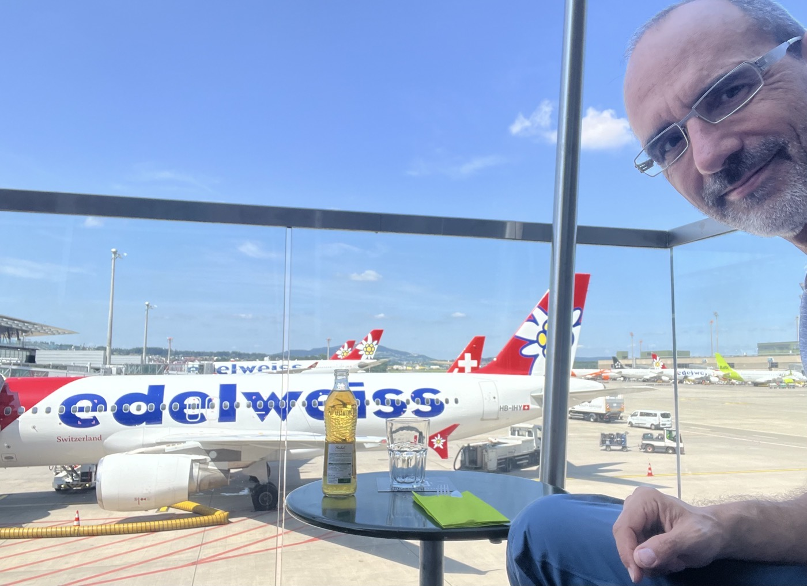

# Décollage

<figure markdown>
{ width=“300” }
</figure>

Attachez vos ceintures ! Les choses deviennent sérieuses. Plus grande leçon du jour : ne pas trop planifier à l'avance, laissez aussi le chemin vous guider.

<!-- more -->

Après un emballage stressant, tout s'est finalement bien terminé et l'enregistrement à l'aéroport de Genève s'est bien passé. Juste à temps (il restait 400g sur les 23Kg autorisés) ⚖️.

Avec Valérie, nous avons ensuite pu profiter d'un bon moment (y compris un bon cappuccino avec un joli dessin dessus ❤️).

J'ai également pu profiter un peu plus longtemps de l'aéroport de Zurich Kloten : la correspondance pour Calgary a été retardée d'1h30. Bonjour terrasse ☕️ encore.

Puis j'ai appris que Jasper est en flammes. Terrible nouvelle, apparemment le feu est en ville 🔥🔥🔥🔥. Il a fait trop chaud : 40 degrés Celsius. Le parc national de Jasper est fermé, la célèbre route Icelands Parkway entre Lake Louise/Banff et Jasper est également fermée à mi-chemin. Eh bien - je prévoyais de commencer à Jasper... 🧐 et maintenant ?

On verra une fois à Calgary. J'envisage de déballer/équiper le vélo et de prendre une chambre près de l'aéroport de Calgary. J'ai aussi vu que le Sentier Transcanadien (TCT) pourrait me mener à Banff. Et probablement que je me dirigerai vers le sud... laissant la route 93 derrière moi, en espérant que le feu sera bientôt maîtrisé.

Update : [les nouvelles sur le drame de Jasper est arrivé jusqu'0en Suisse](https://www.rts.ch/info/monde/2024/article/au-canada-un-feu-de-foret-a-ravage-la-ville-touristique-de-jasper-laissant-un-spectacle-de-desolation-28581173.html). Je vais définitivement me diriger vers Banff. Assez triste de voir cette dévastation...

<figure markdown>
{ width=“300” }
{ width=“300” }
{ width=“300” }
</figure>

