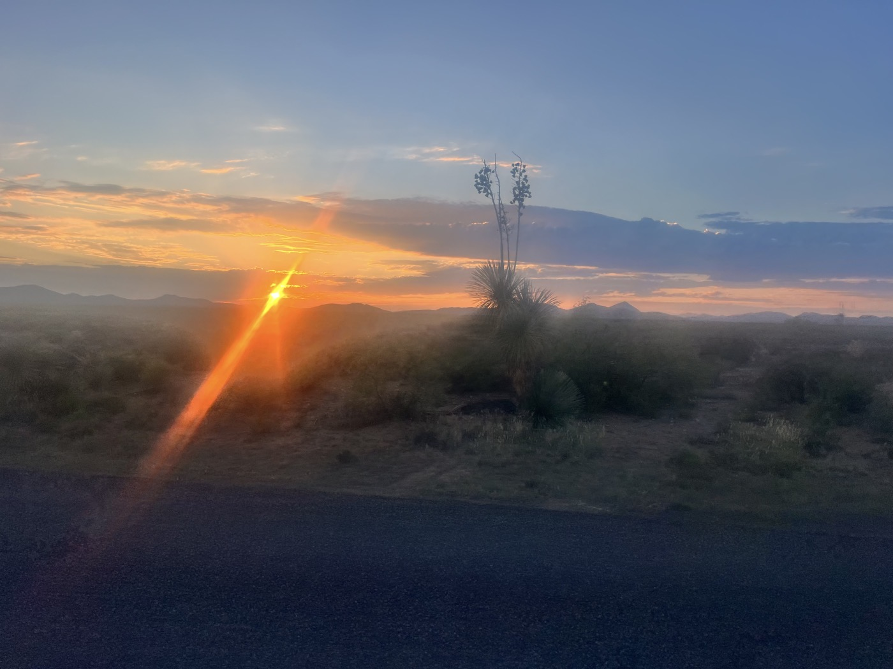
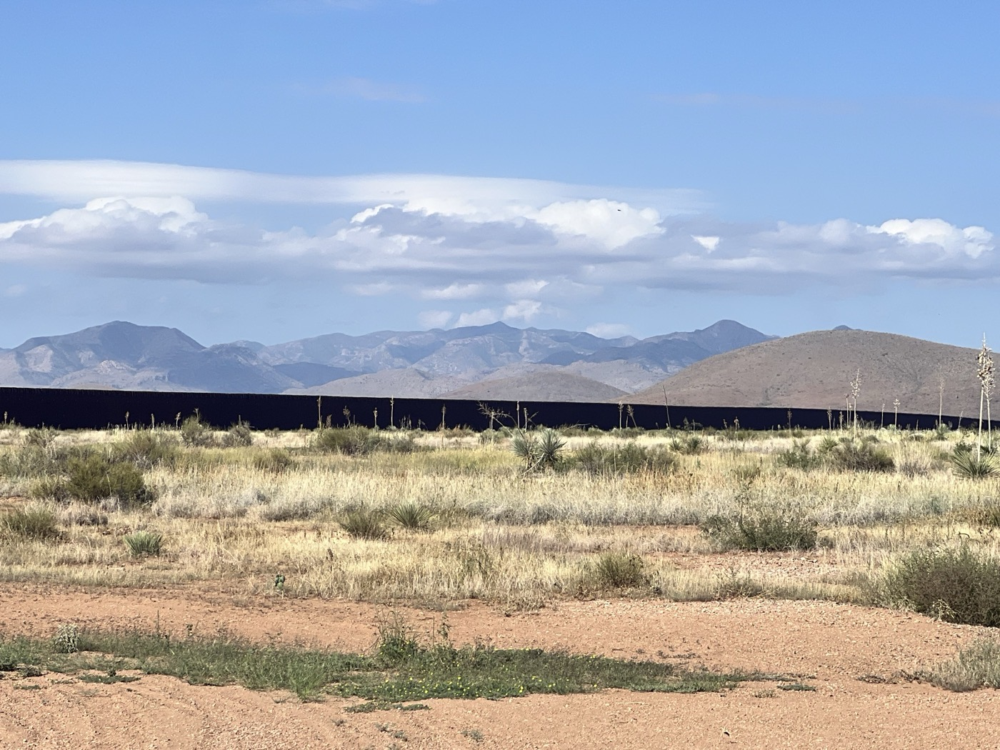
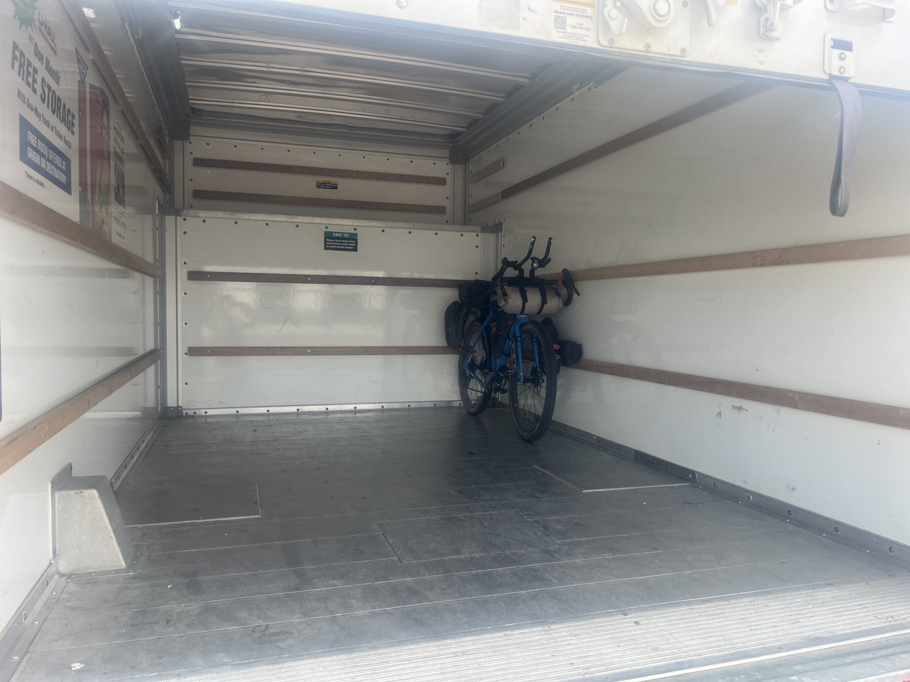

#  Antelope Wells : clap de fin 💪. Vraiment ?

<figure markdown>
{ width=“300†}
</figure>

Ça y est, c'est le jour du dernier coup de rein. Je pars à l'aube pour éviter le vent et enchaîner mon programme. Le bitume devient gravier, le vent est gérable, j'avance bien. Les émotions remontent au fur et à mesure que je prends conscience que c'est la fin. Tant d'efforts, de joies, de privations, de moments de vérité. Oui - j'ai touché mes limites plus d'une fois dans cette aventure, mais je n'ai jamais été seul.

<!-- more -->

# La fin du trait

Le trajet est plutôt court, j'arrive pile à 10h. Jeffery de Hachita s'est spécialisé dans l'assistance logistique car le poste frontière est au milieu de nulle-part. Chacun a besoin d'une solution d'extraction. Et je ne voulais pas repartir à vélo! Il arrive 15mn plus tard pour m'amener à Deming.

La frontière est facile à repérer. Un mur interminable définit le territoire. Les clandestins se blessent en retombant. Je vois des radars, on me parle de drones, frontière ultra-surveillée...

# Émotions

Sur le chemin, les coups de pédale se suivent et ne se ressemblent pas. Quelques explosions qui viennent des tripes, difficile de faire le tri. Je reviendrai dans les jours qui viennent pour remettre de l'ordre dans ce post. Mais l'émotion se transforme en fou rire lorsque je dois plisser les yeux pour  être sûr que sur ma route se trouve bien une (...) tortue! Vous imaginez? Ce sera Antelope la bien-nommée et je la repose bien à l'abri sur le côté de la route.

# Merci! 

D'abord à mon épouse Valérie pour m'avoir permis de faire cette longue aventure. Mes enfants. Aussi à la famille, aux amis : à tous ceux qui m'ont aussi encouragé par un beau mot, un message. Merci pour vos prières, ce voyage m'a replacé face à mes essentiels et Dieu a toujours été à mes côtés. Au final : je me suis régalé.

# Clap de fin ?

Une de mes leçons: un vrai voyage ne se termine jamais, mais se renouvelle chaque jour. On est jamais vraiment arrivé et dans ce qui est devant, tout reste possible. C'est ce que je vais essayer de mettre en pratique! Et le vélo-gravel-bikepacking-rencontres-défis est bien quelque chose que j'aime faire.

Je tourne ma boussole: fini le sud, direction l'ouest avec San Diego. J'essaie de prendre 3 jours de repos avant mon vol de retour. Je loue une camionnette et c'est parti! 

Passez voir vers le 10/11 septembre, j'aurai certainement mis mes dernières nouvelles sur le blog. Et me réjouis de vous retrouver d'ici peu.

En pensées avec vous, amitiés Christian.

!!! hint ""
    cliquez sur les photos pour voir les commentaires

!!! question ""
    🇫🇷 si vous avez été fidèle jusqu'ici, un commentaire est bienvenu! 🇺🇸 if you followed me until here, a comment will be welcome! [>> Click here](https://forms.office.com/r/5TiedXLRaN)

<figure markdown>

{ width=“300†}

{ width=“300†}

{ width=“300†}

{ width=“300†}

{ width=“300†}

{ width=“300†}

{ width=“300†}

{ width=“300†}

{ width=“300†}

</figure>

